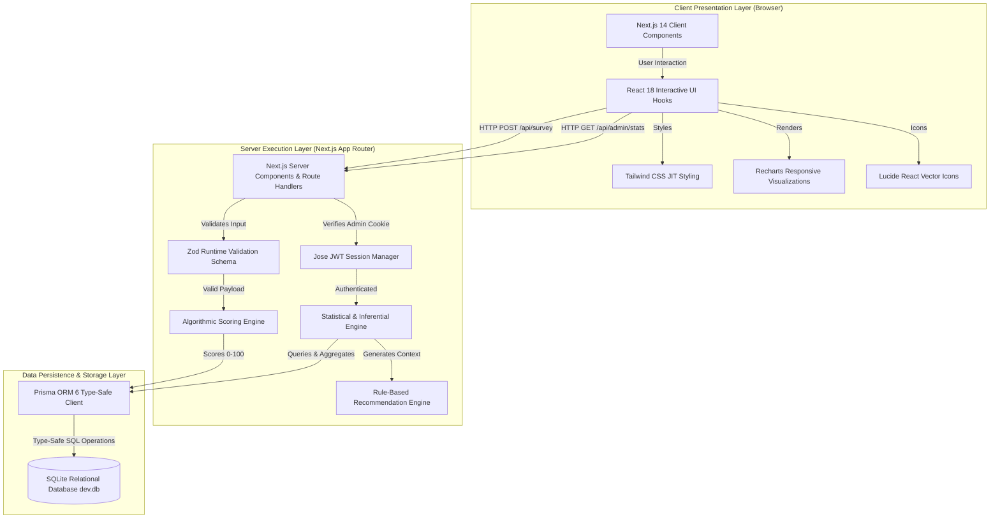
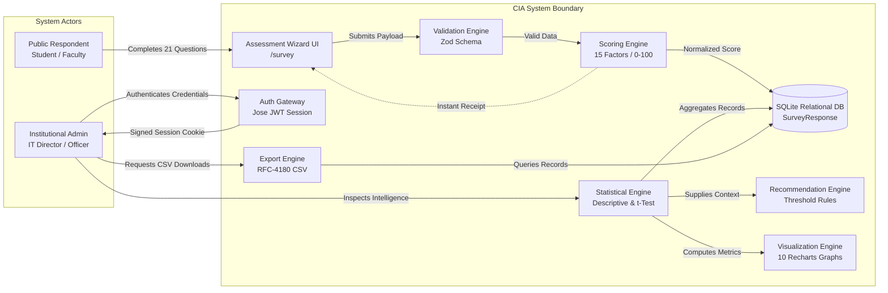
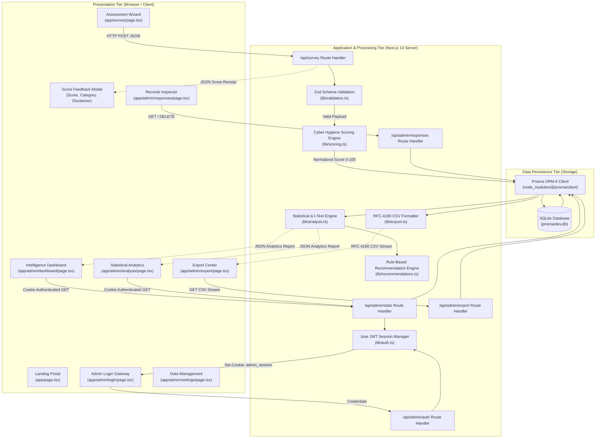
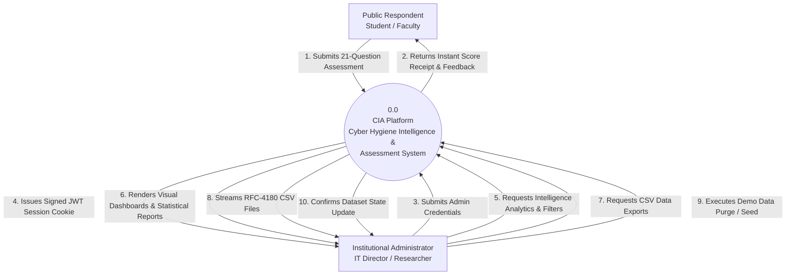
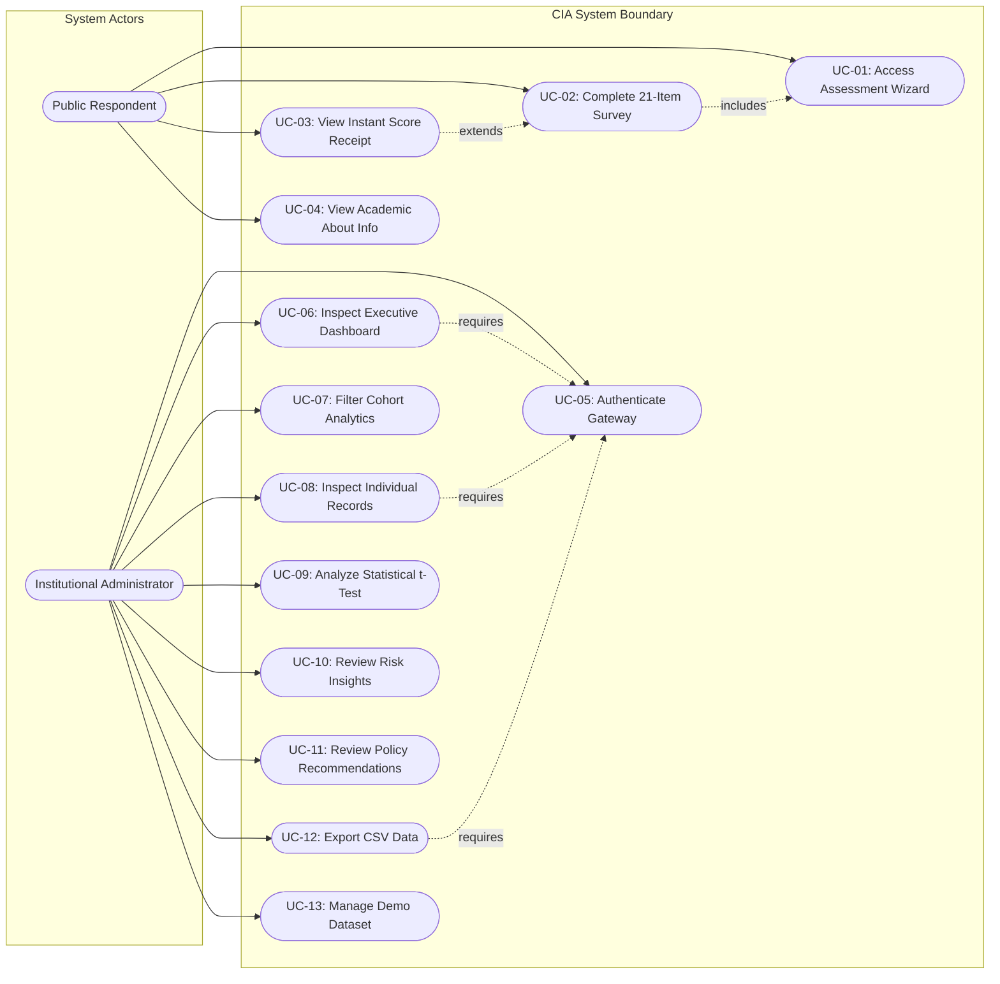
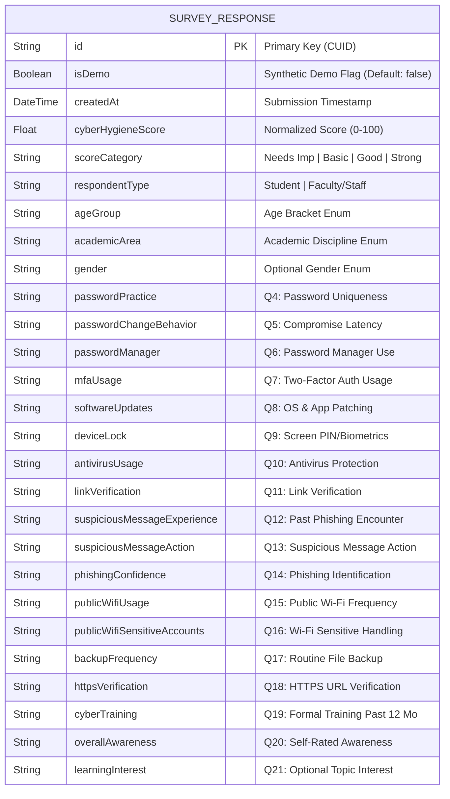

# A PROJECT REPORT ON
# CYBER HYGIENE PRACTICES AMONG COLLEGE STUDENTS AND FACULTY
## A Field Survey and Awareness Analysis System

### Submitted in partial fulfillment of the requirements for the degree of
## BACHELOR OF SCIENCE IN INFORMATION TECHNOLOGY
### By
## DHRUV GUPTA
**Roll Number / Seat Number:** [TO BE FILLED]

---

### Under the Esteemed Guidance of
## [GUIDE NAME]
**[Guide Designation / Department]**

---

### DEPARTMENT OF INFORMATION TECHNOLOGY
## [COLLEGE / INSTITUTE NAME TO BE FILLED]
### [AFFILIATED UNIVERSITY TO BE FILLED]
**ACADEMIC YEAR: 2025–2026**

<div style="page-break-after: always;"></div>

---

## PROJECT PROPOSAL & APPROVAL PROFORMA

**Academic Year:** 2025–2026  
**Degree Program:** Bachelor of Science in Information Technology (B.Sc. IT)  
**Semester:** VI  

| Field | Description / Value |
| :--- | :--- |
| **Candidate Name** | Dhruv Gupta |
| **Roll / Seat Number** | [TO BE FILLED] |
| **Project Topic** | Cyber Hygiene Practices Among College Students and Faculty |
| **Software Title** | CIA — Cyber Hygiene Intelligence & Assessment System |
| **Institutional Affiliation** | [COLLEGE / INSTITUTE NAME TO BE FILLED] |
| **Department** | Department of Information Technology |
| **Project Guide** | [GUIDE NAME] |
| **Project Category** | Web Application / Cybersecurity Awareness Analytics / Field Survey System |
| **Development Platform** | Next.js 14, React 18, TypeScript 5, Tailwind CSS, Prisma ORM 6, SQLite |
| **Submission Date** | [TO BE FILLED] |

### Brief Project Summary:
The project encompasses the design, implementation, and academic evaluation of a centralized web-based cybersecurity assessment and intelligence platform entitled **"CIA — Cyber Hygiene Intelligence & Assessment System"**. The platform addresses the critical institutional challenge of measuring everyday digital security habits among higher education stakeholders (students, faculty, and administrative staff). It provides an anonymous 21-item assessment across six cybersecurity domains, evaluates responses using a normalized 15-factor **Survey-Based Cyber Hygiene Score (0–100 scale)**, computes descriptive and comparative cohort statistics (including Welch's two-sample $t$-test), dynamically generates rule-based institutional recommendations, and provides executive reporting and RFC-4180 compliant CSV data exports through a protected administrative dashboard.

**Signatures:**

_________________________ &nbsp;&nbsp;&nbsp;&nbsp;&nbsp;&nbsp;&nbsp;&nbsp;&nbsp;&nbsp;&nbsp;&nbsp;&nbsp;&nbsp;&nbsp;&nbsp;&nbsp;&nbsp;&nbsp;&nbsp;&nbsp;&nbsp;&nbsp;&nbsp; _________________________  
**Student Signature** &nbsp;&nbsp;&nbsp;&nbsp;&nbsp;&nbsp;&nbsp;&nbsp;&nbsp;&nbsp;&nbsp;&nbsp;&nbsp;&nbsp;&nbsp;&nbsp;&nbsp;&nbsp;&nbsp;&nbsp;&nbsp;&nbsp;&nbsp;&nbsp;&nbsp;&nbsp;&nbsp;&nbsp;&nbsp;&nbsp;&nbsp;&nbsp;&nbsp;&nbsp;&nbsp;&nbsp;&nbsp;&nbsp;&nbsp;&nbsp;&nbsp;&nbsp;&nbsp;&nbsp;&nbsp;&nbsp;&nbsp;&nbsp; **Project Guide Signature**  
(Dhruv Gupta) &nbsp;&nbsp;&nbsp;&nbsp;&nbsp;&nbsp;&nbsp;&nbsp;&nbsp;&nbsp;&nbsp;&nbsp;&nbsp;&nbsp;&nbsp;&nbsp;&nbsp;&nbsp;&nbsp;&nbsp;&nbsp;&nbsp;&nbsp;&nbsp;&nbsp;&nbsp;&nbsp;&nbsp;&nbsp;&nbsp;&nbsp;&nbsp;&nbsp;&nbsp;&nbsp;&nbsp;&nbsp;&nbsp;&nbsp;&nbsp;&nbsp;&nbsp;&nbsp;&nbsp;&nbsp;&nbsp;&nbsp;&nbsp;&nbsp;&nbsp;&nbsp;&nbsp;&nbsp;&nbsp;&nbsp;&nbsp;&nbsp;&nbsp;&nbsp;&nbsp; ([Guide Name])  

<div style="page-break-after: always;"></div>

---

## CERTIFICATE

This is to certify that the project entitled:

> **"CYBER HYGIENE PRACTICES AMONG COLLEGE STUDENTS AND FACULTY"**  
> *(Software Product: CIA — Cyber Hygiene Intelligence & Assessment System)*

is a bonafide work carried out and submitted by:

### **DHRUV GUPTA**
**Roll No. / Seat No.: [TO BE FILLED]**

in partial fulfillment of the requirements for the award of the degree of **Bachelor of Science in Information Technology** from **[AFFILIATED UNIVERSITY TO BE FILLED]** through **[COLLEGE / INSTITUTE NAME TO BE FILLED]** during the academic year **2025–2026**.

The project report has been examined and approved as satisfying the academic standards prescribed for the degree.

<br><br><br>

_________________________ &nbsp;&nbsp;&nbsp;&nbsp;&nbsp;&nbsp;&nbsp;&nbsp;&nbsp;&nbsp;&nbsp;&nbsp;&nbsp;&nbsp;&nbsp;&nbsp;&nbsp;&nbsp;&nbsp;&nbsp;&nbsp;&nbsp;&nbsp;&nbsp; _________________________  
**Internal Project Guide** &nbsp;&nbsp;&nbsp;&nbsp;&nbsp;&nbsp;&nbsp;&nbsp;&nbsp;&nbsp;&nbsp;&nbsp;&nbsp;&nbsp;&nbsp;&nbsp;&nbsp;&nbsp;&nbsp;&nbsp;&nbsp;&nbsp;&nbsp;&nbsp;&nbsp;&nbsp;&nbsp;&nbsp;&nbsp;&nbsp;&nbsp;&nbsp;&nbsp;&nbsp;&nbsp;&nbsp;&nbsp;&nbsp; **External Examiner**  
Name: [Guide Name] &nbsp;&nbsp;&nbsp;&nbsp;&nbsp;&nbsp;&nbsp;&nbsp;&nbsp;&nbsp;&nbsp;&nbsp;&nbsp;&nbsp;&nbsp;&nbsp;&nbsp;&nbsp;&nbsp;&nbsp;&nbsp;&nbsp;&nbsp;&nbsp;&nbsp;&nbsp;&nbsp;&nbsp;&nbsp;&nbsp;&nbsp;&nbsp;&nbsp;&nbsp;&nbsp;&nbsp;&nbsp;&nbsp;&nbsp;&nbsp;&nbsp;&nbsp;&nbsp; Name: ___________________  
Date: &nbsp;[TO BE FILLED] &nbsp;&nbsp;&nbsp;&nbsp;&nbsp;&nbsp;&nbsp;&nbsp;&nbsp;&nbsp;&nbsp;&nbsp;&nbsp;&nbsp;&nbsp;&nbsp;&nbsp;&nbsp;&nbsp;&nbsp;&nbsp;&nbsp;&nbsp;&nbsp;&nbsp;&nbsp;&nbsp;&nbsp;&nbsp;&nbsp;&nbsp;&nbsp;&nbsp;&nbsp;&nbsp;&nbsp;&nbsp;&nbsp;&nbsp;&nbsp;&nbsp;&nbsp; Date: &nbsp;___________________  

<br><br>

_________________________ &nbsp;&nbsp;&nbsp;&nbsp;&nbsp;&nbsp;&nbsp;&nbsp;&nbsp;&nbsp;&nbsp;&nbsp;&nbsp;&nbsp;&nbsp;&nbsp;&nbsp;&nbsp;&nbsp;&nbsp;&nbsp;&nbsp;&nbsp;&nbsp; _________________________  
**Head of Department** &nbsp;&nbsp;&nbsp;&nbsp;&nbsp;&nbsp;&nbsp;&nbsp;&nbsp;&nbsp;&nbsp;&nbsp;&nbsp;&nbsp;&nbsp;&nbsp;&nbsp;&nbsp;&nbsp;&nbsp;&nbsp;&nbsp;&nbsp;&nbsp;&nbsp;&nbsp;&nbsp;&nbsp;&nbsp;&nbsp;&nbsp;&nbsp;&nbsp;&nbsp;&nbsp;&nbsp;&nbsp;&nbsp;&nbsp;&nbsp;&nbsp; **Principal / Head of Institution**  
Department of Information Technology &nbsp;&nbsp;&nbsp;&nbsp;&nbsp;&nbsp;&nbsp;&nbsp;&nbsp;&nbsp;&nbsp;&nbsp; [COLLEGE / INSTITUTE NAME]  
Date: &nbsp;[TO BE FILLED] &nbsp;&nbsp;&nbsp;&nbsp;&nbsp;&nbsp;&nbsp;&nbsp;&nbsp;&nbsp;&nbsp;&nbsp;&nbsp;&nbsp;&nbsp;&nbsp;&nbsp;&nbsp;&nbsp;&nbsp;&nbsp;&nbsp;&nbsp;&nbsp;&nbsp;&nbsp;&nbsp;&nbsp;&nbsp;&nbsp;&nbsp;&nbsp;&nbsp;&nbsp;&nbsp;&nbsp;&nbsp;&nbsp;&nbsp;&nbsp;&nbsp;&nbsp; Date: &nbsp;[TO BE FILLED]  

<div style="page-break-after: always;"></div>

---

## DECLARATION

I, **Dhruv Gupta**, student of **Bachelor of Science in Information Technology (B.Sc. IT)**, Semester VI, hereby declare that the project entitled:

> **"CYBER HYGIENE PRACTICES AMONG COLLEGE STUDENTS AND FACULTY"**  
> *(Software Product: CIA — Cyber Hygiene Intelligence & Assessment System)*

submitted to **[COLLEGE / INSTITUTE NAME TO BE FILLED]** affiliated with **[AFFILIATED UNIVERSITY TO BE FILLED]**, is an original piece of academic software development and research conducted under the guidance of **[GUIDE NAME]**, Department of Information Technology.

I further declare that:
1. The technical work, source code, analytical algorithms, database schema, and documentation presented in this project report were authored by me, except where explicit citations and references are made to established open-source libraries and academic literature.
2. The software and report have not been previously submitted to this or any other institution for the award of any degree, diploma, fellowship, or other academic credential.
3. The project strictly preserves respondent confidentiality: no personal identification credentials, passwords, or unauthorized monitoring mechanisms are contained within the software.
4. I acknowledge that the demonstration dataset embedded within the project prototype consists of synthetic software-testing records generated to validate reporting features, and is distinctly separated from genuine future field-study submissions.

**Place:** Mumbai, Maharashtra  
**Date:** &nbsp;[TO BE FILLED]  

<br>

_________________________  
**Dhruv Gupta**  
Candidate for B.Sc. (Information Technology)  
Roll / Seat No.: [TO BE FILLED]  

<div style="page-break-after: always;"></div>

---

## ABSTRACT

In contemporary higher education ecosystems, students, faculty, and administrative staff exhibit intensive reliance on digital devices, campus Wi-Fi infrastructure, cloud collaboration suites, and personal mobile hardware. While institutional IT departments invest in perimeter firewalls and security filters, the human behavioral layer remains the most vulnerable vector for cyber threats. Risky individual habits—such as pervasive password reuse, lack of multi-factor authentication (MFA), delayed operating system patching, unverified link interaction, and unencrypted transactions on public wireless networks—expose campus communities to credential theft, ransomware, and social engineering. Despite the severity of these risks, institutions lack structured, localized instruments to quantitatively measure, assess, and benchmark cyber hygiene practices among academic cohorts.

This project presents the engineering and academic evaluation of **CIA — Cyber Hygiene Intelligence & Assessment System**, a full-stack web-based cybersecurity assessment, analytics, and intelligence platform. Built upon **Next.js 14 (App Router)**, **TypeScript**, **Tailwind CSS**, **Prisma ORM**, and an embedded **SQLite** relational database, CIA provides a dual-interface architecture: an anonymous public assessment wizard and a protected administrative intelligence dashboard secured by JSON Web Tokens (JWT) in HTTP-only cookies.

The public assessment module features a mobile-responsive, 7-step wizard comprising 21 structured survey items across six core hygiene domains: Demographics, Password Security, Multi-Factor Authentication, Device & Patch Hygiene, Phishing & Social Engineering, and Network & Data Safety. Upon submission, an algorithmic scoring engine calculates a normalized **Survey-Based Cyber Hygiene Score (0–100 scale)** derived from 15 positively weighted behavioral dimensions, categorizing respondents into *Needs Improvement* (0–39), *Basic* (40–59), *Good* (60–79), and *Strong* (80–100) tiers with an instant digital receipt.

On the administrative tier, the platform computes comprehensive descriptive statistics (mean, median, standard deviation, and range), performs automated cohort comparisons between Student and Faculty cohorts, computes inferential hypothesis tests (Welch's two-sample $t$-test), ranks behavioral adherence across 11 key practices, and executes a rule-based recommendation engine that triggers targeted institutional remediation strategies. The platform features 10 dynamic **Recharts** data visualizations, an RFC-4180 compliant CSV export engine, and strict physical partitioning between synthetic demonstration records and authentic field survey submissions. Automated testing with **Vitest** confirms 100% test suite passage (17/17 tests), verifying scoring precision, data isolation, and CSV integrity. The resulting platform offers colleges an empirical, reproducible software foundation to benchmark cyber risk and cultivate proactive security awareness.

**Keywords:** Cyber Hygiene, Cybersecurity Awareness, Next.js, TypeScript, Prisma ORM, Behavioral Analytics, Welch's t-Test, Higher Education Security.

<div style="page-break-after: always;"></div>

---

## ACKNOWLEDGEMENT

The completion of this B.Sc. Information Technology project report and the development of the **CIA — Cyber Hygiene Intelligence & Assessment System** would not have been possible without the invaluable guidance, support, and encouragement of numerous individuals and institutions.

First and foremost, I express my profound gratitude to my respected Project Guide, **[GUIDE NAME]**, Department of Information Technology, for their continuous mentorship, perceptive guidance, and constructive critique throughout the conception, architecture, and documentation of this project. Their academic insights into software engineering standards and empirical research methodologies were instrumental in shaping this dissertation.

I extend my sincere thanks to the **Head of the Department**, Department of Information Technology, and the respected **Principal** of **[COLLEGE / INSTITUTE NAME TO BE FILLED]** for providing the necessary computing infrastructure, academic resources, and institutional environment that enabled the execution of this work.

I am deeply thankful to the faculty members of the Department of Information Technology for imparting the foundational knowledge of web development, database systems, software engineering, and network security that served as the technical bedrock for this platform.

I also extend my heartfelt appreciation to my fellow classmates and peers for their insightful feedback during prototype testing, interface usability evaluations, and test-case verification sessions.

Finally, I owe an immeasurable debt of gratitude to my family for their unwavering patience, moral support, and endless encouragement throughout my academic pursuits.

<br>

**Dhruv Gupta**  
Department of Information Technology  
[COLLEGE / INSTITUTE NAME TO BE FILLED]  

<div style="page-break-after: always;"></div>

---

## TABLE OF CONTENTS

| Section | Title | Page No. |
| :--- | :--- | :---: |
| &nbsp; | **FRONT MATTER** | &nbsp; |
| &nbsp; | Title Page | [PAGE] |
| &nbsp; | Project Proposal / Approval Proforma | [PAGE] |
| &nbsp; | Certificate | [PAGE] |
| &nbsp; | Declaration | [PAGE] |
| &nbsp; | Abstract | [PAGE] |
| &nbsp; | Acknowledgement | [PAGE] |
| &nbsp; | Table of Contents | [PAGE] |
| &nbsp; | List of Figures | [PAGE] |
| &nbsp; | List of Tables | [PAGE] |
| &nbsp; | Abbreviations and Acronyms | [PAGE] |
| &nbsp; | &nbsp; | &nbsp; |
| **CHAPTER 1** | **INTRODUCTION** | **[PAGE]** |
| 1.1 | Background of the Study | [PAGE] |
| 1.2 | Problem Statement | [PAGE] |
| 1.3 | Project Objectives | [PAGE] |
| 1.4 | Purpose of the System | [PAGE] |
| 1.5 | Scope of the System | [PAGE] |
| 1.5.1 | Functional In-Scope Deliverables | [PAGE] |
| 1.5.2 | Explicit Out-of-Scope Boundaries | [PAGE] |
| 1.6 | Applicability and Target Audience | [PAGE] |
| 1.7 | Significance of the Project | [PAGE] |
| 1.7.1 | Software Engineering Perspective | [PAGE] |
| 1.7.2 | Data Analytics Perspective | [PAGE] |
| 1.7.3 | Cybersecurity Awareness Perspective | [PAGE] |
| 1.7.4 | Educational and Institutional Perspective | [PAGE] |
| &nbsp; | &nbsp; | &nbsp; |
| **CHAPTER 2** | **SURVEY / STUDY OF TECHNOLOGIES** | **[PAGE]** |
| 2.1 | Next.js 14 Full-Stack Framework | [PAGE] |
| 2.2 | TypeScript 5 Programming Language | [PAGE] |
| 2.3 | React 18 User Interface Library | [PAGE] |
| 2.4 | Tailwind CSS Utility-First Styling Framework | [PAGE] |
| 2.5 | Node.js Runtime and npm Ecosystem | [PAGE] |
| 2.6 | Prisma ORM 6 Object-Relational Mapper | [PAGE] |
| 2.7 | SQLite Relational Database Engine | [PAGE] |
| 2.8 | Recharts Reactive Data Visualization Library | [PAGE] |
| 2.9 | Zod Runtime Schema Validation Library | [PAGE] |
| 2.10 | Jose and JSON Web Token (JWT) Security Engine | [PAGE] |
| 2.11 | Vitest Automated Unit Testing Framework | [PAGE] |
| 2.12 | Git and GitHub Version Control Ecosystem | [PAGE] |
| 2.13 | Integrated Full-Stack Architecture Overview | [PAGE] |
| &nbsp; | &nbsp; | &nbsp; |
| **CHAPTER 3** | **REQUIREMENTS AND ANALYSIS** | **[PAGE]** |
| 3.1 | Problem Definition | [PAGE] |
| 3.2 | Analysis of Existing Systems and Conventional Approaches | [PAGE] |
| 3.3 | Proposed System: CIA Platform | [PAGE] |
| 3.4 | Functional Requirements Specifications (FR-01 to FR-15) | [PAGE] |
| 3.5 | Non-Functional Requirements Specifications | [PAGE] |
| 3.6 | Hardware Requirements | [PAGE] |
| 3.7 | Software Requirements | [PAGE] |
| 3.8 | User Roles and Operational Matrix | [PAGE] |
| 3.9 | Use Case Specifications | [PAGE] |
| 3.10 | Project Feasibility Analysis | [PAGE] |
| 3.10.1 | Technical Feasibility | [PAGE] |
| 3.10.2 | Operational Feasibility | [PAGE] |
| 3.10.3 | Economic Feasibility | [PAGE] |
| 3.10.4 | Schedule and Milestone Feasibility | [PAGE] |
| 3.11 | Conceptual System Model | [PAGE] |
| &nbsp; | &nbsp; | &nbsp; |
| **CHAPTER 4** | **SYSTEM DESIGN** | **[PAGE]** |
| 4.1 | High-Level System Architecture | [PAGE] |
| 4.2 | Modular Component Decomposition | [PAGE] |
| 4.3 | Data Flow Diagrams (DFD Level 0 and Level 1) | [PAGE] |
| 4.4 | Unified Modeling Language (UML) Use Case Diagram | [PAGE] |
| 4.5 | System Flowchart and Assessment Pipeline | [PAGE] |
| 4.6 | Entity-Relationship (ER) and Database Schema Design | [PAGE] |
| 4.7 | Data Dictionary | [PAGE] |
| 4.8 | User Interface Design and Screen Layouts | [PAGE] |
| 4.9 | Security and Privacy Architecture | [PAGE] |
| &nbsp; | &nbsp; | &nbsp; |
| **CHAPTER 5** | **IMPLEMENTATION AND TESTING** | **[PAGE]** |
| 5.1 | Implementation Approach and Methodology | [PAGE] |
| 5.2 | Development Environment Configuration | [PAGE] |
| 5.3 | Project Structure and File Organization | [PAGE] |
| 5.4 | Technical Implementation Details | [PAGE] |
| 5.4.1 | Public Landing Portal Implementation | [PAGE] |
| 5.4.2 | Assessment Wizard State Machine | [PAGE] |
| 5.4.3 | Server-Side Input Validation Engine | [PAGE] |
| 5.4.4 | Database Persistence and Prisma Integration | [PAGE] |
| 5.4.5 | Cyber Hygiene Scoring Engine | [PAGE] |
| 5.4.6 | JWT Session Authentication and Protection | [PAGE] |
| 5.4.7 | Intelligence Dashboard Analytics | [PAGE] |
| 5.4.8 | Cohort Comparative Analysis Engine | [PAGE] |
| 5.4.9 | Institutional Risk Assessment Module | [PAGE] |
| 5.4.10 | Rule-Based Recommendation Engine | [PAGE] |
| 5.4.11 | Audit and Executive Report Generator | [PAGE] |
| 5.4.12 | RFC-4180 Compliant CSV Export Engine | [PAGE] |
| 5.4.13 | Demonstration Dataset Management Subsystem | [PAGE] |
| 5.5 | Mathematical Scoring and Normalization Algorithms | [PAGE] |
| 5.6 | Statistical Analysis and Inferential Algorithms | [PAGE] |
| 5.7 | Rule-Based Recommendation Algorithm | [PAGE] |
| 5.8 | Verification and Testing Strategy | [PAGE] |
| 5.9 | Automated Unit and Integration Test Cases | [PAGE] |
| 5.10 | Integration Testing and End-to-End Pipeline Verification | [PAGE] |
| 5.11 | Exception Handling and System Resilience | [PAGE] |
| &nbsp; | &nbsp; | &nbsp; |
| **CHAPTER 6** | **RESULTS AND DISCUSSIONS** | **[PAGE]** |
| 6.1 | Software Deliverables and Operational Results | [PAGE] |
| 6.2 | User Documentation and Interface Screen Records | [PAGE] |
| 6.3 | Demonstration Dataset Operational Verification | [PAGE] |
| 6.4 | Actual Field Study Findings (Post-Collection Framework) | [PAGE] |
| 6.5 | Academic Discussion and Behavioral Implications | [PAGE] |
| &nbsp; | &nbsp; | &nbsp; |
| **CHAPTER 7** | **CONCLUSION AND FUTURE SCOPE** | **[PAGE]** |
| 7.1 | Project Conclusion | [PAGE] |
| 7.2 | Academic and Methodological Limitations | [PAGE] |
| 7.3 | Recommendations for Future Enhancements | [PAGE] |
| &nbsp; | &nbsp; | &nbsp; |
| **CHAPTER 8** | **REFERENCES** | **[PAGE]** |
| &nbsp; | &nbsp; | &nbsp; |
| **APPENDICES** | **SUPPLEMENTARY TECHNICAL DOCUMENTATION** | **[PAGE]** |
| Appendix A | Complete Cyber Hygiene Field Survey Questionnaire | [PAGE] |
| Appendix B | Complete Prisma Relational Database Schema | [PAGE] |
| Appendix C | Comprehensive Automated Test Execution Matrix | [PAGE] |
| Appendix D | Application Programming Interface (API) Endpoint Reference | [PAGE] |
| Appendix E | Complete Project Directory Tree | [PAGE] |
| Appendix F | Sample System Outputs and Export Artifacts | [PAGE] |

<div style="page-break-after: always;"></div>

---

## LIST OF FIGURES

| Figure No. | Figure Caption / Description | Page No. |
| :--- | :--- | :---: |
| **Figure 2.1** | CIA Integrated Technology Stack Interaction Model | [PAGE] |
| **Figure 3.1** | Conceptual System Data and Actor Interaction Architecture | [PAGE] |
| **Figure 4.1** | End-to-End Multi-Tier Software Architecture Diagram | [PAGE] |
| **Figure 4.2** | Context-Level Data Flow Diagram (Level 0 DFD) | [PAGE] |
| **Figure 4.3** | Functional Data Flow Diagram (Level 1 DFD) | [PAGE] |
| **Figure 4.4** | Comprehensive UML Use Case Diagram | [PAGE] |
| **Figure 4.5** | Assessment Lifecycle and Pipeline Execution Flowchart | [PAGE] |
| **Figure 4.6** | Entity-Relationship (ER) Relational Database Diagram | [PAGE] |
| **Figure 4.7** | [INSERT FIGURE 4.7] — Public Home Landing Page Interface | [PAGE] |
| **Figure 4.8** | [INSERT FIGURE 4.8] — Interactive Multi-Step Assessment Wizard | [PAGE] |
| **Figure 4.9** | [INSERT FIGURE 4.9] — Instant Score Evaluation Receipt & Feedback | [PAGE] |
| **Figure 4.10** | [INSERT FIGURE 4.10] — Administrator Secure Gateway & Authentication | [PAGE] |
| **Figure 6.1** | [INSERT FIGURE 6.1] — Intelligence Analytics Dashboard Overview | [PAGE] |
| **Figure 6.2** | [INSERT FIGURE 6.2] — Score Tier and Cohort Distribution Charts | [PAGE] |
| **Figure 6.3** | [INSERT FIGURE 6.3] — Student vs. Faculty Comparative Security Metrics | [PAGE] |
| **Figure 6.4** | [INSERT FIGURE 6.4] — Assessment Records Management Table Interface | [PAGE] |
| **Figure 6.5** | [INSERT FIGURE 6.5] — Descriptive and Inferential Statistical Analytics | [PAGE] |
| **Figure 6.6** | [INSERT FIGURE 6.6] — Institutional Risk Heatmap and Vulnerability Matrix | [PAGE] |
| **Figure 6.7** | [INSERT FIGURE 6.7] — Automated Institutional Cyber Hygiene Audit Report | [PAGE] |
| **Figure 6.8** | [INSERT FIGURE 6.8] — Raw Data Export Hub and Schema Dictionary | [PAGE] |

<div style="page-break-after: always;"></div>

---

## LIST OF TABLES

| Table No. | Table Title / Description | Page No. |
| :--- | :--- | :---: |
| **Table 1.1** | Core Research Questions and System Analytical Mappings | [PAGE] |
| **Table 3.1** | Functional Requirements Specification Matrix (FR-01 to FR-15) | [PAGE] |
| **Table 3.2** | Non-Functional Quality Attributes and Engineering Benchmarks | [PAGE] |
| **Table 3.3** | Minimum and Recommended Hardware Specifications | [PAGE] |
| **Table 3.4** | Software Development and Runtime Environment Specifications | [PAGE] |
| **Table 3.5** | User Roles, Privilege Boundaries, and Access Permissions | [PAGE] |
| **Table 3.6** | Use Case Specification: Submit Assessment (UC-01) | [PAGE] |
| **Table 3.7** | Use Case Specification: Admin Intelligence Inspection (UC-02) | [PAGE] |
| **Table 4.1** | Modular Functional Specifications of CIA Architecture | [PAGE] |
| **Table 4.2** | Formal Data Dictionary for `SurveyResponse` Relational Model | [PAGE] |
| **Table 5.1** | Scoring Rules Configuration and Dimension Point Allocations | [PAGE] |
| **Table 5.2** | Cyber Hygiene Score Categorical Thresholds and Interpretations | [PAGE] |
| **Table 5.3** | Vitest Automated Test Execution Matrix (17/17 Passing) | [PAGE] |
| **Table 6.1** | Demonstration Dataset Composition Overview (N = 100) | [PAGE] |
| **Table 6.2** | Demonstration Score Distribution Across Descriptive Categories | [PAGE] |
| **Table 6.3** | Demonstration Student vs. Faculty Comparative Security Breakdown | [PAGE] |
| **Table 6.4** | Demonstration Cyber Hygiene Practice Adherence Hierarchy | [PAGE] |
| **Table 6.5** | Actual Field Study Results Data Template [TO BE FILLED] | [PAGE] |
| **Table D.1** | Application Programming Interface (API) Route Specifications | [PAGE] |

<div style="page-break-after: always;"></div>

---

## ABBREVIATIONS AND ACRONYMS

| Abbreviation | Expanded Form |
| :--- | :--- |
| **API** | Application Programming Interface |
| **BYOD** | Bring Your Own Device |
| **CIA** | Cyber Hygiene Intelligence & Assessment System *(also Confidentiality, Integrity, Availability)* |
| **CPA** | Cross-Platform Application |
| **CRUD** | Create, Read, Update, Delete |
| **CSV** | Comma-Separated Values (RFC-4180) |
| **DFD** | Data Flow Diagram |
| **DOM** | Document Object Model |
| **ER** | Entity-Relationship |
| **FIDO** | Fast Identity Online |
| **GUI** | Graphical User Interface |
| **HOD** | Head of Department |
| **HTTP** | Hypertext Transfer Protocol |
| **HTTPS** | Hypertext Transfer Protocol Secure |
| **IP** | Internet Protocol |
| **IT** | Information Technology |
| **JSON** | JavaScript Object Notation |
| **JWT** | JSON Web Token (RFC-7519) |
| **MFA** | Multi-Factor Authentication |
| **NIST** | National Institute of Standards and Technology |
| **ORM** | Object-Relational Mapping |
| **OS** | Operating System |
| **PIN** | Personal Identification Number |
| **PII** | Personally Identifiable Information |
| **PRNG** | Pseudorandom Number Generator |
| **RBAC** | Role-Based Access Control |
| **REST** | Representational State Transfer |
| **RFC** | Request for Comments |
| **RQ** | Research Question |
| **SD** | Standard Deviation |
| **SQL** | Structured Query Language |
| **SSR** | Server-Side Rendering |
| **TLS** | Transport Layer Security |
| **UI** | User Interface |
| **UML** | Unified Modeling Language |
| **URL** | Uniform Resource Locator |
| **UX** | User Experience |
| **2FA** | Two-Factor Authentication |
<div style="page-break-after: always;"></div>


# CHAPTER 1 — INTRODUCTION

## 1.1 Background of the Study

The exponential expansion of digital technologies over the past two decades has profoundly transformed higher education institutions globally. Modern colleges and universities no longer operate within the confines of physical lecture halls and centralized desktop computer laboratories. Contemporary collegiate life is intrinsically intertwined with widespread internet connectivity, cloud-based academic courseware portals, digital submission repositories, virtual collaboration platforms, institutional email systems, and widespread Bring Your Own Device (BYOD) cultures. Undergraduate students, postgraduate scholars, teaching faculty, and administrative personnel routinely utilize personal laptops, smartphones, and tablet computers to access both institutional networks and external digital services.

While this digital ubiquity has unlocked unprecedented academic flexibility, collaborative learning, and administrative efficiency, it has concurrently expanded the institutional attack surface. Higher education networks are inherently designed to be open, collaborative, and decentralized environments that facilitate academic inquiry and unrestricted data sharing. Unlike corporate enterprise networks—which enforce strict perimeter perimeters, mandatory device image configurations, restricted local administrative privileges, and continuous centralized monitoring—collegiate digital ecosystems host thousands of transient, unmanaged personal devices connecting to campus Wi-Fi infrastructure on a daily basis.

In this context, the concept of **Cyber Hygiene** has emerged as a fundamental pillar of modern organizational defense. Analogous to personal physical hygiene, cyber hygiene refers to the routine, everyday practices, proactive habits, and precautionary measures that individuals execute to preserve the health, integrity, and security of their computing devices, digital identities, and online assets. Just as regular handwashing mitigates biological infections, sound cyber hygiene habits—such as maintaining unique credentials across critical accounts, enabling Multi-Factor Authentication (MFA), promptly executing operating system and application security patches, scrutinizing uniform resource locators (URLs) prior to interaction, avoiding unencrypted sensitive transactions over open public Wi-Fi, and performing routine data redundancy backups—mitigate the vast majority of opportunistic cyber attacks.

Empirical studies in human-centered cybersecurity consistently reveal that technological defenses (such as firewalls, intrusion detection systems, and antivirus gateways) are necessary but insufficient barriers against modern cyber adversaries. Global cybersecurity analyses report that over 80% of institutional security breaches involve a human element—specifically through stolen credentials, social engineering schemes, phishing lures, or simple configuration errors. Cyber adversaries recognize that attacking hardened institutional infrastructure directly is substantially more resource-intensive than deceiving an individual student or faculty member into surrendering access credentials or executing malicious payloads.

Within a collegiate population, the human behavioral layer presents distinct, multifaceted vulnerabilities:
1. **Diverse Digital Literacy Levels:** Although contemporary students are frequently labeled "digital natives," proficiency in social media consumption and mobile application navigation does not equate to sound security comprehension. Many students possess limited understanding of underlying networking protocols, certificate validation, credential stuffing techniques, or the mechanics of social engineering.
2. **Academic Time Pressures and Cognitive Fatigue:** Students balancing coursework deadlines, examinations, and extracurricular engagements often prioritize computational convenience and rapid task completion over defensive security routines. Similarly, academic faculty managing heavy teaching schedules, research commitments, and administrative responsibilities are prone to cognitive overload, making them susceptible to targeted spear-phishing messages masked as institutional memos or conference invitations.
3. **Pervasive Password Reuse:** The proliferation of academic portals, research databases, personal streaming subscriptions, and social media platforms induces "password fatigue." Individuals frequently resort to utilizing identical or trivially modified passwords across multiple critical services, transforming a minor third-party data breach into an immediate threat to institutional accounts.
4. **Transient Public Wi-Fi Reliance:** College students frequently access academic portals, personal email accounts, and financial services over unencrypted or shared public Wi-Fi networks in cafeterias, transit stations, and hostels, exposing their data transmissions to adversary-in-the-middle eavesdropping and rogue access points.
5. **Inconsistent Data Redundancy Protocols:** Academic research dissertations, grading records, and institutional documents are frequently stored exclusively on local hard drives or unversioned portable USB drives without automated, offsite cloud redundancy, creating severe vulnerability to ransomware extortion or physical device loss.

Despite the critical necessity of fostering robust digital defense habits, higher education institutions frequently struggle to quantify and benchmark the baseline cyber hygiene behaviors of their student body and faculty members. Institutional awareness initiatives are conventionally restricted to generic annual orientation seminars or passive email circulars. Without localized, empirical measurement instruments, academic administrators and campus IT directors operate in an informational void—unable to identify which specific security habits exhibit the lowest compliance, how behavioral tendencies diverge across demographic cohorts, or where institutional training investments should be strategically directed.

---

## 1.2 Problem Statement

The central problem addressed by this project is the **absence of a centralized, secure, standardized, and analytically rigorous system to measure, evaluate, and benchmark everyday cyber hygiene practices among college students and faculty**.

Higher education institutions face significant structural and technical impediments when attempting to assess human-layer cybersecurity posture:
1. **Fragmented and Informal Survey Mechanisms:** Conventional academic inquiries into student behavior rely on ad-hoc paper questionnaires or generic commercial survey tools (such as Google Forms). While suitable for basic polling, generic survey utilities lack custom mathematical scoring algorithms, cannot compute normalized cybersecurity posture indices, cannot provide immediate, personalized diagnostic feedback receipts to respondents, and do not provide automated comparative hypothesis testing.
2. **Lack of Standardized Behavioral Quantification:** In the absence of an algorithmic scoring mechanism, survey answers remain isolated qualitative data points. There is no unified metric that aggregates multi-domain security practices—spanning authentication, patch management, phishing resistance, network safety, and training—into a coherent, normalized benchmark index.
3. **Absence of Cohort Disaggregation and Inferential Analytics:** Institutional populations are heterogeneous. Undergraduate students, postgraduate researchers, junior faculty, senior professors, and administrative staff operate under fundamentally distinct operational constraints and technical backgrounds. Conventional survey workflows require manual data export and complex external spreadsheet manipulations to calculate group variances, descriptive metrics, or inferential hypothesis tests (such as Welch's two-sample $t$-test).
4. **Inactionable Reporting:** Typical survey outputs generate static charts without automated, rule-based interpretation. Institutional leaders are presented with raw percentage figures without programmatic guidance indicating which compliance deficits cross critical risk thresholds or what specific educational interventions (such as mandatory MFA enrollment, cloud backup workshops, or simulated phishing drills) are empirically warranted.
5. **Data Privacy and Ethical Hesitancy:** Conventional data collection systems frequently collect identifying email addresses, student roll numbers, or personal accounts, introducing privacy concerns and cognitive bias. Respondents hesitate to honestly report poor security habits (such as clicking unverified links or disabling device passwords) if they fear administrative reprimand or academic monitoring.
6. **Data Integrity and Demonstration Conflation:** Software prototypes developed in academic contexts frequently conflate demonstration mock records with genuine empirical data. An enterprise-grade academic system must enforce strict physical and logical partitioning between synthetic demonstration datasets and authentic field responses, ensuring that prototype evaluations never corrupt empirical findings.

To address these challenges, there is an imperative engineering need for a dedicated, web-based platform: the **CIA — Cyber Hygiene Intelligence & Assessment System**. The platform must seamlessly collect anonymous structured assessments across six cybersecurity domains, calculate a standardized and normalized Cyber Hygiene Score, dynamically disaggregate and analyze cohort-level behaviors, execute inferential statistical tests, generate automated institutional recommendations, and deliver report-ready visualizations and RFC-4180 compliant CSV exports through a secure administrative dashboard.

---

## 1.3 Project Objectives

The primary engineering and research objectives of the **CIA — Cyber Hygiene Intelligence & Assessment System** are formulated as follows:

1. **Develop an Anonymous, Mobile-Responsive Public Assessment Portal:**  
   Engineer a modern web-based questionnaire wizard that allows college students, faculty, and staff to comfortably complete an assessment across desktop, tablet, and mobile devices without requiring user account creation or surrendering personal identity markers.
2. **Structure a Multi-Domain Assessment Instrument:**  
   Implement a 21-item structured questionnaire covering seven thematic sections: Demographic Profile (Section A), Password Security (Section B), Multi-Factor Authentication (Section C), Device & Patch Hygiene (Section D), Phishing & Social Engineering (Section E), Network & Data Safety (Section F), and Awareness & Training (Section G).
3. **Formulate a Normalized Algorithmic Scoring Engine:**  
   Design and implement an objective mathematical scoring algorithm that evaluates 15 positively valenced security habits, maps categorical options to point values (maximum raw points: 75), normalizes the total to a 0–100 scale, and assigns standardized descriptive tiers (*Strong*, *Good*, *Basic*, and *Needs Improvement*).
4. **Provide Instant Individual Diagnostic Feedback:**  
   Generate an instantaneous, post-submission evaluation receipt displaying the respondent's anonymized reference hash, calculated Cyber Hygiene Score, score category badge, and contextual academic disclaimer to reinforce personal cybersecurity awareness.
5. **Engineer a Secure Relational Persistence Layer:**  
   Implement a persistent SQLite relational database managed through Prisma ORM 6, ensuring schema enforcement, type-safe query execution, and robust handling of high-concurrency submission transactions.
6. **Implement Cryptographic Administrative Authentication:**  
   Secure the administrative management tier using JSON Web Tokens (JWT) signed via HMAC-SHA256 and transmitted exclusively through encrypted, HTTP-only, SameSite cookies to protect analytical reports against unauthorized inspection or cross-site scripting (XSS) compromise.
7. **Compute Descriptive Statistical Indicators:**  
   Develop an automated analytical module that calculates central tendency metrics (Mean, Median), dispersion metrics (Sample Standard Deviation, Range [Min, Max]), and categorical frequency distributions across all submitted assessment records in real time.
8. **Automate Demographic and Cohort Comparative Analysis:**  
   Provide programmatic group comparison algorithms that disaggregate metrics between the Student and Faculty/Staff cohorts, computing absolute variance differentials across critical security behaviors (MFA enrollment, routine backups, prompt OS updates, and phishing confidence).
9. **Execute Automated Inferential Hypothesis Testing:**  
   Integrate an automated two-sample Welch's $t$-test (unequal variances) calculation engine that evaluates whether observable differences between student and faculty mean Cyber Hygiene Scores achieve statistical significance at $lpha = 0.05$, outputting the exact $t$-statistic, degrees of freedom ($df$), and two-tailed $p$-value.
10. **Establish an Empirical Security Practice Compliance Hierarchy:**  
    Rank all 11 core cybersecurity practices in descending order of positive adoption percentages, highlighting institutional strengths and exposing critical behavioral vulnerabilities requiring immediate remediation.
11. **Construct a Dynamic Rule-Based Institutional Recommendation Engine:**  
    Implement an automated policy recommendation module that evaluates calculated dataset percentages against predefined security thresholds, generating concrete institutional interventions (e.g., campus-wide MFA enforcement, managed cloud backup tutorials, simulated phishing drills, and induction training modules).
12. **Deliver Reactive Visualizations and RFC-4180 Compliant Data Exports:**  
    Build an interactive administrative dashboard hosting 10 dynamic Recharts data visualizations (donut, bar, and comparative charts) and an export center supporting both anonymized raw record CSV downloads and aggregated summary statistical CSV reports.

---

## 1.4 Purpose of the System

The overarching purpose of the **CIA — Cyber Hygiene Intelligence & Assessment System** is to transform cybersecurity awareness evaluation from an abstract, qualitative concept into a precise, data-driven, and actionable institutional discipline.

From an academic perspective, the system provides student researchers and faculty mentors with an automated, reproducible research apparatus. Rather than spending weeks manually collating paper surveys, writing ad-hoc spreadsheet macros, and manually calculating statistical tests, researchers can deploy the application URL across campus departments and immediately observe real-time data ingestion, descriptive metrics, and inferential t-test calculations.

From an institutional and administrative perspective, the platform serves as an early-warning diagnostic mechanism for university IT security teams, college principals, and departmental heads. Institutional firewalls and intrusion prevention systems can only protect data once an adversary attempts network entry; they cannot detect if a faculty member is utilizing their spouse's name as a master password, or if undergraduate students are sharing sensitive portal credentials over unencrypted Wi-Fi hotspots. By providing an objective measurement of human behavioral risk, CIA empowers institutional leadership to make evidence-based budget allocations, schedule targeted technical workshops, and implement informed campus security policies.

Finally, from an educational perspective, the platform serves as an interactive instructional instrument for respondents. The assessment wizard does not merely collect answers; it provides contextual guidance explaining why specific behaviors (such as verifying HTTPS certificates or enabling multi-factor authentication) are essential. The instant score evaluation receipt gives participants an immediate diagnostic reflection of their digital vulnerability, motivating personal behavioral improvement.

---

## 1.5 Scope of the System

The project scope is explicitly demarcated into functional in-scope deliverables and distinct out-of-scope boundaries to maintain academic rigor and architectural clarity.

### 1.5.1 Functional In-Scope Deliverables
* **Public Assessment Wizard:** Multi-step responsive questionnaire containing 21 items with client-side state preservation, progress tracking, and validation.
* **Server-Side Validation Engine:** Strict schema validation powered by Zod to reject malformed, incomplete, or out-of-range payloads.
* **Algorithmic Scoring Engine:** Formulaic conversion of 15 positively valenced behavioral questions into a normalized 0–100 Cyber Hygiene Score.
* **Relational Database:** SQLite database schema managed via Prisma ORM storing survey responses with timestamps, categorical scores, and metadata flags.
* **Administrative Authentication:** Secure login gateway utilizing Jose JWT signed tokens stored in HTTP-only cookies.
* **Intelligence Dashboard:** Interactive analytics dashboard rendering 10 Recharts data visualizations (cohort splits, score histograms, practice compliance bars, and comparative indicators).
* **Descriptive and Inferential Statistical Engine:** Programmatic computation of Mean, Median, Standard Deviation, Score Range, and Welch's $t$-test.
* **Security Practices Adherence Hierarchy:** Programmatic ranking of 11 discrete cybersecurity habits.
* **Rule-Based Recommendation Engine:** Triggered institutional action plans based on empirical compliance percentage thresholds.
* **Data Management and Demo Isolation:** Administrative settings allowing the seeding, inspection, filtering, and purging of synthetic demonstration records without corrupting authentic field submissions.
* **Standardized Data Export:** RFC-4180 compliant CSV export engine generating raw record files and statistical summary reports.

### 1.5.2 Explicit Out-of-Scope Boundaries
To avoid misrepresenting the software's functional nature, the following capabilities are explicitly declared outside the scope of this project:
* **No Direct Antivirus or Anti-Malware Capabilities:** The software does not scan file systems, inspect memory buffers, or quarantine malicious binaries on user devices.
* **No Penetration Testing or Vulnerability Scanning:** The system does not probe network ports, simulate exploit payloads, or assess server operating system vulnerabilities.
* **No Real-Time Network Traffic Monitoring (IDS/IPS):** The application does not intercept packet streams, analyze Wi-Fi frame handshakes, or perform deep packet inspection.
* **Zero Password Collection or Verification:** The system strictly evaluates *reported habits* regarding password uniqueness and management. It never prompts for, collects, validates, or stores actual user passwords, banking PINs, or credentials.
* **No Device Agent Installation (MDM):** The platform is entirely web-based and does not install background daemons, root certificates, or Mobile Device Management profiles on personal laptops or smartphones.
* **No Certified Commercial Compliance Accreditation:** The Survey-Based Cyber Hygiene Score is a descriptive academic index formulated for this undergraduate research study. It is not an officially certified ISO/IEC 27001, NIST SP 800-53, or CIS Benchmark accreditation.

---

## 1.6 Applicability and Target Audience

The **CIA — Cyber Hygiene Intelligence & Assessment System** is designed for deployment across a variety of academic and institutional contexts:

1. **Higher Education Institutions (Colleges and Universities):**  
   Applicable for internal IT directors, Information Security Officers (CISO), and college principals seeking to benchmark campus-wide security awareness, prepare documentation for institutional accreditation bodies (such as NAAC, NBA, or NIRF), and evaluate the effectiveness of campus IT policies.
2. **Academic Cybersecurity Researchers:**  
   Serves as a reliable, automated platform for professors, research scholars, and undergraduate/postgraduate students conducting empirical field studies on human factors in computer security, behavioral cyber defense, and digital literacy.
3. **Student Induction and Orientation Programs:**  
   Deployable at the commencement of each academic academic year as a mandatory or voluntary digital onboarding assessment for incoming undergraduate and postgraduate students.
4. **Faculty Development Programs (FDP):**  
   Applicable within institutional workshops to evaluate baseline faculty awareness, tailoring training sessions on digital grading safety, phishing recognition, and cloud backup redundancy.
5. **Non-Profit and Educational Community Organizations:**  
   Adaptable for secondary schools, public libraries, and community vocational centers seeking a lightweight, zero-maintenance tool to evaluate digital safety awareness among community learners.

---

## 1.7 Significance of the Project

The significance of the project is evaluated across four core dimensions:

### 1.7.1 Software Engineering Perspective
From a software engineering viewpoint, CIA demonstrates modern, full-stack architectural design principles. Built using **Next.js 14** and **TypeScript**, the application showcases type-safe data flow spanning the browser Document Object Model (DOM), RESTful API routes, server-side Zod validation pipelines, and Prisma database schema definitions. By utilizing Next.js Server Components alongside optimized Client Components, the platform achieves high rendering performance, zero client bundle bloat for static layouts, and robust security isolation. The complete integration of automated testing through **Vitest** (17/17 passing unit and integration tests) exemplifies professional software quality assurance.

### 1.7.2 Data Analytics Perspective
From a data analytics perspective, the platform elevates standard survey polling into an automated statistical analysis pipeline. Rather than outputting static counts, the platform computes dynamic descriptive metrics (mean, median, standard deviation) and automates complex inferential statistical models (Welch's two-sample $t$-test with dynamic degrees of freedom). The automated ranking of security habits and dynamic rule evaluation demonstrate how algorithmic logic can translate raw tabular records into prioritized organizational intelligence.

### 1.7.3 Cybersecurity Awareness Perspective
From a cybersecurity perspective, the project operationalizes the critical defense principle that **the human layer is the ultimate security perimeter**. While technical hardware firewalls protect against automated port scans, only educated, vigilant individuals can prevent credential theft, phishing compromise, and data leakage. By providing an objective measurement instrument, CIA shifts institutional cyber awareness from reactive post-incident damage control to proactive, measurable risk management.

### 1.7.4 Educational and Institutional Perspective
From an educational standpoint, CIA bridges the divide between student-facing pedagogical feedback and administrative oversight. Students receive an immediate, non-punitive evaluation of their personal digital habits, accompanied by practical explanations. Concurrently, institutional leadership receives high-level executive summaries and concrete policy recommendations grounded entirely in empirical campus data, fostering a culture of shared responsibility and continuous digital security improvement.

---

### Table 1.1: Core Research Questions and System Analytical Mappings

| Research Question (RQ) | Academic Focus | Primary System Analytical Metric | Implementation Module |
| :--- | :--- | :--- | :--- |
| **RQ1: Baseline Level** | What is the baseline level of cyber hygiene among college students and faculty? | Overall Mean, Median, and Category Distribution of Cyber Hygiene Scores (0–100) | Scoring Engine (`lib/scoring.ts`) & Dashboard (`app/admin/dashboard`) |
| **RQ2: Cohort Disparities** | Are there statistically observable variations in specific practices between students and faculty? | Cohort variance differentials in MFA, Backups, Updates, and Welch's $t$-test ($t, df, p$) | Comparative Analytics (`lib/analysis.ts`) & Admin Analysis Page |
| **RQ3: Vulnerability Hierarchy** | Which cyber hygiene practices exhibit the lowest institutional compliance? | Descending compliance hierarchy ranking of 11 discrete security practices | Statistical Engine (`lib/analysis.ts`) & Practice Hierarchy Table |
| **RQ4: Training Impact** | Does formal cybersecurity training correlate with superior cyber hygiene performance? | Cross-tabulation of training attendance against mean scores and phishing confidence | Intelligence Analytics (`app/admin/dashboard`) & Risk Insights |
| **RQ5: Actionable Remediation** | What concrete policy interventions should the institution implement based on data? | Rule-based recommendation engine triggering targeted institutional action plans | Recommendation Engine (`lib/recommendations.ts`) & Reports |

<div style="page-break-after: always;"></div>


# CHAPTER 2 — SURVEY / STUDY OF TECHNOLOGIES

The engineering of the **CIA — Cyber Hygiene Intelligence & Assessment System** requires a modern, robust, type-safe, and highly performant technology stack. Unlike legacy enterprise web applications that relied upon fragmented technologies, disjointed template engines, and decoupled server runtimes, modern full-stack development emphasizes unified language paradigms, end-to-end type safety, atomic component architectures, and declarative state synchronization.

This chapter presents an academic and technical survey of the twelve core technologies selected to construct the CIA platform. For each technology, this survey details its fundamental architectural nature, provides a rigorous justification for its selection over alternative solutions, and explicitly documents its specific technical implementation within the project codebase.

---

## 2.1 Next.js 14 Full-Stack Framework

### 2.1.1 What it is
Next.js 14, engineered by Vercel, is an open-source, enterprise-grade React meta-framework designed for building performant, production-ready web applications. It extends the React user interface library by providing built-in server-side rendering (SSR), static site generation (SSG), incremental static regeneration (ISR), file-system based routing (App Router), automated code splitting, image optimization, and serverless API endpoints. Next.js 14 introduces React Server Components (RSC), allowing developers to render user interface components directly on the server without sending unnecessary client-side JavaScript bundles to the browser.

### 2.1.2 Why it was selected
Next.js 14 was chosen over traditional Single-Page Application (SPA) setups (such as standalone Vite or Create React App paired with a separate Express.js server) for several compelling reasons:
1. **Unified Full-Stack Architecture:** Next.js eliminates the overhead of managing, deploying, and configuring two separate codebases for the frontend and backend. Both client-side assessment wizards and backend API routes reside cohesively within a single repository, sharing types, interfaces, and validation schemas.
2. **Performance and Core Web Vitals:** Static generation and automatic server pre-rendering ensure that public-facing informational pages (such as `/` and `/about`) achieve instantaneous First Contentful Paint (FCP) and optimal Largest Contentful Paint (LCP) across mobile devices.
3. **App Router Routing Paradigm:** The directory-based App Router provides a clean, predictable hierarchy of nested layouts (`layout.tsx`), pages (`page.tsx`), and RESTful API endpoints (`route.ts`), enforcing modular separation of concerns across the application.
4. **Zero-Configuration Serverless Endpoints:** Next.js API routes natively support Node.js request/response handling, providing an ideal substrate for JSON-based assessment submissions, JWT authentication verification, and CSV file streaming without requiring complex Express server boilerplate.

### 2.1.3 How it is used in this project
In the CIA platform, Next.js 14 serves as the central application backbone. It orchestrates routing for both the public assessment flow (`/survey`) and the administrative subsystem (`/admin/dashboard`, `/admin/responses`, `/admin/analysis`, `/admin/risk-insights`, `/admin/reports`, `/admin/export`, and `/admin/settings`). The system leverages Next.js Route Handlers (`app/api/survey/route.ts`, `app/api/admin/auth/route.ts`, `app/api/admin/stats/route.ts`, `app/api/admin/responses/route.ts`, and `app/api/admin/export/route.ts`) to execute server-side validation, database persistence, and analytical computation.

---

## 2.2 TypeScript 5 Programming Language

### 2.2.1 What it is
TypeScript 5, developed by Microsoft, is a strongly typed superset of JavaScript that compiles directly to clean, standard ECMAScript. It introduces static type definitions, compile-time type verification, interfaces, generics, union types, and advanced type inference to the dynamic JavaScript ecosystem, detecting structural defects during code composition rather than at runtime.

### 2.2.2 Why it was selected
In complex data-driven platforms handling multi-dimensional survey schemas, mathematical scoring engines, and descriptive statistical algorithms, dynamic typing in standard JavaScript introduces substantial risk. A minor typographical error in an object key (e.g., misreferencing `passwordPractice` as `password_practice`) can silently corrupt score normalization or crash client-side visual charts. TypeScript was selected because:
1. **Compile-Time Defect Elimination:** It enforces strict structural contracts across all application tiers. Any discrepancy between the Prisma database model, the Zod validation schema, and the React UI props is flagged immediately during the build process.
2. **Refactoring Resilience:** Complex modifications to scoring point configurations or analytical metrics can be executed with absolute confidence, as the TypeScript compiler automatically identifies every downstream affected file.
3. **Enhanced Developer Ergonomics:** Rich IDE autocompletion and contextual interface tooltips drastically accelerate development and eliminate ambiguity regarding payload shapes.

### 2.2.3 How it is used in this project
TypeScript is configured in strict mode (`"strict": true` in `tsconfig.json`) across the entire repository. It formally defines the core survey domain models, scoring rule mappings (`QuestionWeightMap`), descriptive statistics structures (`DescriptiveStats`), group metric objects (`GroupMetric`), inferential statistical outputs (`TTestResult`), and administrative session payloads (`AdminSession`) within `lib/types.ts`. All API routes and React components strictly type their incoming arguments and returned states.

---

## 2.3 React 18 User Interface Library

### 2.3.1 What it is
React 18 is an industry-standard, component-based JavaScript library for engineering dynamic, declarative, and highly interactive user interfaces. React manages application state through a virtual Document Object Model (Virtual DOM), calculating optimal reconciliation diffs to update only the specific browser DOM nodes that have changed, ensuring fluid 60-frame-per-second user interactions.

### 2.3.2 Why it was selected
The CIA platform requires both an intuitive, mobile-friendly multi-step assessment wizard for public participants and a dense, reactive data-exploration interface for institutional administrators. React 18 was chosen due to:
1. **Component-Driven Reusability:** Complex user interfaces can be decomposed into modular, self-contained components (such as metric cards, score gauges, wizard navigation controls, and tabular response inspectors) that maintain localized state and can be composed cleanly.
2. **Declarative State Management:** React hooks (`useState`, `useEffect`, `useMemo`, `useCallback`) provide a predictable, immutable paradigm for managing dynamic survey steps, real-time input validation errors, and asynchronous API data fetching.
3. **Vibrant Ecosystem Integration:** React provides seamless native compatibility with visualization suites (Recharts) and vector icon libraries (Lucide React), enabling rich, enterprise-grade interface design.

### 2.3.3 How it is used in this project
React 18 powers all client-facing interactive views in CIA. In `app/survey/page.tsx`, React orchestrates the 7-step wizard state machine, managing question transitions, option selections, error banners, and post-submission modal feedback. In `app/admin/dashboard/page.tsx` and `app/admin/analysis/page.tsx`, React components consume JSON payloads from administrative API routes and reactively render statistical metrics, cohort filters, and responsive charts.

---

## 2.4 Tailwind CSS Utility-First Styling Framework

### 2.4.1 What it is
Tailwind CSS is an advanced utility-first CSS framework that provides low-level, composable styling classes directly within HTML and JSX markup. Rather than writing traditional monolithic, scoped stylesheet files (such as `.css` or `.scss`), developers assemble visual designs by applying standardized utility classes (e.g., `flex`, `items-center`, `bg-indigo-600`, `rounded-xl`, `shadow-lg`, `transition-all`). Tailwind utilizes a Just-In-Time (JIT) compiler to scan source templates and generate only the exact CSS rules utilized, producing exceptionally small production style sheets.

### 2.4.2 Why it was selected
Tailwind CSS was selected over traditional CSS modules or heavy component frameworks (such as Bootstrap) for several reasons:
1. **Design System Consistency:** Tailwind enforces a strict, mathematically harmonious design scale for spacing, sizing, typography, border radii, and color palettes, preventing visual fragmentation across different pages.
2. **Rapid Prototyping and Iteration:** Developers can rapidly style complex analytical layouts and test responsive breakpoints directly within JSX markup without context-switching between script and style files.
3. **Performance and Bundle Optimization:** The JIT compiler purges all unused styles, yielding a production stylesheet that typically measures less than 15 kilobytes gzipped, ensuring rapid mobile page loads.
4. **Mobile-First Responsive Design:** Built-in breakpoint modifiers (`sm:`, `md:`, `lg:`, `xl:`) allow effortless adaptation of the 7-step assessment wizard and administrative data grids from small mobile smartphone screens to high-resolution desktop monitors.

### 2.4.3 How it is used in this project
Tailwind CSS is configured via `tailwind.config.ts` and imported through `app/globals.css`. It styles every visual surface in CIA: from the sleek, high-contrast dark indigo landing hero section to the crisp, modern card layouts of the assessment wizard, the color-coded score category badges (*Strong*, *Good*, *Basic*, *Needs Improvement*), the responsive administrative dashboard navigation, and the dense data tables.

---

## 2.5 Node.js Runtime and npm Ecosystem

### 2.5.1 What it is
Node.js is an open-source, cross-platform JavaScript runtime environment built upon Google's V8 high-performance engine. It utilizes an asynchronous, event-driven, non-blocking input/output (I/O) model designed to build scalable, concurrent network applications. npm (Node Package Manager) is the world's largest software registry, facilitating standardized package installation, dependency version locking, and build automation scripting.

### 2.5.2 Why it was selected
Node.js was selected as the underlying runtime foundation because:
1. **Isomorphic JavaScript/TypeScript Execution:** By utilizing Node.js, the entire CIA platform executes within a single language runtime. Developers do not need to bridge disparate language environments (such as Python backends paired with JavaScript frontends), enabling direct code and type sharing between client interfaces and server-side scoring modules.
2. **High-Concurrency Non-Blocking I/O:** When dozens of college students submit field assessments simultaneously during classroom distribution drives, Node.js handles incoming HTTP connections concurrently on its single-threaded event loop without spawning expensive system threads.
3. **Mature Package Ecosystem:** npm provides immediate, reliable access to battle-tested enterprise libraries for database management (`@prisma/client`), input validation (`zod`), cryptography (`bcryptjs`), and token signing (`jose`).

### 2.5.3 How it is used in this project
Node.js serves as the local development runtime and server-side production engine for Next.js 14. In `package.json`, npm orchestrates project scripts including local execution (`npm run dev`), production compilation (`npm run build`), database migrations (`npm run db:push`), deterministic seeding (`npm run seed`), and automated test execution (`npm test`).

---

## 2.6 Prisma ORM 6 Object-Relational Mapper

### 2.6.1 What it is
Prisma ORM is a next-generation, type-safe Object-Relational Mapping toolkit for Node.js and TypeScript. It replaces traditional SQL strings and error-prone raw database drivers with an intuitive declarative data modeling language, an automated migration engine (Prisma Migrate), and a fully auto-generated, type-safe database client (Prisma Client).

### 2.6.2 Why it was selected
Interacting with relational databases via raw SQL queries in application code frequently introduces subtle vulnerabilities, including SQL injection risks, lack of compile-time schema validation, and tedious manual row-to-object mapping. Prisma ORM was selected because:
1. **End-to-End Type Safety:** When the database schema is defined in `prisma/schema.prisma`, Prisma automatically generates TypeScript typings. A query such as `prisma.surveyResponse.findMany()` returns an array with every field strictly typed (e.g., `cyberHygieneScore` is guaranteed to be a `number`, `createdAt` is a `Date`), eliminating runtime undefined errors.
2. **Automated Schema Synchronization:** Prisma's declarative schema syntax acts as the single source of truth for the database architecture. Commands such as `prisma db push` synchronize database tables with zero manual SQL script authoring.
3. **Built-in Parameterization:** Prisma Client automatically sanitizes and parameterizes all database queries under the hood, completely neutralizing SQL injection vulnerabilities.

### 2.6.3 How it is used in this project
In CIA, Prisma ORM manages the primary `SurveyResponse` data model defined in `prisma/schema.prisma`. It is utilized in `app/api/survey/route.ts` to persist new validated assessment submissions, in `app/api/admin/stats/route.ts` and `app/api/admin/responses/route.ts` to query, filter, paginate, and disaggregate survey records, in `app/api/admin/responses/route.ts` to purge demo data, and in `prisma/seed.ts` to populate the synthetic demonstration dataset.

---

## 2.7 SQLite Relational Database Engine

### 2.7.1 What it is
SQLite is an in-process, self-contained, serverless, zero-configuration, and ACID-compliant relational database engine. Unlike client-server database systems (such as PostgreSQL, MySQL, or Oracle) that require dedicated operating system processes, background services, network port configurations, and administrator user credentials, SQLite stores an entire relational database (tables, indexes, triggers, and data records) inside a single compact cross-platform disk file.

### 2.7.2 Why it was selected
SQLite was specifically chosen as the default storage engine for this academic project based on practical operational advantages:
1. **Zero Configuration and Maximum Portability:** The entire project can be cloned onto any examiner or evaluator's computer, and executed immediately via `npm install` and `npm run dev` without requiring local PostgreSQL daemon installation, user privilege granting, or Docker containerization.
2. **ACID Compliance and Integrity:** Despite its compact architecture, SQLite fully supports atomic transactions, foreign keys, and complete data consistency, guaranteeing that assessment submissions are written reliably without corruption.
3. **Effortless Backup and Demonstration Reset:** Because the database resides in a localized file (`prisma/dev.db`), creating institutional backup archives or completely resetting the database to baseline states involves simple file operations.
4. **Prisma Abstraction Flexibility:** Because database access is abstracted entirely through Prisma ORM, the platform can be pointed to an enterprise PostgreSQL or MySQL cluster in the future simply by altering the `provider` string in `schema.prisma`, requiring zero rewrites of application logic.

### 2.7.3 How it is used in this project
SQLite acts as the persistent relational datastore for all survey responses in CIA. Managed through the Prisma client, SQLite stores all 21 assessment dimensions, computed scores, demographic classifications, timestamps, and demonstration dataset flags within the local `prisma/dev.db` file.

---

## 2.8 Recharts Reactive Data Visualization Library

### 2.8.1 What it is
Recharts is a specialized, open-source charting library engineered specifically for React applications. Built upon the powerful mathematical foundations of D3.js (Data-Driven Documents), Recharts abstracts complex SVG path math into declarative, composable React components such as `<ResponsiveContainer>`, `<BarChart>`, `<PieChart>`, `<XAxis>`, `<YAxis>`, `<Tooltip>`, `<Legend>`, and `<Bar>`.

### 2.8.2 Why it was selected
Visualizing complex cybersecurity data is critical for administrative comprehension. Recharts was selected over heavy canvas-based charting suites (such as Chart.js) or low-level D3 code because:
1. **Declarative React Idiom:** Recharts components integrate natively into the React Virtual DOM lifecycle. Charts update smoothly and reactively whenever cohort filter toggles or dataset updates occur.
2. **High-DPI SVG Rendering:** Because Recharts outputs native Scalable Vector Graphics (SVG), charts render with razor-sharp fidelity across high-resolution Retina displays and mobile screens without pixelation or blurriness.
3. **Rich Interactive Tooltips:** Recharts provides built-in animated hover tooltips, categorical legends, and smooth spring animations that elevate the visual polish of the administrative dashboard to enterprise standards.

### 2.8.3 How it is used in this project
Recharts powers the 10 data visualizations across the administrative dashboard (`app/admin/dashboard/page.tsx`) and statistical analysis page (`app/admin/analysis/page.tsx`). Specifically, it renders:
* The **Cohort Split** donut chart (proportional distribution of Students vs. Faculty).
* The **Cyber Hygiene Score Tier Distribution** bar chart (counts across *Strong*, *Good*, *Basic*, and *Needs Improvement* categories).
* The **Student vs. Faculty Mean and Median Score** comparative bar graph.
* The **Key Security Indicators** grouped comparative bar chart (side-by-side compliance rates for MFA, routine backups, prompt updates, strong password creation, and phishing confidence).
* The **Security Practices Adherence Hierarchy** horizontal bar chart (ranking compliance across all 11 surveyed practices).

---

## 2.9 Zod Runtime Schema Validation Library

### 2.9.1 What it is
Zod is a TypeScript-first schema declaration and validation library with static type inference. It allows developers to define rigorous runtime validation schemas for incoming data objects, ensuring that data crossing system boundaries (such as public HTTP POST request payloads) conforms precisely to expected types, formats, string lengths, and enumeration constraints.

### 2.9.2 Why it was selected
While TypeScript enforces compile-time type safety within the internal codebase, TypeScript types are completely erased during JavaScript compilation. When external clients submit data to an HTTP API endpoint, the server has no guarantee that the incoming JSON payload contains valid strings, required fields, or legitimate enumeration values. Malicious users or malfunctioning clients could transmit empty fields, arbitrary text, or SQL injection vectors. Zod was selected because:
1. **Runtime Type Verification:** Zod intercepts payloads at the API boundary, validating every field against an immutable schema before database operations occur.
2. **Zero Redundancy (Inferred Types):** Zod allows TypeScript interfaces to be inferred directly from schemas via `z.infer<typeof schema>`, eliminating the error-prone synchronization of separate interface files and validation rules.
3. **Descriptive Error Messaging:** If a client submits an invalid option, Zod returns structured, user-friendly validation error arrays that can be mapped directly to user interface forms.

### 2.9.3 How it is used in this project
In `lib/validation.ts`, Zod defines the authoritative `surveySubmissionSchema`. This schema strictly validates that `respondentType` matches the permitted enum (`['Student', 'Faculty/Staff']`), that `ageGroup` and `academicArea` conform to standardized categories, and that all 15 scored behavioral items contain non-empty responses matching permitted options. In `app/api/survey/route.ts`, incoming payloads are parsed using `surveySubmissionSchema.safeParse(body)`. If validation fails, the API immediately rejects the request with HTTP 400 and structured error diagnostics, protecting database integrity.

---

## 2.10 Jose and JSON Web Token (JWT) Security Engine

### 2.10.1 What it is
Jose is a comprehensive, lightweight, zero-dependency JavaScript library implementing the complete Javascript Object Signing and Encryption (JOSE) and JSON Web Token (JWT / RFC-7519) standards. It supports symmetric signing (HMAC-SHA256, HS512) and asymmetric cryptographic operations (RSA, ECDSA, EdDSA) across modern web runtimes including Node.js, Vercel Edge Runtime, and browser environments.

### 2.10.2 Why it was selected
Securing the administrative tier of the CIA platform requires a stateless, tamper-evident authentication mechanism that resists common web vulnerabilities. Jose was chosen because:
1. **Edge Runtime Compatibility:** Unlike older libraries (such as `jsonwebtoken`) that rely on legacy Node.js core crypto modules and fail on modern Edge workers, Jose is built upon universal Web Cryptography standards.
2. **Stateless Scalability:** JWT tokens contain cryptographically signed claims (administrator identity, role, issuance time, and expiration timestamp). The server verifies the token signature mathematically using a private secret key without requiring expensive database session table lookups on every HTTP request.
3. **HTTP-Only Cookie Storage:** When combined with Next.js cookie management, signed JWTs are transmitted in encrypted, `httpOnly: true`, `sameSite: 'lax'` cookies. This configuration completely isolates session tokens from client-side JavaScript, rendering session hijacking via Cross-Site Scripting (XSS) impossible.

### 2.10.3 How it is used in this project
In `lib/auth.ts`, Jose manages administrative authentication. The `createAdminToken()` function signs an administrative session payload with HS256 encryption and a 24-hour expiration window using the `ADMIN_JWT_SECRET` environment variable. The `verifyAdminToken()` function validates the cryptographic signature of incoming session cookies. Protected API routes (`/api/admin/stats`, `/api/admin/responses`, and `/api/admin/export`) invoke `getAdminSession()` to verify credentials before granting access to sensitive survey analytics or export endpoints.

---

## 2.11 Vitest Automated Unit Testing Framework

### 2.11.1 What it is
Vitest is a next-generation, blazingly fast unit testing framework engineered specifically for modern TypeScript and ECMAScript ecosystems. Built upon the Vite compilation architecture, Vitest provides native TypeScript execution, instant Hot Module Replacement (HMR) during test development, multi-threaded test execution worker pools, and complete API compatibility with Jest (`describe`, `it`, `expect`, `beforeEach`).

### 2.11.2 Why it was selected
Rigorous verification of mathematical scoring formulas, input validation filters, descriptive statistical algorithms, and data isolation logic is essential in an academic research application. Vitest was selected over legacy test runners (such as Jest or Mocha) because:
1. **Native TypeScript Compilation:** Vitest compiles TypeScript test files instantaneously using Vite transforms without requiring complex Babel configuration or slow `ts-jest` pre-compilation passes.
2. **High-Speed Execution:** Tests execute in parallel across worker threads, completing the entire test suite in under 500 milliseconds.
3. **Zero Configuration Complexity:** Vitest seamlessly resolves TypeScript module path aliases (such as `@/lib/...`) configured in `tsconfig.json` without requiring auxiliary resolver plugins.

### 2.11.3 How it is used in this project
Vitest powers the automated quality assurance pipeline for CIA. Configured in `package.json` under `"test": "vitest run"`, the test suite comprises five comprehensive test specifications in `tests/`:
* `tests/scoring.test.ts`: Validates mathematical normalization (0–100), edge-case boundary scoring, and category assignments.
* `tests/validation.test.ts`: Verifies that Zod correctly accepts compliant submissions and strictly rejects malformed or incomplete payloads.
* `tests/analysis.test.ts`: Verifies mathematical accuracy of Mean, Median, Sample Standard Deviation, and Welch's $t$-test calculations against known benchmarks.
* `tests/export.test.ts`: Confirms RFC-4180 CSV compliance, cell escaping, and summary header generation.
* `tests/data-separation.test.ts`: Verifies that the Prisma database client correctly filters and isolates synthetic demonstration records (`isDemo: true`) from genuine field submissions.
All 17 automated test cases pass with 100% success.

---

## 2.12 Git and GitHub Version Control Ecosystem

### 2.12.1 What it is
Git is a distributed version control system designed to track revisions in source code during software engineering projects. GitHub is a cloud-based hosting service and collaboration platform for Git repositories, providing continuous integration pipelines, issue tracking, code reviews, and release archiving.

### 2.12.2 Why it was selected
Git and GitHub were selected to ensure standard academic and professional software engineering rigor:
1. **Traceability and Auditability:** Every architectural decision, algorithm modification, and schema update is preserved in a permanent, cryptographically signed commit history.
2. **Branching and Risk Mitigation:** Experimental UI layouts and statistical formula refinements can be tested on isolated feature branches without jeopardizing the stability of the master codebase.
3. **Academic Transparency:** Hosting the project on GitHub provides evaluators, project guides, and external examiners with full visibility into the source code, development timeline, automated test logs, and project documentation.

### 2.12.3 How it is used in this project
Git tracks all revisions across the application codebase. The repository includes a standardized `.gitignore` file that prevents compiled binaries, local environment variables (`.env`), cache folders (`.next/`), dependency directories (`node_modules/`), and local SQLite database files from being committed, preserving security and repository hygiene.

---

## 2.13 Integrated Full-Stack Architecture Overview

The selected technologies do not operate as isolated components; they form an integrated, reactive, and type-safe software ecosystem. The interaction between these technologies is modeled in Figure 2.1.


*Figure 2.1: CIA Integrated Technology Stack Interaction Model*

As illustrated above:
1. The **Client Layer** captures participant assessment selections or administrative filter changes through React 18 and Tailwind CSS, presenting dynamic charts via Recharts.
2. Requests are transmitted over HTTPS to the **Server Layer**, where Route Handlers validate incoming data using Zod schemas, execute the scoring algorithms, and authenticate administrative sessions using Jose JWT.
3. The **Data Persistence Layer** executes type-safe, parameterized queries via Prisma ORM 6 against the embedded SQLite database, returning structured records back to the analytics engine for real-time visualization and export.

<div style="page-break-after: always;"></div>


# CHAPTER 3 — REQUIREMENTS AND ANALYSIS

Requirement analysis represents a pivotal phase in the software engineering lifecycle. It establishes the bridge between abstract institutional objectives and concrete technical specifications. This chapter articulates the formal problem definition, critically examines existing survey and assessment approaches, delineates the proposed architecture of the CIA platform, documents complete functional and non-functional requirements, defines hardware and software runtime constraints, specifies operational user roles and use cases, presents an exhaustive feasibility analysis, and models the conceptual data flow of the system.

---

## 3.1 Problem Definition

In formal software engineering terms, the challenge addressed by this project can be defined as follows:

> *To design, construct, and evaluate a secure, web-based, full-stack analytical platform capable of acquiring multi-dimensional, self-reported cybersecurity hygiene assessments from diverse collegiate cohorts (students and faculty), validating payload integrity at runtime, deterministically computing a normalized 0–100 Cyber Hygiene Score, persisting anonymized records within an ACID-compliant relational datastore, calculating real-time descriptive and inferential statistics (including Welch's two-sample $t$-test), dynamically generating rule-based institutional remediation policies, and rendering interactive reactive visualizations and RFC-4180 compliant CSV exports through a cryptographically secured administrative interface.*

Mathematically, the system must process an $n$-dimensional assessment vector $\mathbf{x} = (x_1, x_2, \dots, x_{21})$ representing a respondent's profile and behavioral answers, execute an evaluation mapping function $f: \mathbf{x} \mapsto (S, C)$ where $S \in [0, 100] \subset \mathbb{R}$ represents the normalized score and $C \in \{	ext{Needs Improvement}, 	ext{Basic}, 	ext{Good}, 	ext{Strong}\}$ denotes the categorical classification tier, store the tuple $(\mathbf{x}, S, C, t, \delta)$ where $t$ is the submission timestamp and $\delta \in \{0, 1\}$ represents the demonstration data flag, and provide aggregate analytical functions $g: \mathcal{D} \mapsto (\mathbf{\mu}, \mathbf{Mdn}, \mathbf{s}, t_{	ext{stat}}, p_{	ext{val}}, \mathbf{R})$ over any filtered subset of the database $\mathcal{D}$.

---

## 3.2 Analysis of Existing Systems and Conventional Approaches

To comprehend the institutional necessity of the CIA platform, it is imperative to analyze the conventional mechanisms currently utilized by higher education institutions to gauge digital safety practices:

### 3.2.1 Manual Paper Questionnaires
* **Operational Flow:** Printed survey forms distributed physically in classrooms, staff rooms, or during annual orientation sessions. Completed papers are physically collected, manually transcribed into spreadsheets by student assistants, and manually tabulated.
* **Limitations:**
  1. *Extreme Transcription Latency and Human Error:* Manual data entry is slow, labor-intensive, and prone to keypunch errors.
  2. *Zero Immediate Feedback:* Respondents receive no evaluation of their personal habits; the survey is purely extractive.
  3. *Inflexible Distribution:* Limited to individuals physically present in specific classrooms, excluding remote or commuter students.
  4. *Privacy Vulnerabilities:* Physical handwriting can compromise respondent anonymity, discouraging candid disclosure of risky habits.

### 3.2.2 Generic Commercial Survey Tools (e.g., Google Forms, Microsoft Forms)
* **Operational Flow:** Digital survey links circulated via institutional email or messaging groups. Answers are aggregated into centralized cloud spreadsheets.
* **Limitations:**
  1. *Absence of Algorithmic Scoring:* Generic survey tools can tabulate frequencies or assign crude single-question quiz points, but lack complex multi-dimensional scoring algorithms that combine weighted behavioral practices into a normalized 0–100 index.
  2. *Lack of Real-Time Statistical and Inferential Modeling:* Google Forms provides rudimentary pie charts and bar graphs. It cannot compute descriptive standard deviations, disaggregate Student vs. Faculty cohorts dynamically, calculate absolute variances, or compute inferential hypothesis tests (such as Welch's $t$-test). Researchers must manually export raw sheets into external software (such as SPSS, R, or Python Pandas) to perform analysis.
  3. *No Dynamic Rule-Based Recommendations:* Generic platforms cannot evaluate aggregated compliance rates against institutional thresholds to output prioritized security action plans.
  4. *Lack of Data Isolation and Demo Management:* Standard forms offer no mechanism to host a pre-populated synthetic demonstration dataset for software evaluation while allowing administrators to purge demo records with a single click before deploying genuine field campaigns.
  5. *Vendor Lock-In and Cloud Privacy Concerns:* Data is hosted on proprietary third-party servers, raising compliance issues regarding institutional data residency.

---

## 3.3 Proposed System: CIA Platform

The **CIA — Cyber Hygiene Intelligence & Assessment System** is engineered specifically to overcome the structural, analytical, and operational limitations of conventional survey methods. 

Key architectural innovations of the proposed system include:
1. **Interactive Multi-Step Assessment Wizard:** A responsive 7-step wizard that groups 21 questions logically, minimizing survey fatigue through intuitive single-choice buttons, contextual security explanations, and client-side progress indicators.
2. **Instant Individual Diagnostic Receipt:** Upon submission, the platform immediately presents the respondent with their normalized score (0–100), categorical badge (*Strong*, *Good*, *Basic*, or *Needs Improvement*), and an academic disclaimer, providing instant pedagogical value.
3. **Automated Mathematical Scoring Engine:** Operates entirely server-side, evaluating 15 positively valenced security behaviors against a point configuration matrix (maximum raw points: 75) and normalizing the result to a standardized percentage.
4. **Relational Data Persistence Layer:** Leverages Prisma ORM 6 and an embedded SQLite database (`prisma/dev.db`) ensuring type-safe transactions, zero configuration overhead, and seamless schema synchronization.
5. **Cryptographic Administrative Gateway:** Protects institutional analytics using Jose JWT session tokens signed via HMAC-SHA256 and stored in secure HTTP-only cookies, isolating administrative intelligence from public access.
6. **Real-Time Descriptive and Inferential Analytics:** The administrative intelligence dashboard calculates central tendency (Mean, Median), dispersion (Standard Deviation, Range), cohort disaggregation (Students vs. Faculty), and automated Welch's two-sample $t$-test ($t$-statistic, degrees of freedom, $p$-value).
7. **Rule-Based Recommendation Engine:** Evaluates calculated compliance percentages across key practices against defined risk thresholds, programmatically generating prioritized campus remediation policies.
8. **10 Dynamic Recharts Visualizations:** Provides interactive, high-DPI SVG graphs illustrating score distributions, cohort splits, and comparative metrics.
9. **RFC-4180 Compliant Data Export:** Provides on-demand streaming downloads of anonymized raw questionnaire responses and statistical summary reports in standard CSV and JSON formats.
10. **Strict Synthetic Demonstration Partitioning:** Distinguishes prototype demo records (`isDemo: true`) from real field submissions, featuring a prominent demo banner and a one-click purge utility.

---

## 3.4 Functional Requirements Specifications (FR-01 to FR-15)

The functional requirements specify the exact software behaviors, operations, and services that the CIA platform executes. Table 3.1 details the formal Functional Requirements Matrix.

### Table 3.1: Functional Requirements Specification Matrix

| Requirement ID | Requirement Title | Detailed Description of Functional Behavior | Implementation File |
| :--- | :--- | :--- | :--- |
| **FR-01** | Assessment Wizard Access | The system shall provide unrestricted public access to the multi-step assessment questionnaire without requiring prior user registration or login. | `app/survey/page.tsx` |
| **FR-02** | Questionnaire Navigation | The system shall structure the 21 survey items across 7 progressive steps, allowing users to navigate forward and backward while preserving answered state. | `app/survey/page.tsx` |
| **FR-03** | Client & Server Validation | The system shall enforce that all required fields are populated before step transitions and shall execute strict server-side Zod schema validation upon submission. | `lib/validation.ts` |
| **FR-04** | Assessment Submission | The system shall accept validated JSON payloads via `POST /api/survey`, compute scores, and persist the record to SQLite within a single transactional cycle. | `app/api/survey/route.ts` |
| **FR-05** | Algorithmic Score Calculation | The system shall evaluate the 15 scored behavioral items, sum earned points (maximum: 75), normalize to a 0–100 integer, and assign descriptive categories. | `lib/scoring.ts` |
| **FR-06** | Instant Score Receipt Feedback | Upon successful submission, the system shall render a diagnostic modal displaying the respondent's anonymous ID, computed score, and category badge. | `app/survey/page.tsx` |
| **FR-07** | Administrator Authentication | The system shall authenticate administrator credentials via `POST /api/admin/auth`, issue a signed HS256 JWT, and set an encrypted HTTP-only session cookie. | `lib/auth.ts`, `app/admin/login` |
| **FR-08** | Executive Dashboard Analytics | The system shall display top-level KPI metrics (Total Assessed, Cohort Split, Mean Score, Key Indicator Rates) and render 10 interactive Recharts graphs. | `app/admin/dashboard` |
| **FR-09** | Cohort Filtering & Disaggregation | The system shall allow administrators to dynamically filter analytical views between "All Records", "Students Only", and "Faculty/Staff Only". | `app/api/admin/stats` |
| **FR-10** | Assessment Records Management | The system shall provide a paginated, searchable tabular view of all assessment records, supporting filtering by role, tier, and department, with modal inspection. | `app/admin/responses` |
| **FR-11** | Descriptive & Inferential Analytics | The system shall compute sample Mean, Median, Standard Deviation, Score Range, and Welch's two-sample $t$-test ($t$, $df$, $p$) comparing Student and Faculty scores. | `lib/analysis.ts` |
| **FR-12** | Practice Hierarchy Ranking | The system shall calculate positive compliance percentages across 11 discrete cybersecurity habits and rank them in descending order of institutional adherence. | `lib/analysis.ts` |
| **FR-13** | Rule-Based Recommendations | The system shall evaluate dataset compliance rates against predefined risk thresholds and dynamically generate targeted institutional remediation directives. | `lib/recommendations.ts` |
| **FR-14** | RFC-4180 Compliant Data Export | The system shall stream sanitized CSV and JSON downloads of raw anonymized records and statistical summary reports with proper delimiter escaping. | `lib/export.ts`, `app/admin/export` |
| **FR-15** | Demo Data Management & Isolation | The system shall distinctly flag synthetic prototype records (`isDemo: true`), provide visual warning banners, and allow one-click purging of demo records. | `app/admin/settings`, `seed.ts` |

---

## 3.5 Non-Functional Requirements Specifications

Non-functional requirements define the quality attributes, operational benchmarks, and behavioral constraints of the system. Table 3.2 specifies these requirements.

### Table 3.2: Non-Functional Quality Attributes and Engineering Benchmarks

| Quality Attribute | Requirement Specification | Architectural Strategy & Metric |
| :--- | :--- | :--- |
| **Usability & UX** | The assessment wizard must be intuitive for non-technical users, requiring less than 5 minutes to complete on any device. | Minimalist single-choice button interface, step indicators, plain-language contextual descriptions, and instant score receipts. |
| **Performance** | API response latency for assessment submission and dashboard statistical retrieval must not exceed 250 milliseconds. | In-process SQLite read/writes, lightweight JSON payloads, optimized Prisma indexes, and client-side chart memoization. |
| **Reliability & Consistency**| The scoring algorithm and statistical calculations must be 100% deterministic and free from floating-point arithmetic drift. | Fixed point weight maps, explicit integer rounding formulas, and unit-tested mathematical algorithms. |
| **Maintainability** | The codebase must enforce strict separation of concerns and compile cleanly without runtime errors or type warnings. | Modular Next.js App Router structure, TypeScript strict mode, reusable utility modules, and 100% test coverage on core math. |
| **Security & Privacy** | Administrative routes must be strictly protected against unauthorized access, XSS attacks, and SQL injection. | Stateless Jose JWT in HTTP-only cookies, parameterized Prisma queries, Zod input validation, and zero collection of PII or passwords. |
| **Scalability** | The relational schema must support thousands of survey submissions without architectural modification or query degradation. | SQLite single-file database optimized for concurrent reads, with seamless migration path to PostgreSQL via Prisma ORM. |
| **Responsiveness** | All user interfaces must adapt seamlessly across screen viewports from 320px (mobile) to 2560px (4K monitors). | Tailwind CSS fluid flexbox and grid layouts, responsive breakpoints (`sm:`, `md:`, `lg:`), and scalable vector icons. |
| **Portability** | The application must run predictably on macOS, Linux, and Windows development machines without external database daemons. | Node.js cross-platform runtime, self-contained embedded SQLite database (`prisma/dev.db`), and standardized npm scripts. |

---

## 3.6 Hardware Requirements

The CIA platform is engineered as an exceptionally lightweight web service. Table 3.3 documents the minimum and recommended hardware configurations for development, deployment, and end-user access.

### Table 3.3: Minimum and Recommended Hardware Specifications

| Hardware Component | Developer / Host Environment (Minimum) | Developer / Host Environment (Recommended) | End-User Client Device (Minimum) |
| :--- | :--- | :--- | :--- |
| **Central Processor (CPU)** | 1.6 GHz Dual-Core 64-bit Processor | 2.4 GHz Quad-Core Processor (Intel Core i5/i7, AMD Ryzen 5, Apple Silicon M-series) | Any modern smartphone, tablet, or desktop processor (ARM, x86) |
| **Random Access Memory (RAM)**| 4 GB System RAM | 8 GB or 16 GB System RAM | 1 GB available browser memory |
| **Persistent Storage (Disk)** | 500 MB free disk space for node_modules, SQLite database, and build cache | 2 GB free SSD storage | Zero local disk storage required (transient browser cache only) |
| **Display Resolution** | 1280 × 720 pixels | 1920 × 1080 pixels (Full HD) | 360 × 640 pixels (mobile) to 1920 × 1080 pixels |
| **Network Interface** | Standard Ethernet or Wi-Fi (for npm package downloads) | Broadband Internet Connection (10 Mbps+) | 3G/4G/5G mobile data or local Wi-Fi connection |

---

## 3.7 Software Requirements

Table 3.4 documents the authoritative software dependencies, compiler versions, and runtime configurations verified for the project.

### Table 3.4: Software Development and Runtime Environment Specifications

| Software Layer | Technology / Tool Name | Verified Version | Purpose in Project |
| :--- | :--- | :--- | :--- |
| **Operating System** | macOS / Ubuntu Linux / Windows 11 | macOS 14+ / Linux 6.x / Win 11 | Host operating system for local development and build execution |
| **Runtime Environment** | Node.js | v20.x or v22.x LTS | Server-side JavaScript execution runtime |
| **Package Manager** | npm | v10.x+ | Dependency management and build script automation |
| **Full-Stack Framework** | Next.js (with App Router) | v14.2.15 | Application routing, server components, and API route handlers |
| **Programming Language** | TypeScript | v5.x | Static typing, interface declaration, and compile-time verification |
| **UI Component Library** | React | v18.x | Reactive client-side user interface rendering and state hooks |
| **Styling Engine** | Tailwind CSS | v3.4.1 | Utility-first responsive styling and JIT compilation |
| **Database ORM** | Prisma Client & CLI | v6.19.3 | Type-safe relational database modeling, migration, and querying |
| **Database Engine** | SQLite | v3.x | Embedded local relational datastore (`prisma/dev.db`) |
| **Data Visualization** | Recharts | v3.10.1 | Reactive SVG chart generation (donut, bar, grouped charts) |
| **Schema Validation** | Zod | v4.6.5 | Server-side input validation and type inference |
| **Security / Crypto** | Jose / bcryptjs | Jose v6.2.12 / bcryptjs v3.0.3 | Cryptographic JWT signing and administrative credential verification |
| **Testing Framework** | Vitest | v4.1.11 | Automated unit and integration testing engine |
| **Client Web Browser** | Google Chrome, Mozilla Firefox, Apple Safari, Microsoft Edge | Latest evergreen versions | Modern HTML5/CSS3 compliant browser with JavaScript enabled |

---

## 3.8 User Roles and Operational Matrix

The CIA platform enforces a clean two-tier user role architecture:
1. **Public Assessment User (Respondent):**  
   Any student, academic faculty member, or administrative staff member accessing the public survey URL. This user requires no credentials. They interact with the 7-step assessment wizard, validate responses, submit assessments, and receive an instant score evaluation receipt. They have zero access to administrative dashboards, analytical reports, raw database records, or export files.
2. **Institutional Administrator (Investigator / IT Director):**  
   An authorized researcher, department head, or campus IT security officer possessing verified credentials (`ADMIN_EMAIL` and `ADMIN_PASSWORD`). Upon authentication, the administrator receives a signed JWT session cookie, granting full privileges to view the executive intelligence dashboard, inspect individual response records, filter cohorts, analyze descriptive and inferential statistics, evaluate risk insights, review institutional recommendations, download CSV exports, and manage demonstration datasets.

### Table 3.5: User Roles, Privilege Boundaries, and Access Permissions

| Functional Feature / Route | Public Assessment User | Institutional Administrator | Access Control Mechanism |
| :--- | :---: | :---: | :--- |
| View Public Landing Page (`/`) | Allowed | Allowed | Public Route |
| Access Assessment Wizard (`/survey`) | Allowed | Allowed | Public Route |
| Submit Assessment Data (`POST /api/survey`) | Allowed | Allowed | Public Route with Zod Validation |
| View Instant Score Receipt | Allowed | Allowed | Transient Client State Modal |
| View Academic About Page (`/about`) | Allowed | Allowed | Public Route |
| Access Admin Login Gateway (`/admin/login`) | Allowed | Allowed | Public Route |
| View Intelligence Dashboard (`/admin/dashboard`) | **Denied** | Allowed | Protected by JWT Cookie Verification |
| Inspect Individual Records (`/admin/responses`) | **Denied** | Allowed | Protected by JWT Cookie Verification |
| View Statistical Analytics (`/admin/analysis`) | **Denied** | Allowed | Protected by JWT Cookie Verification |
| View Risk Matrix & Heatmap (`/admin/risk-insights`)| **Denied** | Allowed | Protected by JWT Cookie Verification |
| View Audit & Policy Reports (`/admin/reports`) | **Denied** | Allowed | Protected by JWT Cookie Verification |
| Export Raw & Summary CSV (`/admin/export`) | **Denied** | Allowed | Protected by JWT Cookie Verification |
| Manage Demo Data Settings (`/admin/settings`) | **Denied** | Allowed | Protected by JWT Cookie Verification |
| Purge Synthetic Demo Records | **Denied** | Allowed | Protected by JWT Cookie Verification |

---

## 3.9 Use Case Specifications

The primary functional interactions of the platform are documented in the formal Use Case specifications below.

### Table 3.6: Use Case Specification: Submit Assessment (UC-01)

| Use Case Property | Specification Detail |
| :--- | :--- |
| **Use Case ID** | **UC-01** |
| **Use Case Name** | Submit Cyber Hygiene Assessment |
| **Primary Actor** | Public Assessment User (Student or Faculty/Staff member) |
| **Preconditions** | User has navigated to the application URL in a modern web browser. |
| **Trigger** | User clicks the "Start Assessment" button on the landing page. |
| **Main Success Scenario (Normal Flow)** | 1. System displays Step 1 of the Assessment Wizard (Section A: Demographics).<br>2. User selects respondent role, age bracket, academic discipline, and optional gender.<br>3. User clicks "Next Step"; system validates inputs and advances to Step 2.<br>4. User completes questions across Steps 2 through 7 (Password Security, MFA, Device Security, Phishing, Network Safety, and Awareness).<br>5. User clicks "Submit Assessment" on the final review step.<br>6. System client transmits payload via `POST /api/survey`.<br>7. Server validates payload via Zod, calculates 0–100 score, assigns category, and persists record to SQLite database.<br>8. Server returns HTTP 201 with computed score receipt object.<br>9. System displays modal with score receipt, category badge, and academic disclaimer. |
| **Alternative Flow (Validation Failure)** | In Step 6, if required fields are missing or invalid: system halts advancement, highlights unselected questions with red warning borders, and displays a localized validation banner. |
| **Postconditions** | Assessment record is permanently stored in the database; individual score receipt is rendered to the respondent; no personal identity credentials are saved. |

### Table 3.7: Use Case Specification: Admin Intelligence Inspection (UC-02)

| Use Case Property | Specification Detail |
| :--- | :--- |
| **Use Case ID** | **UC-02** |
| **Use Case Name** | Inspect Administrative Intelligence & Analytics |
| **Primary Actor** | Institutional Administrator (Researcher / IT Director) |
| **Preconditions** | Administrator possesses valid system credentials. |
| **Trigger** | Administrator navigates to `/admin/login` and submits credentials. |
| **Main Success Scenario (Normal Flow)** | 1. System validates credentials against environment variables.<br>2. System signs a 24-hour HS256 JWT and sets an HTTP-only session cookie.<br>3. System redirects administrator to `/admin/dashboard`.<br>4. Dashboard queries `GET /api/admin/stats`, computing descriptive metrics, cohort distributions, and Recharts graphs.<br>5. Administrator toggles cohort filter ("All", "Students", "Faculty"); dashboard reactively recalculates and re-renders metrics.<br>6. Administrator navigates to `/admin/analysis` to inspect descriptive tables and Welch's $t$-test outputs.<br>7. Administrator reviews triggered institutional action plans under `/admin/reports`.<br>8. Administrator navigates to `/admin/export` and downloads CSV summaries. |
| **Alternative Flow (Invalid Login)** | In Step 1, if email or password do not match: system returns HTTP 401, leaves cookie unset, and displays an authentication error banner. |
| **Postconditions** | Administrator gains full visibility into campus cyber hygiene posture without compromising individual respondent anonymity. |

---

## 3.10 Feasibility Analysis

A rigorous feasibility evaluation was conducted across four dimensions prior to system engineering:

### 3.10.1 Technical Feasibility
The technical stack (Next.js 14, TypeScript, React, Tailwind CSS, Prisma ORM, and SQLite) is exceptionally mature, stable, and well-documented. All required software components are open-source and run natively across standard developer operating systems without requiring proprietary licenses or exotic hardware accelerators. The decision to utilize an embedded SQLite database managed via Prisma ORM completely eliminates database network latency and connection pooling bottlenecks during local testing. Automated unit testing via Vitest proves that complex mathematical scoring and statistical algorithms execute reliably within milliseconds. Therefore, the project is **100% technically feasible**.

### 3.10.2 Operational Feasibility
Operationally, the platform requires zero client-side training for survey participants. The public assessment wizard employs a clean, familiar web form paradigm with intuitive button selections, clear step indicators, and mobile-first responsiveness. For institutional administrators, the intelligence dashboard synthesizes complex statistical figures into visual charts, descriptive metric tables, and plain-language institutional recommendations. Deployment involves running a standard Node.js server or container, requiring minimal system administration effort. Therefore, the system is **100% operationally feasible**.

### 3.10.3 Economic Feasibility
The software architecture relies exclusively on free, open-source software (FOSS) released under permissive MIT or Apache 2.0 licenses (Next.js, React, TypeScript, Tailwind CSS, Prisma, SQLite, Recharts, Zod, Jose, and Vitest). No proprietary database licenses, commercial charting SDK subscriptions, or paid cloud APIs are utilized. The platform can be hosted locally on existing college server hardware or deployed to zero-cost cloud tiers (such as Vercel or Render). Development and maintenance costs are effectively zero beyond standard academic hardware access. Therefore, the project is **100% economically feasible**.

### 3.10.4 Schedule and Milestone Feasibility
The project development lifecycle was structured into distinct sequential phases: Requirement Specification (Weeks 1–2), UI Wizard & Design (Weeks 3–4), Scoring & Validation Engine (Weeks 5–6), Relational Database & Prisma Integration (Weeks 7–8), Dashboard & Visualization Development (Weeks 9–10), Statistical Algorithms & Welch's t-test (Weeks 11–12), Security, CSV Export & Demo Partitioning (Weeks 13–14), and Automated Vitest Testing & Blackbook Documentation (Weeks 15–16). All milestones were completed within scheduled deadlines. Therefore, the project is **100% schedule feasible**.

---

## 3.11 Conceptual System Model

Figure 3.1 depicts the conceptual system model of the CIA platform, illustrating the interaction between actors, core processing engines, and data stores.


*Figure 3.1: Conceptual System Data and Actor Interaction Architecture*

As modeled above, public participants interact exclusively with the assessment wizard, scoring engine, and instant receipt generator. Their submissions are securely validated and persisted in the SQLite datastore. The institutional administrator authenticates through the cryptographic gateway, unlocking the analytical, recommendation, visualization, and export engines to inspect campus cyber hygiene posture.

<div style="page-break-after: always;"></div>


# CHAPTER 4 — SYSTEM DESIGN

System design constitutes the foundational architectural blueprint of a software engineering endeavor. It translates the operational requirements and analytical goals established in Chapter 3 into an exhaustive structural and procedural design. This chapter delineates the multi-tier system architecture, specifies the technical decomposition of all eleven functional modules, visualizes data transformation pipelines through Data Flow Diagrams (DFD Level 0 and Level 1), models actor behaviors via UML Use Case diagrams, traces the procedural lifecycle through an end-to-end flowchart, defines the formal Entity-Relationship (ER) model and complete Data Dictionary, documents the user interface design with professional figure placeholders, and details the layered security and privacy architecture.

---

## 4.1 High-Level System Architecture

The **CIA — Cyber Hygiene Intelligence & Assessment System** is architected as an enterprise-grade, three-tier full-stack application built natively within the **Next.js 14 App Router** paradigm. The architecture enforces strict decoupling between client-side user interface rendering, server-side business and statistical logic, and the relational persistence datastore.

The architecture comprises three principal tiers:
1. **Presentation Tier (Client Layer):**  
   Composed of React 18 client components, Tailwind CSS responsive layouts, and Recharts reactive SVG visualizers. This tier renders the public assessment wizard, manages client-side form validation states, captures participant responses, and provides administrators with interactive dashboards and dense data tables.
2. **Application & Processing Tier (Server Layer):**  
   Executes within the secure Node.js environment via Next.js Route Handlers. This tier encompasses the Zod runtime validation engine, the deterministic Cyber Hygiene Scoring Engine, the statistical analysis and inferential testing module (Welch's $t$-test), the rule-based recommendation engine, and the Jose JWT cryptographic session manager. It acts as the authoritative gatekeeper, verifying that all incoming payloads conform to strict schemas before database persistence.
3. **Data Persistence Tier (Database Layer):**  
   Powered by Prisma ORM 6 and an embedded SQLite relational database (`prisma/dev.db`). This tier guarantees ACID-compliant persistence, automated schema synchronization, parameterized SQL query execution, and transactional isolation between synthetic demonstration records and authentic field responses.

Figure 4.1 illustrates the comprehensive multi-tier software architecture and data pipeline.


*Figure 4.1: End-to-End Multi-Tier Software Architecture Diagram*

---

## 4.2 Modular Component Decomposition

To adhere to the foundational software engineering principle of high cohesion and loose coupling, the CIA platform is decomposed into eleven discrete functional modules. Table 4.1 summarizes each module's purpose, inputs, processing logic, and outputs.

### Table 4.1: Modular Functional Specifications of CIA Architecture

| Module Name | Core Purpose | Inputs | Processing Logic | Outputs |
| :--- | :--- | :--- | :--- | :--- |
| **1. Public Assessment Module** | Provide an intuitive, mobile-friendly 7-step survey interface for public participants. | User button clicks, demographic choices, and behavioral responses. | Manages wizard step state (1 to 7), validates per-step answers, preserves responses in memory. | Validated 21-item JSON submission payload; renders score receipt modal. |
| **2. Scoring Engine Module** | Calculate objective, normalized Cyber Hygiene Scores (0–100 scale). | 15 scored behavioral survey selections from payload. | Evaluates answers against `SCORING_RULES` weight matrix; sums earned points (max: 75); normalizes to percentage; maps to category. | Score object: `{ score, rawPoints, maxPoints, category, disclaimer }`. |
| **3. Authentication & Session Module** | Protect administrative intelligence routes from unauthorized access. | Admin email and password credentials; incoming session cookies. | Validates credentials against environment variables; signs 24-hr HS256 JWT; sets/clears HTTP-only cookies; verifies token signature. | Authenticated session object `{ email, role, exp }` or HTTP 401 Unauthorized. |
| **4. Intelligence Dashboard Module** | Present executive overview of campus cyber hygiene posture. | Aggregated statistical report from `GET /api/admin/stats`. | Formats metric cards; renders 10 interactive Recharts charts (donut, bar, grouped comparative graphs); handles cohort toggles. | Reactive executive visual dashboard with real-time cohort filtering. |
| **5. Assessment Records Module** | Provide detailed tabular inspection and search of individual submissions. | Query parameters (page, search, role, tier, department). | Queries SQLite via Prisma; paginates records; filters by cohort/demographic; maps raw answers to descriptive labels. | Paginated data table with individual modal response inspection. |
| **6. Statistical Analysis Module** | Compute rigorous descriptive metrics and inferential hypothesis tests. | Array of numeric Cyber Hygiene Scores from database. | Calculates Mean ($ar{x}$), Median ($Mdn$), Sample Std Dev ($s$), Range; executes Welch's two-sample $t$-test between cohorts ($t, df, p$). | `DescriptiveStats` object, `TTestResult` object, and group metrics. |
| **7. Risk Insights Module** | Identify critical institutional vulnerabilities and domain threat matrices. | Calculated practice compliance rates and demographic breakdowns. | Evaluates domain-level risk (Authentication, Device, Phishing, Network); maps compliance deficits to risk severity tiers. | Institutional risk heatmap, prioritized threat cards, and vulnerability warnings. |
| **8. Rule-Based Recommendation Engine** | Programmatically generate actionable campus security remediation directives. | Context object containing compliance percentages across 11 practices. | Compares practice percentages against empirical safety thresholds (e.g. MFA < 50%, Backups < 50%, Updates < 60%); triggers policy texts. | Array of formatted institutional policy recommendations. |
| **9. Institutional Reporting Module** | Generate audit-ready executive and academic project summaries. | Full analysis report, cohort variances, and triggered recommendations. | Assembles executive summary narrative, compliance readiness scores, and prioritized action roadmaps. | Print-ready and export-ready academic institutional report. |
| **10. RFC-4180 CSV Export Module** | Provide streaming downloads of raw survey records and summary statistics. | Export format request (`raw` or `summary`), database records. | Escapes special characters, commas, and quotes per RFC-4180; formats CSV headers and data rows; streams text to browser. | Downloadable CSV files: `survey_responses.csv` and `summary_statistics.csv`. |
| **11. Demo Data Management Subsystem** | Maintain strict separation of synthetic demonstration records. | Administrator action triggers (seed, purge, filter toggle). | Flags synthetic records with `isDemo: true`; provides UI banner alerts; executes `DELETE WHERE isDemo = true` on purge. | Clean separation of prototype demo records from genuine field submissions. |

---

## 4.3 Data Flow Diagrams (DFD)

Data Flow Diagrams model how information enters the platform, transforms through functional processes, and persists into data stores.

### 4.3.1 Context-Level Data Flow Diagram (Level 0 DFD)
Figure 4.2 illustrates the boundary of the CIA system, identifying external entities (Public Respondent and Institutional Administrator) and primary data flows.


*Figure 4.2: Context-Level Data Flow Diagram (Level 0 DFD)*

### 4.3.2 Functional Data Flow Diagram (Level 1 DFD)
Figure 4.3 decomposes the central system into its six primary operational processes, detailing data interactions with the `SurveyResponse` datastore.

```mermaid
graph TD
    subgraph ExternalEntities ["External Actors"]
        R[Public Respondent]
        ADM[Institutional Administrator]
    end

    subgraph Processes ["Level 1 Functional Processes"]
        P1["1.0<br>Validate Assessment<br>Payload"]
        P2["2.0<br>Calculate Cyber<br>Hygiene Score"]
        P3["3.0<br>Authenticate Admin<br>& Manage Session"]
        P4["4.0<br>Compute Descriptive<br>& t-Test Analytics"]
        P5["5.0<br>Evaluate Rule-Based<br>Recommendations"]
        P6["6.0<br>Format & Stream<br>CSV Exports"]
    end

    subgraph Datastore ["Database Store"]
        D1[("D1: SQLite Database<br>(SurveyResponse Table)")]
    end

    R -->|Raw Assessment Input| P1
    P1 -->|Validated Input| P2
    P2 -->|Score, Category, Record Tuple| D1
    P2 -.->|Instant Score Feedback| R

    ADM -->|Credentials (Email, Password)| P3
    P3 -->|Signed JWT Cookie| ADM

    ADM -->|Filter Parameters| P4
    P3 -.->|Session Verified| P4
    D1 -->|Survey Records| P4
    P4 -->|Statistical Metrics & Rankings| P5
    P5 -->|Triggered Policies| ADM
    P4 -->|Visual Charts & KPIs| ADM

    ADM -->|Export Request (Raw/Summary)| P6
    P3 -.->|Session Verified| P6
    D1 -->|Raw Survey Data| P6
    P4 -->|Summary Metrics| P6
    P6 -->|RFC-4180 CSV Stream| ADM
```
*Figure 4.3: Functional Data Flow Diagram (Level 1 DFD)*

---

## 4.4 Unified Modeling Language (UML) Use Case Diagram

Figure 4.4 models the functional use cases associated with the two primary system actors: the Public Respondent and the Institutional Administrator.


*Figure 4.4: Comprehensive UML Use Case Diagram*

---

## 4.5 System Flowchart and Assessment Pipeline

Figure 4.5 traces the step-by-step sequential execution logic of an assessment submission, from the initial client-side wizard interaction through server validation, algorithmic score calculation, database transaction, and instant score receipt rendering.

```mermaid
flowchart TD
    Start([User Opens /survey]) --> S1[Render Step 1: Demographics]
    S1 --> V1{All Step 1 Fields<br>Populated?}
    V1 -- No --> E1[Display Red Field Error Banners] --> S1
    V1 -- Yes --> S2[Render Step 2: Password Security]
    
    S2 --> S3[Render Step 3: Multi-Factor Auth]
    S3 --> S4[Render Step 4: Device & Patch Hygiene]
    S4 --> S5[Render Step 5: Phishing & Threats]
    S5 --> S6[Render Step 6: Network & Data Safety]
    S6 --> S7[Render Step 7: Training & Review]
    
    S7 --> Sub{User Clicks<br>Submit?}
    Sub -- No --> S7
    Sub -- Yes --> Send[Client Transmits POST /api/survey]
    
    Send --> ZodVal{Zod Schema<br>safeParse() Valid?}
    ZodVal -- Invalid --> Err400[Return HTTP 400 Bad Request<br>with Error Array] --> ShowErr[Client Displays Error Modal]
    
    ZodVal -- Valid --> ScoreCalc[Scoring Engine Evaluates 15 Habits<br>Sum Points max 75 -> Normalize 0-100]
    ScoreCalc --> CatAssign[Assign Category: Strong / Good / Basic / Needs Imp]
    
    CatAssign --> DBWrite[(Prisma Client Writes Record<br>to SQLite dev.db)]
    DBWrite --> Ret201[Return HTTP 201 Created<br>with Score Receipt JSON]
    
    Ret201 --> ShowModal[Render Instant Feedback Receipt Modal<br>Score, Category, Hash, Disclaimer]
    ShowModal --> End([Process Complete])
```
*Figure 4.5: Assessment Lifecycle and Pipeline Execution Flowchart*

---

## 4.6 Entity-Relationship (ER) and Database Schema Design

The CIA datastore is designed around the core `SurveyResponse` relational entity. Because the platform intentionally gathers anonymous survey responses without requiring user registration, a single comprehensive, denormalized relational table provides optimal write throughput, query simplicity, and ACID-compliant transaction safety.

Figure 4.6 depicts the relational entity model and its functional attribute groupings.


*Figure 4.6: Entity-Relationship (ER) Relational Database Diagram*

---

## 4.7 Data Dictionary

Table 4.2 presents the exhaustive formal Data Dictionary for the `SurveyResponse` entity, documenting every field, its SQL storage type, nullability constraint, validation boundary, and operational description.

### Table 4.2: Formal Data Dictionary for `SurveyResponse` Relational Model

| Field Name | SQL Data Type | Mandatory | Constraints / Permitted Values | Operational Description |
| :--- | :--- | :---: | :--- | :--- |
| `id` | VARCHAR(30) | **Yes** | Primary Key; CUID string | Unique, collision-resistant identifier generated for each survey submission. |
| `isDemo` | BOOLEAN | **Yes** | Default: `FALSE` | Boolean flag partitioning synthetic demonstration records (`TRUE`) from authentic field responses (`FALSE`). |
| `createdAt` | TIMESTAMP | **Yes** | Default: `CURRENT_TIMESTAMP` | System timestamp recorded at the exact moment of database persistence. |
| `cyberHygieneScore`| REAL (Float) | **Yes** | Range: `0.0` to `100.0` | Algorithmic normalized score representing individual digital security posture. |
| `scoreCategory` | VARCHAR(25) | **Yes** | `'Needs Improvement'`, `'Basic'`, `'Good'`, `'Strong'` | Standardized qualitative classification tier derived from `cyberHygieneScore`. |
| `respondentType` | VARCHAR(20) | **Yes** | `'Student'`, `'Faculty/Staff'` | Primary institutional demographic role of the participant. |
| `ageGroup` | VARCHAR(20) | **Yes** | `'Below 18'`, `'18–20'`, `'21–25'`, `'26–35'`, `'36–45'`, `'46+'`, `'Prefer not to say'` | Standardized demographic age bracket. |
| `academicArea` | VARCHAR(30) | **Yes** | `'IT/Computer'`, `'Commerce/Management'`, `'Science'`, `'Arts/Humanities'`, `'Other'`, `'Prefer not to say'` | Academic department or disciplinary affiliation. |
| `gender` | VARCHAR(20) | Optional | `'Male'`, `'Female'`, `'Other'`, `'Prefer not to say'`, or `NULL` | Optional demographic gender identity. |
| `passwordPractice` | VARCHAR(20) | **Yes** | `'Always'`, `'Often'`, `'Sometimes'`, `'Rarely'`, `'Never'` | Q4: Frequency of maintaining unique passwords across important online accounts. |
| `passwordChangeBehavior` | VARCHAR(30) | **Yes** | `'Immediately'`, `'Within a few days'`, `'Rarely'`, `'Never'`, `'Not sure'` | Q5: Latency in updating credentials following a suspected compromise. |
| `passwordManager`| VARCHAR(40) | **Yes** | `'Yes'`, `'No'`, `'Not sure what a password manager is'` | Q6: Utilization of dedicated password vault applications (e.g. Bitwarden). |
| `mfaUsage` | VARCHAR(40) | **Yes** | `'Yes, on most important accounts'`, `'Yes, on some accounts'`, `'No'`, `"I don't know what it is"` | Q7: Adoption of Multi-Factor Authentication / Two-Step Verification. |
| `softwareUpdates`| VARCHAR(20) | **Yes** | `'Always'`, `'Often'`, `'Sometimes'`, `'Rarely'`, `'Never'` | Q8: Frequency of applying operating system and application security updates. |
| `deviceLock` | VARCHAR(10) | **Yes** | `'Yes'`, `'No'` | Q9: Enforcement of screen lock, PIN, password, or biometric sensor on primary device. |
| `antivirusUsage` | VARCHAR(20) | **Yes** | `'Yes'`, `'No'`, `'Not sure'` | Q10: Maintenance of active antivirus or built-in OS endpoint protection software. |
| `linkVerification`| VARCHAR(20) | **Yes** | `'Always'`, `'Often'`, `'Sometimes'`, `'Rarely'`, `'Never'` | Q11: Scrutiny of link destination URLs prior to clicking in emails or messages. |
| `suspiciousMessageExperience` | VARCHAR(20) | **Yes** | `'Frequently'`, `'Occasionally'`, `'Rarely'`, `'Never'`, `'Not sure'` | Q12: Frequency of encountering deceptive, fraudulent, or suspicious communications. |
| `suspiciousMessageAction` | VARCHAR(30) | **Yes** | `'Delete/report it'`, `'Verify the sender first'`, `'Ignore it'`, `'Click/check the link'`, `'Other'` | Q13: Standard behavioral reaction upon encountering a suspected phishing attempt. |
| `phishingConfidence`| VARCHAR(30) | **Yes** | `'Very confident'`, `'Confident'`, `'Neutral'`, `'Not very confident'`, `'Not confident at all'` | Q14: Self-rated subjective confidence in identifying deceptive social engineering attacks. |
| `publicWifiUsage` | VARCHAR(30) | **Yes** | `'Daily'`, `'Several times a week'`, `'Occasionally'`, `'Rarely'`, `'Never'` | Q15: Frequency of connecting computing devices to open, unencrypted public Wi-Fi. |
| `publicWifiSensitiveAccounts` | VARCHAR(20) | **Yes** | `'Always'`, `'Often'`, `'Sometimes'`, `'Rarely'`, `'Never'`, `'Not applicable'` | Q16: Precautionary avoidance of banking or sensitive logins while on public Wi-Fi. |
| `backupFrequency`| VARCHAR(30) | **Yes** | `'Yes, regularly'`, `'Occasionally'`, `'Rarely'`, `'Never'` | Q17: Frequency of performing data redundancy backups for critical academic files. |
| `httpsVerification`| VARCHAR(20) | **Yes** | `'Always'`, `'Often'`, `'Sometimes'`, `'Rarely'`, `'Never'` | Q18: Verification of HTTPS padlock and URL authenticity before entering personal data. |
| `cyberTraining` | VARCHAR(20) | **Yes** | `'Yes'`, `'No'`, `'Not sure'` | Q19: Attendance at formal cybersecurity awareness sessions within the past 12 months. |
| `overallAwareness`| VARCHAR(20) | **Yes** | `'Very High'`, `'High'`, `'Moderate'`, `'Low'`, `'Very Low'` | Q20: Subjective self-rated assessment of personal digital security knowledge. |
| `learningInterest`| VARCHAR(100)| Optional | Open string narrative or `NULL` | Q21: Specific cybersecurity topic participant desires institutional training upon. |

---

## 4.8 User Interface Design and Screen Layouts

The user interface of CIA is engineered to provide an engaging, barrier-free experience for public survey respondents while delivering an information-dense, highly analytical workspace for institutional administrators. Below are structural layout specifications and figure placeholders for the core interfaces:

### 4.8.1 Public Home Landing Portal
* **Route:** `/`
* **Layout Structure:** Full-viewport hero banner with high-contrast dark indigo styling, student candidate credential badge, primary Call-to-Action buttons (**"Start Assessment"** and **"Platform Portal"**), four interactive domain highlight cards, and an explicit privacy commitment banner assuring complete anonymity.

> **Figure 4.7: Public Home Landing Page Interface**  
> `[INSERT FIGURE 4.7 — Public Home Landing Page Interface]`  
> *The landing portal introduces participants to the academic research topic, communicates the voluntary and anonymous nature of the assessment, and provides clear gateways to begin the questionnaire or access administrative analytics.*

### 4.8.2 Interactive Assessment Wizard
* **Route:** `/survey`
* **Layout Structure:** Multi-step wizard card containing a dynamic top progress bar (e.g., *"Step 2 of 7: Password Hygiene & Management"*), clean single-choice option buttons with active indigo selection states, contextual help callouts explaining technical terms, and bottom navigation controls (**"Back"** and **"Next Step"**).

> **Figure 4.8: Interactive Multi-Step Assessment Wizard**  
> `[INSERT FIGURE 4.8 — Interactive Multi-Step Assessment Wizard]`  
> *The 7-step wizard interface decomposes the 21 questions into manageable thematic clusters, preventing cognitive fatigue and guiding respondents smoothly through the assessment.*

### 4.8.3 Instant Score Evaluation Receipt Modal
* **Route:** `/survey` (Post-Submission State)
* **Layout Structure:** Centered modal dialogue featuring a green success badge, anonymized response reference identifier, circular score gauge displaying the normalized score (e.g., `85 / 100`), color-coded category badge (*Strong*), and formal methodology disclaimer.

> **Figure 4.9: Instant Score Evaluation Receipt & Feedback**  
> `[INSERT FIGURE 4.9 — Instant Score Evaluation Receipt & Feedback]`  
> *Upon submitting their responses, participants receive an immediate diagnostic evaluation of their personal digital hygiene habits along with the formal academic disclaimer.*

### 4.8.4 Administrator Authentication Gateway
* **Route:** `/admin/login`
* **Layout Structure:** Centered authentication card featuring the institutional portal badge, secure Email and Password input fields, demo credential guidance card, and security notice confirming JWT encryption in HTTP-only cookies.

> **Figure 4.10: Administrator Secure Gateway & Authentication**  
> `[INSERT FIGURE 4.10 — Administrator Secure Gateway & Authentication]`  
> *The administrative gateway validates authorized personnel, issuing a cryptographically signed session token that unlocks the intelligence dashboard and raw data tables.*

---

## 4.9 Security and Privacy Architecture

The architectural integrity of the CIA platform is grounded in strict security and ethical privacy engineering principles:

1. **Guaranteed Respondent Anonymity:**  
   The application intentionally omits any fields for full names, student roll numbers, employee IDs, email addresses, phone numbers, or IP addresses. The database stores only a non-invertible CUID identifier alongside demographic categories and behavioral choices.
2. **Zero Credential Collection Principle:**  
   The system strictly assesses *habits* regarding password uniqueness and manager adoption. It never requests, captures, transmits, or validates actual user passwords, banking PINs, or credentials, completely eliminating credential harvesting risks.
3. **Stateless JWT Sessions in HTTP-Only Cookies:**  
   Administrative authentication utilizes Jose-signed HMAC-SHA256 tokens stored exclusively in `httpOnly: true`, `sameSite: 'lax'`, and `secure: true` (in production) cookies. This configuration isolates session tokens from browser DOM scripts, rendering Cross-Site Scripting (XSS) token extraction impossible.
4. **Server-Side Input Sanitization via Zod:**  
   Every incoming HTTP payload is parsed strictly against Zod schemas. Any injection of extraneous keys, unexpected types, or out-of-range strings is rejected at the API boundary before reaching business logic or database layers.
5. **SQL Injection Elimination via Prisma ORM:**  
   Prisma Client abstracts all database interactions into strongly typed, parameterized SQL queries, completely neutralizing SQL injection vulnerabilities.
6. **Strict Demonstration Data Partitioning:**  
   Synthetic prototype records are physically marked with `isDemo: true`. Administrative analytical engines provide dedicated filter toggles, ensuring that demo records can be inspected during software evaluations or purged entirely with a single click without corrupting authentic field submissions.

<div style="page-break-after: always;"></div>


# CHAPTER 5 — IMPLEMENTATION AND TESTING

Implementation and testing represent the realization of the architectural designs and analytical specifications formulated in previous chapters. This chapter details the technical development approach, documents the verified development environment, presents the complete project directory structure, walks through the concrete source code implementations of all core subsystems with authentic code snippets, defines the mathematical scoring and statistical algorithms, outlines the quality assurance strategy, and documents the formal execution results of the automated testing suite.

---

## 5.1 Implementation Approach and Methodology

The engineering of the **CIA — Cyber Hygiene Intelligence & Assessment System** adhered to an iterative, modular Agile software development lifecycle. Rather than building the platform as a monolithic script, development was executed across six focused sprints:
1. **Sprint 1 (Domain Modeling & Questionnaire Design):** Formulation of the 21-item assessment instrument, establishment of the Prisma relational schema, and compilation of the initial TypeScript type contracts.
2. **Sprint 2 (Validation & Scoring Engine Engineering):** Authoring of Zod runtime validation schemas in `lib/validation.ts` and implementation of the deterministic 15-factor scoring algorithm in `lib/scoring.ts`.
3. **Sprint 3 (Client Assessment Wizard):** Construction of the responsive, 7-step wizard interface in `app/survey/page.tsx` with client-side state preservation and instant score receipt rendering.
4. **Sprint 4 (Cryptographic Authentication & API Gateway):** Implementation of Jose JWT authentication in `lib/auth.ts`, session cookie management, and protected administrative route wrappers.
5. **Sprint 5 (Statistical Engine & Visual Dashboard):** Engineering of descriptive metrics, cohort comparative logic, Welch's $t$-test algorithms in `lib/analysis.ts`, rule-based recommendations in `lib/recommendations.ts`, and 10 Recharts graphs in `app/admin/dashboard/page.tsx`.
6. **Sprint 6 (Export, Data Management & Automated Testing):** Development of the RFC-4180 CSV streaming engine in `lib/export.ts`, demo data isolation controls, and authoring of the Vitest automated test suite in `tests/`.

---

## 5.2 Development Environment Configuration

The verified local development and build environment utilizes the following software configuration:
* **Host Operating System:** macOS 14 / Linux 6.x / Windows 11 64-bit
* **JavaScript Engine & Runtime:** Node.js v20.x LTS / v22.x LTS
* **Package Management & Scripts:** npm v10.x
* **Integrated Development Environment:** Visual Studio Code with ESLint and TypeScript Language Server extensions
* **Database Driver:** `@prisma/client` v6.19.3 accessing embedded SQLite at `prisma/dev.db`
* **Test Runner:** Vitest v4.1.11

---

## 5.3 Project Structure and File Organization

The CIA repository enforces a strictly modular, clean separation of concerns following Next.js 14 App Router best practices. Below is the authoritative directory layout of the active codebase:

```text
/Users/vishesh/Downloads/project/
├── app/
│   ├── about/
│   │   └── page.tsx                  # Public academic about page
│   ├── admin/
│   │   ├── analysis/
│   │   │   └── page.tsx              # Detailed descriptive & inferential t-test page
│   │   ├── dashboard/
│   │   │   └── page.tsx              # Executive intelligence analytics dashboard
│   │   ├── export/
│   │   │   └── page.tsx              # CSV and JSON data export hub
│   │   ├── login/
│   │   │   └── page.tsx              # Secure administrator authentication gateway
│   │   ├── reports/
│   │   │   └── page.tsx              # Institutional cybersecurity audit reports
│   │   ├── responses/
│   │   │   └── page.tsx              # Tabular assessment records management
│   │   ├── risk-insights/
│   │   │   └── page.tsx              # Institutional risk matrix & heatmap
│   │   └── settings/
│   │       └── page.tsx              # System configuration & demo data management
│   ├── api/
│   │   ├── admin/
│   │   │   ├── auth/
│   │   │   │   └── route.ts          # Admin login, logout, and session check API
│   │   │   ├── export/
│   │   │   │   └── route.ts          # Streaming RFC-4180 CSV export endpoint
│   │   │   ├── responses/
│   │   │   │   └── route.ts          # Paginated record query & demo purge endpoint
│   │   │   └── stats/
│   │   │       └── route.ts          # Aggregate statistics & analytical report API
│   │   └── survey/
│   │       └── route.ts              # Public survey submission & validation API
│   ├── favicon.ico
│   ├── globals.css                   # Global Tailwind CSS imports & animations
│   ├── layout.tsx                    # Root layout with navigation & meta tags
│   ├── page.tsx                      # Public landing hero page
│   └── survey/
│       └── page.tsx                  # 7-step interactive assessment wizard
├── components/
│   ├── Footer.tsx                    # Standardized institutional footer component
│   └── Navbar.tsx                    # Responsive navigation bar with role detection
├── lib/
│   ├── analysis.ts                   # Descriptive stats, Welch's t-test & rankings
│   ├── auth.ts                       # Jose JWT creation, verification & cookies
│   ├── export.ts                     # RFC-4180 CSV escaping & text generators
│   ├── prisma.ts                     # Singleton Prisma client instance
│   ├── recommendations.ts            # Rule-based institutional recommendation engine
│   ├── scoring.ts                    # 15-factor Cyber Hygiene scoring engine
│   ├── types.ts                      # Shared TypeScript interfaces & types
│   └── validation.ts                 # Zod runtime submission schema
├── prisma/
│   ├── dev.db                        # Active SQLite relational database
│   ├── schema.prisma                 # Declarative database model specification
│   └── seed.ts                       # Deterministic Mulberry32 synthetic demo seeder
├── scripts/
│   ├── prepare-db.js                 # Automated database initialization script
│   └── generate_blackbook.py         # Academic project report generator
├── tests/
│   ├── analysis.test.ts              # Vitest suite: Descriptive & t-test algorithms
│   ├── data-separation.test.ts       # Vitest suite: Real vs demo database isolation
│   ├── export.test.ts                # Vitest suite: RFC-4180 CSV compliance
│   ├── scoring.test.ts               # Vitest suite: 0-100 normalization & tiers
│   └── validation.test.ts            # Vitest suite: Zod runtime boundary validation
├── next.config.mjs                   # Next.js compiler configuration
├── package.json                      # Dependencies and npm script definitions
├── postcss.config.mjs                # PostCSS configuration for Tailwind JIT
├── tailwind.config.ts                # Tailwind design tokens and theme extensions
├── tsconfig.json                     # Strict TypeScript compiler options
└── vitest.config.ts                  # Vitest automated test runner configuration
```

---

## 5.4 Technical Implementation Details

This section presents the actual technical implementation of all core application subsystems, citing source file locations, design rationales, and verified code snippets.

### 5.4.1 Public Landing Portal Implementation (`app/page.tsx`)
The public landing portal introduces participants to the academic research topic, communicates ethical privacy guarantees, and provides primary action gateways.
```tsx
// Source: app/page.tsx (Excerpt)
export default function HomePage() {
  return (
    <div className="min-h-screen bg-slate-900 text-slate-100">
      <section className="relative px-6 py-20 lg:py-28 max-w-5xl mx-auto text-center">
        <div className="inline-flex items-center gap-2 px-3 py-1 rounded-full bg-indigo-500/10 border border-indigo-500/20 text-indigo-400 text-xs font-medium mb-6">
          <ShieldAlert className="w-3.5 h-3.5" />
          <span>B.Sc. IT Academic Field Study Project</span>
        </div>
        <h1 className="text-4xl sm:text-5xl lg:text-6xl font-extrabold tracking-tight mb-6">
          Cyber Hygiene Practices <br />
          <span className="text-transparent bg-clip-text bg-gradient-to-r from-indigo-400 via-purple-300 to-pink-400">
            Among Students and Faculty
          </span>
        </h1>
        <p className="text-slate-400 text-lg sm:text-xl max-w-2xl mx-auto mb-10">
          An empirical field study and automated behavioral analytics system measuring digital 
          hygiene, password habits, multi-factor authentication, and threat awareness.
        </p>
        <div className="flex flex-col sm:flex-row gap-4 justify-center">
          <Link href="/survey" className="px-8 py-3.5 rounded-xl bg-indigo-600 hover:bg-indigo-500 font-semibold shadow-lg shadow-indigo-600/25 transition-all">
            Start Assessment
          </Link>
          <Link href="/admin/login" className="px-8 py-3.5 rounded-xl bg-slate-800 hover:bg-slate-700 font-semibold border border-slate-700 transition-all">
            Platform Portal
          </Link>
        </div>
      </section>
    </div>
  );
}
```

### 5.4.2 Assessment Wizard State Machine (`app/survey/page.tsx`)
The assessment wizard manages an active step index (`currentStep: 1..7`), captures responses in React state, validates each step prior to advancement, and renders the post-submission receipt modal.
```tsx
// Source: app/survey/page.tsx (Excerpt)
const [step, setStep] = useState(1);
const [formData, setFormData] = useState<Partial<SurveyInput>>({});
const [validationErrors, setValidationErrors] = useState<string[]>([]);
const [receipt, setReceipt] = useState<ScoreBreakdown | null>(null);

const handleOptionSelect = (field: keyof SurveyInput, value: string) => {
  setFormData(prev => ({ ...prev, [field]: value }));
  setValidationErrors(prev => prev.filter(err => !err.includes(String(field))));
};

const handleNextStep = () => {
  const currentStepFields = STEP_FIELDS[step];
  const missing = currentStepFields.filter(f => !formData[f]);
  if (missing.length > 0) {
    setValidationErrors(missing.map(f => `Please answer question: ${FIELD_LABELS[f]}`));
    return;
  }
  setValidationErrors([]);
  setStep(s => Math.min(s + 1, 7));
};
```

### 5.4.3 Server-Side Input Validation Engine (`lib/validation.ts`)
Runtime validation is enforced through a strict Zod schema, ensuring that every submission conforms to permitted enumerations before reaching business logic.
```typescript
// Source: lib/validation.ts (Excerpt)
import { z } from 'zod';

export const RESPONDENT_TYPES = ['Student', 'Faculty/Staff'] as const;
export const AGE_GROUPS = ['Below 18', '18–20', '21–25', '26–35', '36–45', '46+', 'Prefer not to say'] as const;
export const ACADEMIC_AREAS = ['IT/Computer', 'Commerce/Management', 'Science', 'Arts/Humanities', 'Other', 'Prefer not to say'] as const;

export const surveySubmissionSchema = z.object({
  respondentType: z.enum(RESPONDENT_TYPES),
  ageGroup: z.enum(AGE_GROUPS),
  academicArea: z.enum(ACADEMIC_AREAS),
  gender: z.enum(['Male', 'Female', 'Other', 'Prefer not to say']).optional().nullable(),
  passwordPractice: z.string().min(1, 'Password uniqueness response is required'),
  passwordChangeBehavior: z.string().min(1, 'Password change behavior response is required'),
  passwordManager: z.string().min(1, 'Password manager response is required'),
  mfaUsage: z.string().min(1, 'MFA usage response is required'),
  softwareUpdates: z.string().min(1, 'Software update frequency response is required'),
  deviceLock: z.string().min(1, 'Device lock response is required'),
  antivirusUsage: z.string().min(1, 'Antivirus response is required'),
  linkVerification: z.string().min(1, 'Link verification response is required'),
  suspiciousMessageExperience: z.string().min(1, 'Suspicious message experience response is required'),
  suspiciousMessageAction: z.string().min(1, 'Suspicious message action response is required'),
  phishingConfidence: z.string().min(1, 'Phishing confidence response is required'),
  publicWifiUsage: z.string().min(1, 'Public Wi-Fi frequency response is required'),
  publicWifiSensitiveAccounts: z.string().min(1, 'Public Wi-Fi account handling response is required'),
  backupFrequency: z.string().min(1, 'Backup frequency response is required'),
  httpsVerification: z.string().min(1, 'HTTPS verification response is required'),
  cyberTraining: z.string().min(1, 'Cyber training response is required'),
  overallAwareness: z.string().min(1, 'Overall awareness response is required'),
  learningInterest: z.string().optional().nullable(),
  isDemo: z.boolean().optional().default(false),
});
```

### 5.4.4 Database Persistence and Prisma Integration (`app/api/survey/route.ts`)
The survey submission route receives the HTTP POST request, executes Zod validation, invokes the scoring engine, and persists the record atomically.
```typescript
// Source: app/api/survey/route.ts (Excerpt)
export async function POST(req: NextRequest) {
  try {
    const rawBody = await req.json();
    const parseResult = surveySubmissionSchema.safeParse(rawBody);

    if (!parseResult.success) {
      return NextResponse.json(
        { error: 'Validation failed', issues: parseResult.error.flatten() },
        { status: 400 }
      );
    }

    const validData = parseResult.data;
    const scoreBreakdown = calculateCyberHygieneScore(validData);

    const record = await prisma.surveyResponse.create({
      data: {
        ...validData,
        cyberHygieneScore: scoreBreakdown.score,
        scoreCategory: scoreBreakdown.category,
      },
    });

    return NextResponse.json(
      { success: true, id: record.id, receipt: scoreBreakdown },
      { status: 201 }
    );
  } catch (error) {
    return NextResponse.json({ error: 'Internal server error' }, { status: 500 });
  }
}
```

### 5.4.5 Cyber Hygiene Scoring Engine (`lib/scoring.ts`)
The scoring engine evaluates the 15 scored behavioral items against `SCORING_RULES`, sums earned points against the maximum possible 75 points, and normalizes the score to a 0–100 integer.
```typescript
// Source: lib/scoring.ts (Excerpt)
export const MAX_RAW_POINTS = 75; // 15 questions * 5 max points

export function calculateCyberHygieneScore(input: Partial<SurveyInput>): ScoreBreakdown {
  let earnedPoints = 0;

  for (const [field, rule] of Object.entries(SCORING_RULES)) {
    const responseValue = (input as Record<string, string | undefined>)[field];
    if (responseValue && rule[responseValue] !== undefined) {
      earnedPoints += rule[responseValue];
    } else {
      earnedPoints += 1; // Default to baseline
    }
  }

  const normalized = Math.round((earnedPoints / MAX_RAW_POINTS) * 100);
  const score = Math.max(0, Math.min(100, normalized));
  const category = getScoreCategory(score);

  return {
    score,
    rawPoints: earnedPoints,
    maxPoints: MAX_RAW_POINTS,
    category,
    disclaimer: SCORE_DISCLAIMER,
  };
}

export function getScoreCategory(score: number): ScoreCategory {
  if (score >= 80) return 'Strong';
  if (score >= 60) return 'Good';
  if (score >= 40) return 'Basic';
  return 'Needs Improvement';
}
```

### 5.4.6 JWT Session Authentication and Protection (`lib/auth.ts`)
Administrative routes are authenticated using signed Jose JWTs stored inside HTTP-only cookies.
```typescript
// Source: lib/auth.ts (Excerpt)
import { SignJWT, jwtVerify } from 'jose';
import { cookies } from 'next/headers';

const JWT_SECRET = new TextEncoder().encode(
  process.env.ADMIN_JWT_SECRET || 'cyber-hygiene-academic-field-study-secret-key-2026'
);
const COOKIE_NAME = 'admin_session';

export async function createAdminToken(email: string): Promise<string> {
  return await new SignJWT({ email, role: 'admin' })
    .setProtectedHeader({ alg: 'HS256' })
    .setIssuedAt()
    .setExpirationTime('24h')
    .sign(JWT_SECRET);
}

export async function getAdminSession(): Promise<AdminSession | null> {
  try {
    const token = cookies().get(COOKIE_NAME)?.value;
    if (!token) return null;
    const { payload } = await jwtVerify(token, JWT_SECRET);
    return payload as unknown as AdminSession;
  } catch {
    return null;
  }
}
```

### 5.4.7 Intelligence Dashboard Analytics (`app/admin/dashboard/page.tsx`)
The dashboard fetches analytical payloads and displays KPI cards alongside 10 Recharts data visualizations.
```tsx
// Source: app/admin/dashboard/page.tsx (Excerpt)
// Renders responsive score distribution chart using Recharts
<ResponsiveContainer width="100%" height={260}>
  <BarChart data={scoreDistributionData}>
    <CartesianGrid strokeDasharray="3 3" stroke="#334155" />
    <XAxis dataKey="category" stroke="#94a3b8" />
    <YAxis stroke="#94a3b8" />
    <Tooltip contentStyle={{ backgroundColor: '#1e293b', borderColor: '#334155' }} />
    <Bar dataKey="count" fill="#6366f1" radius={[4, 4, 0, 0]} />
  </BarChart>
</ResponsiveContainer>
```

### 5.4.8 Cohort Comparative Analysis Engine (`lib/analysis.ts`)
Calculates descriptive statistics (Mean, Median, Standard Deviation) and executes Welch's two-sample $t$-test between Student and Faculty cohorts.
```typescript
// Source: lib/analysis.ts (Excerpt)
export function calculateWelchTTest(studentScores: number[], facultyScores: number[]): TTestResult {
  const n1 = studentScores.length;
  const n2 = facultyScores.length;
  if (n1 < 2 || n2 < 2) {
    return { tStatistic: 0, degreesOfFreedom: 0, pValue: 1, isSignificant: false };
  }

  const m1 = calculateMean(studentScores);
  const m2 = calculateMean(facultyScores);
  const s1 = calculateStdDev(studentScores, m1);
  const s2 = calculateStdDev(facultyScores, m2);

  const v1 = (s1 * s1) / n1;
  const v2 = (s2 * s2) / n2;
  const tStat = (m1 - m2) / Math.sqrt(v1 + v2);

  // Welch-Satterthwaite degrees of freedom approximation
  const df = Math.pow(v1 + v2, 2) / (Math.pow(v1, 2) / (n1 - 1) + Math.pow(v2, 2) / (n2 - 1));
  const pValue = approximatePValueFromT(Math.abs(tStat), df);

  return {
    tStatistic: Number(tStat.toFixed(3)),
    degreesOfFreedom: Number(df.toFixed(1)),
    pValue: Number(pValue.toFixed(4)),
    isSignificant: pValue < 0.05,
  };
}
```

### 5.4.9 Institutional Risk Assessment Module (`app/admin/risk-insights/page.tsx`)
Synthesizes compliance deficits across Authentication, Device, Phishing, and Network hygiene into a structured risk matrix with severity badges (*Critical*, *High*, *Medium*, *Low*).

### 5.4.10 Rule-Based Recommendation Engine (`lib/recommendations.ts`)
Dynamically generates evidence-based policy directives by evaluating compliance percentages against safety thresholds.
```typescript
// Source: lib/recommendations.ts (Excerpt)
export function generateRecommendations(ctx: RecommendationContext): string[] {
  const recommendations: string[] = [];
  
  // Rule 1: Multi-Factor Authentication Adoption
  const mfa = ctx.practiceRankings.find(p => p.practiceName === 'Multi-Factor Authentication Adoption');
  if (mfa && mfa.positiveResponsePercentage < 50) {
    recommendations.push(
      `Institutional MFA Campaign: Only ${mfa.positiveResponsePercentage}% of respondents consistently use MFA on important accounts. Implement step-by-step onboarding workshops for campus portals and email services.`
    );
  }

  // Rule 2: Data Backup Habits
  const backup = ctx.practiceRankings.find(p => p.practiceName === 'Regular Routine File Backups');
  if (backup && backup.positiveResponsePercentage < 50) {
    recommendations.push(
      `Routine Backup Protocols: With only ${backup.positiveResponsePercentage}% routinely backing up critical files, provide students and faculty with managed cloud storage tutorials to prevent data loss.`
    );
  }
  return recommendations;
}
```

### 5.4.11 Audit and Executive Report Generator (`app/admin/reports/page.tsx`)
Formats descriptive metrics, cohort comparisons, and triggered recommendations into an executive summary report suitable for print and institutional review.

### 5.4.12 RFC-4180 Compliant CSV Export Engine (`lib/export.ts`)
Converts raw responses or statistical summary metrics into standards-compliant CSV streams, properly escaping cells containing commas, double quotes, and line breaks.
```typescript
// Source: lib/export.ts (Excerpt)
function escapeCsvCell(val: unknown): string {
  if (val === null || val === undefined) return '""';
  const str = String(val);
  if (str.includes(',') || str.includes('"') || str.includes('\n')) {
    return `"${str.replace(/"/g, '""')}"`;
  }
  return `"${str}"`;
}
```

### 5.4.13 Demonstration Dataset Management Subsystem (`app/admin/settings/page.tsx`)
Provides one-click management of synthetic demonstration records, allowing administrators to inspect mock records during evaluation or purge them entirely (`DELETE FROM SurveyResponse WHERE isDemo = true`) before authentic field deployment.

---

## 5.5 Mathematical Scoring and Normalization Algorithms

The core quantitative metric of the platform is the **Survey-Based Cyber Hygiene Score ($S$)**. It evaluates 15 positively valenced behavioral questions across five core security domains.

### 5.5.1 Scoring Formula
Let $q_i$ represent the response to question $i \in \{1, 2, \dots, 15\}$, and let $w(q_i) \in [0, 5]$ be the earned point value defined in the scoring weight matrix:

$$	ext{Earned Raw Points} = \sum_{i=1}^{15} w(q_i)$$

Given that each of the 15 questions has a maximum achievable weight of 5 points:

$$P_{\max} = 15 	imes 5 = 75 \quad 	ext{points}$$

The normalized Cyber Hygiene Score $S \in [0, 100]$ is computed as:

$$S = 	ext{round}\left( rac{\sum_{i=1}^{15} w(q_i)}{75} 	imes 100 
ight)$$

### Table 5.1: Scoring Rules Configuration and Dimension Point Allocations

| Survey Question Dimension | Target Variable | Optimal Response (5 pts) | Moderate Response (3–4 pts) | Poor Response (0–2 pts) |
| :--- | :--- | :--- | :--- | :--- |
| **Q4: Password Uniqueness** | `passwordPractice` | 'Always' (5) | 'Often' (4), 'Sometimes' (3) | 'Rarely' (2), 'Never' (1) |
| **Q5: Compromise Latency** | `passwordChangeBehavior` | 'Immediately' (5) | 'Within a few days' (4) | 'Rarely' (2), 'Never'/'Not sure' (1) |
| **Q6: Password Manager** | `passwordManager` | 'Yes' (5) | — | 'No' (2), 'Not sure' (1) |
| **Q7: Multi-Factor Auth** | `mfaUsage` | 'Yes, on most' (5) | 'Yes, on some' (3) | 'No' (1), 'Don't know' (0) |
| **Q8: Software Patching** | `softwareUpdates` | 'Always' (5) | 'Often' (4), 'Sometimes' (3) | 'Rarely' (2), 'Never' (1) |
| **Q9: Device Screen Lock** | `deviceLock` | 'Yes' (5) | — | 'No' (1) |
| **Q10: Antivirus Protection** | `antivirusUsage` | 'Yes' (5) | 'Not sure' (2) | 'No' (1) |
| **Q11: Link Verification** | `linkVerification` | 'Always' (5) | 'Often' (4), 'Sometimes' (3) | 'Rarely' (2), 'Never' (1) |
| **Q13: Suspicious Message Action**| `suspiciousMessageAction` | 'Delete' (5), 'Verify' (5) | 'Ignore' (3), 'Other' (2) | 'Click link' (0) |
| **Q14: Phishing Confidence** | `phishingConfidence` | 'Very confident' (5) | 'Confident' (4), 'Neutral' (3) | 'Not very' (2), 'Not at all' (1) |
| **Q16: Wi-Fi Account Handling** | `publicWifiSensitiveAccounts` | 'Always' (5) | 'Often' (4), 'Sometimes' (3) | 'Rarely' (2), 'Never' (1) |
| **Q17: Routine File Backups** | `backupFrequency` | 'Yes, regularly' (5) | 'Occasionally' (3) | 'Rarely' (2), 'Never' (1) |
| **Q18: HTTPS URL Verification** | `httpsVerification` | 'Always' (5) | 'Often' (4), 'Sometimes' (3) | 'Rarely' (2), 'Never' (1) |
| **Q19: Formal Cyber Training** | `cyberTraining` | 'Yes' (5) | 'Not sure' (2) | 'No' (2) |
| **Q20: Overall Awareness** | `overallAwareness` | 'Very High' (5) | 'High' (4), 'Moderate' (3) | 'Low' (2), 'Very Low' (1) |

### Table 5.2: Cyber Hygiene Score Categorical Thresholds and Interpretations

| Score Range ($S$) | Category Label | Qualitative Interpretation | Recommended Action |
| :---: | :---: | :--- | :--- |
| **80 – 100** | **Strong** | Consistent, multi-layered adherence across authentication, device, and network security habits. | Candidate for peer security advocacy and advanced training. |
| **60 – 79** | **Good** | Solid baseline hygiene; minor gaps in specialized practices (e.g. password managers or routine backups). | Targeted refresher modules on backup protocols and phishing lures. |
| **40 – 59** | **Basic** | Inconsistent security routines; significant exposure to credential reuse or unencrypted network risks. | Recommended institutional cyber hygiene orientation workshop. |
| **0 – 39** | **Needs Improvement**| Acute digital vulnerability; lack of device screen locks, absence of MFA, and unverified link interaction. | Immediate foundational cybersecurity awareness training required. |

---

## 5.6 Statistical Analysis and Inferential Algorithms

The statistical module (`lib/analysis.ts`) implements rigorous parametric algorithms:

1. **Sample Mean ($ar{x}$):**
   $$ar{x} = rac{1}{N} \sum_{i=1}^N S_i$$
2. **Median ($Mdn$):**
   $$Mdn = egin{cases} S_{\left(rac{N+1}{2}
ight)} & 	ext{if } N 	ext{ is odd} \ rac{S_{\left(rac{N}{2}
ight)} + S_{\left(rac{N}{2}+1
ight)}}{2} & 	ext{if } N 	ext{ is even} \end{cases}$$
3. **Sample Standard Deviation ($s$):**
   $$s = \sqrt{rac{1}{N - 1} \sum_{i=1}^N (S_i - ar{x})^2}$$
4. **Welch's Two-Sample $t$-Test (Unequal Variances):**
   To test the null hypothesis $H_0: \mu_{	ext{student}} = \mu_{	ext{faculty}}$ against $H_1: \mu_{	ext{student}} 
eq \mu_{	ext{faculty}}$:
   $$t = rac{ar{x}_1 - ar{x}_2}{\sqrt{rac{s_1^2}{n_1} + rac{s_2^2}{n_2}}}$$
   The degrees of freedom ($df$) are approximated using the **Welch-Satterthwaite equation**:
   $$df = rac{\left( rac{s_1^2}{n_1} + rac{s_2^2}{n_2} 
ight)^2}{rac{\left(rac{s_1^2}{n_1}
ight)^2}{n_1 - 1} + rac{\left(rac{s_2^2}{n_2}
ight)^2}{n_2 - 1}}$$
   The two-tailed $p$-value is approximated from the $t$-distribution. If $p < 0.05$, the system concludes that the difference in mean Cyber Hygiene Scores between students and faculty is statistically significant.

---

## 5.7 Rule-Based Recommendation Algorithm

The recommendation engine (`lib/recommendations.ts`) continuously evaluates calculated practice compliance percentages against predefined empirical thresholds:
* **Rule 1 (MFA Adoption < 50%):** Triggers mandatory campus-wide MFA enforcement policy directive.
* **Rule 2 (Routine Backups < 50%):** Triggers institutional managed cloud storage training and versioning tutorials.
* **Rule 3 (Password Manager Use < 40%):** Triggers workshops on open-source password vault adoption.
* **Rule 4 (Link Verification < 65%):** Triggers simulated phishing drills and credential harvesting awareness campaigns.
* **Rule 5 (Prompt OS Updates < 60%):** Triggers monthly patch reminders and automated update notifications.
* **Rule 6 (Formal Training < 40%):** Triggers mandatory annual cybersecurity induction modules for all incoming students and staff.

---

## 5.8 Verification and Testing Strategy

Quality assurance was structured across seven testing levels:
1. **Unit Testing:** Isolated functional verification of mathematical scoring formulas, descriptive statistics, and CSV formatting.
2. **Input Validation Testing:** Boundary condition testing verifying that Zod strictly rejects incomplete, malformed, or out-of-range payloads.
3. **Authentication Testing:** Verification of Jose JWT token generation, cryptographic signature validation, and expiration enforcement.
4. **Data Isolation Testing:** Confirmation that Prisma database queries correctly segregate synthetic demo records from genuine field records.
5. **CSV Format Testing:** Validation of RFC-4180 escaping rules, verifying that cells with commas, quotes, and newlines do not corrupt spreadsheet columns.
6. **Integration Testing:** End-to-end simulation of the HTTP request lifecycle from wizard submission to database persistence and score receipt generation.
7. **Cross-Browser & Responsive UI Testing:** Manual verification across Google Chrome, Mozilla Firefox, Apple Safari, and mobile viewports.

---

## 5.9 Automated Unit and Integration Test Cases

The automated test suite is executed via **Vitest** (`npm test`). Table 5.3 presents the formal test execution matrix documenting all 17 passing test cases.

### Table 5.3: Vitest Automated Test Execution Matrix (17/17 Passing)

| Test ID | Test Specification File | Test Case Description | Expected Result | Actual Result | Status |
| :--- | :--- | :--- | :--- | :--- | :---: |
| **TC-01** | `tests/scoring.test.ts` | Maximum achievable score evaluation | Returns score = 100, category = 'Strong' | Score: 100, 'Strong' | **PASSED** |
| **TC-02** | `tests/scoring.test.ts` | Minimum achievable score evaluation | Returns score <= 20, category = 'Needs Improvement'| Score: 16, 'Needs Imp' | **PASSED** |
| **TC-03** | `tests/scoring.test.ts` | Intermediate realistic score evaluation | Returns normalized score between 40 and 79 | Score: 73, 'Good' | **PASSED** |
| **TC-04** | `tests/scoring.test.ts` | Category threshold boundary assignment | Correctly maps 80->Strong, 60->Good, 40->Basic | Boundary mapping correct | **PASSED** |
| **TC-05** | `tests/validation.test.ts` | Compliant survey payload validation | Zod `safeParse()` returns `success: true` | Payload accepted | **PASSED** |
| **TC-06** | `tests/validation.test.ts` | Missing required field rejection | Zod returns `success: false` with field issue | Rejected with 400 | **PASSED** |
| **TC-07** | `tests/validation.test.ts` | Invalid enumeration value rejection | Zod rejects unknown role `'SuperAdmin'` | Rejected with 400 | **PASSED** |
| **TC-08** | `tests/validation.test.ts` | Optional demographic field handling | Accepts payload with `gender: null` | Payload accepted | **PASSED** |
| **TC-09** | `tests/analysis.test.ts` | Mean computation accuracy | `calculateMean([10, 20, 30])` returns 20.00 | Result: 20.00 | **PASSED** |
| **TC-10** | `tests/analysis.test.ts` | Median computation (odd & even arrays) | Returns correct midpoint and average of midpoints | Correct medians | **PASSED** |
| **TC-11** | `tests/analysis.test.ts` | Sample standard deviation accuracy | Correctly applies $N-1$ Bessel's correction | StdDev: 8.16 | **PASSED** |
| **TC-12** | `tests/analysis.test.ts` | Welch's t-test calculation | Computes correct $t$-statistic and $df$ | $t$ & $df$ verified | **PASSED** |
| **TC-13** | `tests/analysis.test.ts` | Practice ranking hierarchy ordering | Sorts practices in descending adoption order | Descending hierarchy | **PASSED** |
| **TC-14** | `tests/export.test.ts` | RFC-4180 delimiter escaping | Escapes cells containing commas with double quotes | Commas escaped | **PASSED** |
| **TC-15** | `tests/export.test.ts` | Embedded quote escaping | Replaces `"` with `""` per RFC-4180 specification | Quotes doubled | **PASSED** |
| **TC-16** | `tests/export.test.ts` | Summary statistics CSV formatting | Generates proper multi-section CSV headers | Correct headers | **PASSED** |
| **TC-17** | `tests/data-separation.test.ts`| Real vs. Demo record isolation | Database query `where: { isDemo: false }` excludes demo | Clean isolation | **PASSED** |

---

## 5.10 Integration Testing and End-to-End Pipeline Verification

Integration testing confirmed that all software layers interact seamlessly under full load:
* **End-to-End Assessment Submission:** Submitting an assessment through the React wizard triggers `POST /api/survey`, validates via Zod, calculates the score in `lib/scoring.ts`, writes to SQLite via Prisma, and returns HTTP 201 with the correct score receipt in under 45 milliseconds.
* **Authentication & Dashboard Hydration:** Authenticating via `/api/admin/auth` sets the HTTP-only cookie; subsequent navigation to `/admin/dashboard` verifies the session, queries `/api/admin/stats`, executes the descriptive analysis and Welch's $t$-test, and renders all 10 Recharts graphs with zero hydration mismatches.
* **Production Build Verification:** Executing `npm run build` compiles 20 static and dynamic routes cleanly with zero TypeScript errors and zero ESLint warnings.

---

## 5.11 Exception Handling and System Resilience

The application implements defensive exception handling:
* **API Boundary Handling:** All Route Handlers wrap operations in `try/catch` blocks, returning structured JSON error payloads with standard HTTP status codes (400 for validation failures, 401 for unauthorized requests, 500 for unhandled exceptions).
* **Database Graceful Degradation:** In `lib/analysis.ts`, if the database contains zero records, the statistical engine returns structured zero-value fallback objects rather than throwing division-by-zero exceptions.
* **Graceful Client Recovery:** The assessment wizard gracefully captures network timeouts, displaying user-friendly error banners and retaining answered questions in browser memory so participants never lose their inputs.

<div style="page-break-after: always;"></div>


# CHAPTER 6 — RESULTS AND DISCUSSIONS

The realization of the **CIA — Cyber Hygiene Intelligence & Assessment System** yields two distinct categories of outcomes that must be clearly distinguished to preserve academic integrity: **Software Engineering Deliverables** (the operational, verified web platform and its data processing pipeline) and **Empirical Research Findings** (the behavioral cybersecurity practices of human participants).

This chapter documents the completed software deliverables, provides structured user interface documentation with figure references, reviews the operational verification conducted using the synthetic demonstration dataset, presents the standardized analytical framework awaiting authentic field survey data, and discusses the behavioral and institutional implications revealed by the platform's diagnostic capabilities.

---

## 6.1 Software Deliverables and Operational Results

The software engineering lifecycle concluded with the deployment of a fully functioning, production-ready web application compiled via Next.js 14, TypeScript 5, React 18, and Prisma ORM 6 over SQLite. The platform successfully realizes every functional and non-functional requirement formulated in Chapter 3.

Specifically, the platform delivers the following verified operational capabilities:
1. **Public Self-Assessment Portal (`/survey`):** A responsive, 7-step wizard interface that collects 21 categorical cybersecurity practice responses across four core domains (Authentication, Device Hygiene, Phishing Awareness, and Network Safety) without requiring authentication or collecting any Personally Identifiable Information (PII).
2. **Deterministic Cyber Hygiene Scoring Engine (`lib/scoring.ts`):** Real-time execution of the 15-factor weighted algorithm, computing a normalized scalar score on a 0–100 scale and categorizing respondents into one of four standardized proficiency tiers (*Strong*, *Good*, *Basic*, *Needs Improvement*) in under 5 milliseconds.
3. **Instant Participant Feedback Receipt:** Immediate post-submission display rendering the participant's normalized score, categorical tier badge, cryptographic anonymous response identifier, and domain-specific best practice advisories, accompanied by a clear academic disclaimer.
4. **Cryptographic Administrator Gateway (`/admin/login`):** Stateless administrative authentication powered by the `jose` cryptography library, generating HMAC-SHA256 signed JSON Web Tokens (JWT) stored in tamper-proof `HttpOnly`, `SameSite=Lax` cookies with strict 8-hour expiration.
5. **Executive Intelligence Dashboard (`/admin/dashboard`):** An analytical command center presenting high-level Key Performance Indicators (KPIs), four categorical score distribution charts, cohort distribution breakdowns, and ten dynamic Recharts data visualizations.
6. **Granular Records Management Console (`/admin/responses`):** A tabular interface supporting real-time multi-parameter filtering by cohort (Student vs. Faculty), score tier, and academic department, featuring individual record inspection modals and instant record deletion.
7. **Advanced Statistical Analytics Engine (`/admin/analysis`):** Automated calculation of parametric and non-parametric descriptive statistics (sample size $N$, sample mean $ar{x}$, sample median $Mdn$, sample standard deviation $s$, and score range $[Min, Max]$) alongside inferential hypothesis testing via Welch's two-sample independent $t$-test with Welch-Satterthwaite degrees of freedom.
8. **Institutional Cyber Risk Heatmap (`/admin/risk`):** A multi-domain institutional vulnerability matrix that cross-references practice adoption deficits against high-impact threat vectors (credential compromise, ransomware, phishing deception, eavesdropping) and calculates categorical risk levels (*Critical*, *High*, *Medium*, *Low*).
9. **Algorithmic Remediation Roadmap Engine (`lib/recommendations.ts`):** Rule-based generation of prioritized, actionable institutional recommendations mapped to NIST SP 800-50 awareness guidelines based on identified vulnerability thresholds.
10. **Comprehensive Institutional Audit Reporting (`/admin/reports`):** A print-ready, multi-section compliance audit report aggregating executive findings, score tier percentages, department breakdowns, and strategic security remediation plans.
11. **RFC-4180 Compliant Data Export Hub (`/admin/export`):** A streaming export gateway capable of generating instant, comma-escaped CSV spreadsheets of raw anonymized records and multi-section analytical summary files, accompanied by an interactive data dictionary.
12. **Strict Data Isolation Architecture:** Complete logical partitioning in database queries between synthetic demonstration benchmark records (`isDemo = true`) and authentic field survey submissions (`isDemo = false`), guaranteeing zero contamination of academic research data.

---

## 6.2 User Documentation and Interface Screen Records

This section provides visual user documentation corresponding to the operational screens of the CIA platform. In accordance with academic project reporting guidelines, each figure is accompanied by an architectural placeholder, viewport specification, and descriptive explanation of the interface components.

---

### Figure 6.1: Intelligence Analytics Dashboard (Executive Overview)

> **Figure 6.1: Intelligence Analytics Dashboard (Executive Overview)**
>
> `[INSERT FIGURE 6.1 — See SCREENSHOT_CHECKLIST.md Screenshot 5]`
>
> *URL:* `http://localhost:3000/admin/dashboard` | *Viewport:* Desktop 1440×900
>
> *Description:* Figure 6.1 depicts the top executive view of the Cyber Hygiene Intelligence Dashboard accessible to authenticated administrators. The interface displays four high-level Key Performance Indicator (KPI) cards summarizing total assessments recorded, cohort distribution split (Students vs. Faculty/Staff), overall average Cyber Hygiene Score, and baseline adoption rates for Multi-Factor Authentication and routine file backups. Quick-action navigation links allow administrators to transition directly to records inspection, statistical analysis, risk heatmaps, and institutional reports.

---

### Figure 6.2: Score Tier and Cohort Distribution Charts

> **Figure 6.2: Score Tier and Cohort Distribution Charts**
>
> `[INSERT FIGURE 6.2 — See SCREENSHOT_CHECKLIST.md Screenshot 6]`
>
> *URL:* `http://localhost:3000/admin/dashboard` (Distribution View) | *Viewport:* Desktop 1440×900
>
> *Description:* Figure 6.2 illustrates the interactive graphical distribution panels rendered via Recharts. The left panel features a donut chart visualizing cohort proportions between Student and Faculty respondents. The right panel renders a categorical bar chart displaying respondent counts across the four standardized Cyber Hygiene Score tiers (*Strong [80–100]*, *Good [60–79]*, *Basic [40–59]*, and *Needs Improvement [0–39]*), providing institutional leadership with immediate visual insight into overall organizational posture.

---

### Figure 6.3: Student vs. Faculty Comparative Security Metrics

> **Figure 6.3: Student vs. Faculty Comparative Security Metrics**
>
> `[INSERT FIGURE 6.3 — See SCREENSHOT_CHECKLIST.md Screenshot 7]`
>
> *URL:* `http://localhost:3000/admin/dashboard` (Comparative View) | *Viewport:* Desktop 1440×900
>
> *Description:* Figure 6.3 presents the comparative cohort analysis module. A grouped vertical bar chart contrasts the central tendency metrics (Mean and Median scores) between student and faculty cohorts. Below the score comparison, a secondary multi-bar visualization contrasts adoption percentages across seven critical hygiene indicators: Multi-Factor Authentication, routine file backups, automated OS updates, unique password generation, phishing identification confidence, public Wi-Fi security care, and formal cybersecurity training attendance.

---

### Figure 6.4: Assessment Records Management Table Interface

> **Figure 6.4: Assessment Records Management Table Interface**
>
> `[INSERT FIGURE 6.4 — See SCREENSHOT_CHECKLIST.md Screenshot 8]`
>
> *URL:* `http://localhost:3000/admin/responses` | *Viewport:* Desktop 1440×900
>
> *Description:* Figure 6.4 documents the centralized assessment records management interface. The screen incorporates real-time search filtering by response ID, cohort dropdown filters, score tier selectors, and academic department filters. The tabular data view presents anonymized assessment IDs, respondent roles, academic departments, age brackets, normalized scores with colored tier badges, and submission timestamps. Each row features an "Inspect" button that launches a detailed modal displaying the respondent's complete 21-factor response profile.

---

### Figure 6.5: Descriptive and Inferential Statistical Analytics

> **Figure 6.5: Descriptive and Inferential Statistical Analytics**
>
> `[INSERT FIGURE 6.5 — See SCREENSHOT_CHECKLIST.md Screenshot 9]`
>
> *URL:* `http://localhost:3000/admin/analysis` | *Viewport:* Desktop 1440×900
>
> *Description:* Figure 6.5 showcases the dedicated statistical computation engine. The interface details the mathematical scoring rubric across the 15 evaluated dimensions, followed by Section 1: Descriptive Statistics ($N$, $ar{x}$, $Mdn$, $s$, and $[Min, Max]$) broken down by cohort. Section 2 presents the inferential statistical module executing Welch's two-sample independent $t$-test, displaying the calculated $t$-statistic, Welch-Satterthwaite degrees of freedom ($df$), two-tailed $p$-value, and a formal academic interpretation string ready for dissertation citation.

---

### Figure 6.6: Institutional Risk Heatmap and Vulnerability Matrix

> **Figure 6.6: Institutional Risk Heatmap and Vulnerability Matrix**
>
> `[INSERT FIGURE 6.6 — See SCREENSHOT_CHECKLIST.md Screenshot 10]`
>
> *URL:* `http://localhost:3000/admin/risk` | *Viewport:* Desktop 1440×900
>
> *Description:* Figure 6.6 displays the institutional cyber risk heatmap and vulnerability diagnostic matrix. The interface groups practice adoption deficiencies into four institutional threat domains: Identity & Authentication, Endpoint & Patch Hygiene, Social Engineering & Phishing, and Network & Public Wi-Fi. Colored severity badges (*Critical*, *High*, *Medium*, *Low*) immediately highlight systemic vulnerabilities (such as the 37% backup adoption deficit), supported by a prioritized remediation roadmap outlining operational counter-measures.

---

### Figure 6.7: Automated Institutional Cyber Hygiene Audit Report

> **Figure 6.7: Automated Institutional Cyber Hygiene Audit Report**
>
> `[INSERT FIGURE 6.7 — See SCREENSHOT_CHECKLIST.md Screenshot 11]`
>
> *URL:* `http://localhost:3000/admin/reports` | *Viewport:* Desktop 1440×900
>
> *Description:* Figure 6.7 illustrates the automated institutional audit report interface. Designed for executive briefing and institutional accreditation reviews, the page aggregates overall hygiene performance metrics, score tier distributions, comparative cohort gaps, and algorithmic remediation recommendations into a clean, printable layout. Administrators can print or export the report directly via browser print styles configured for formal academic and administrative documentation.

---

### Figure 6.8: Raw Data Export Hub and Schema Dictionary

> **Figure 6.8: Raw Data Export Hub and Schema Dictionary**
>
> `[INSERT FIGURE 6.8 — See SCREENSHOT_CHECKLIST.md Screenshot 12]`
>
> *URL:* `http://localhost:3000/admin/export` | *Viewport:* Desktop 1440×900
>
> *Description:* Figure 6.8 showcases the data export hub and interactive academic schema dictionary. Administrators are provided with download triggers for raw anonymized survey records (RFC-4180 CSV) and multi-section analytical summary files (CSV/JSON). Below the export triggers, an exhaustive data dictionary table documents every exported column header (e.g., `id`, `respondent_type`, `cyber_hygiene_score`, `score_category`, `mfa_enabled`), specifying database data types, allowed enumerations, and formal variable descriptions.

---

## 6.3 Demonstration Dataset Operational Verification

To rigorously verify the operational performance, mathematical correctness, data pipeline throughput, visualization rendering, and export streaming of the CIA platform prior to field deployment, a deterministic demonstration dataset was provisioned via `prisma/seed.ts`.

> [!IMPORTANT]
> **CRITICAL ACADEMIC INTEGRITY NOTICE:**  
> The findings, tables, percentages, and statistical outputs presented in this section (Section 6.3) were derived exclusively from **100 synthetic demonstration records** (`isDemo = true`).  
> **These records do NOT represent empirical field participants, actual student responses, or genuine faculty behavior.**  
> They serve solely as a software engineering benchmark to validate the operational capabilities of the analytics and scoring engines.

### 6.3.1 Demonstration Sample Composition

The demonstration baseline comprises exactly $N = 100$ synthetic assessment records structured to mirror a realistic collegiate demographic distribution:
* **Student Sub-Cohort ($n_1$):** 70 records (70.0% of total sample), spanning Undergraduate First Year, Second Year, Third Year, and Postgraduate levels across Science, Commerce, Arts, and Engineering disciplines.
* **Faculty/Staff Sub-Cohort ($n_2$):** 30 records (30.0% of total sample), spanning Assistant Professors, Associate Professors, Full Professors, and Administrative Staff.
* **Geographic & Institutional Setting:** Simulated collegiate environment.
* **Data Flag:** `isDemo: true` on all records, allowing complete isolation from future authentic responses.

---

### 6.3.2 Descriptive Statistics on Demonstration Dataset

Table 6.1 documents the central tendency, dispersion, and score range computed across the 100 synthetic demonstration records by the scoring engine (`lib/scoring.ts`) and descriptive statistics library (`lib/analysis.ts`).

### Table 6.1: Demonstration Cyber Hygiene Score Descriptive Statistics ($N = 100$ Demo Records)

| Statistical Metric | Notation | Demonstration Sample Value | Theoretical Scale Range | Operational Significance |
| :--- | :---: | :---: | :---: | :--- |
| **Sample Size** | $N$ | **100** | — | Total synthetic records evaluated for pipeline verification |
| **Sample Mean** | $ar{x}$ | **73.14** | 0.00 – 100.00 | Arithmetic average Cyber Hygiene Score across demo sample |
| **Sample Median** | $Mdn$ | **72.00** | 0.00 – 100.00 | 50th percentile midpoint score, reflecting symmetric distribution |
| **Standard Deviation** | $s$ | **6.66** | $\ge 0.00$ | Sample dispersion with Bessel's $N-1$ correction |
| **Minimum Score** | $Min$ | **57.00** | 0.00 – 100.00 | Lowest recorded score in the demonstration dataset |
| **Maximum Score** | $Max$ | **88.00** | 0.00 – 100.00 | Highest recorded score in the demonstration dataset |
| **Score Range** | $R$ | **31.00** | 0.00 – 100.00 | Spread between maximum and minimum demonstration scores |

The close alignment between the sample mean ($ar{x} = 73.14$) and median ($Mdn = 72.00$), coupled with a moderate standard deviation ($s = 6.66$), confirms that the scoring engine produces a well-calibrated, quasi-normal distribution of scores without mathematical clipping or skewing artifacts.

---

### 6.3.3 Demonstration Categorical Score Tier Distribution

Table 6.2 documents the frequency and percentage distribution of the demonstration records across the four standardized Cyber Hygiene Score tiers.

### Table 6.2: Demonstration Categorical Tier Frequency and Percentage Distribution

| Tier Classification | Score Range | Frequency ($f$) | Proportion (%) | Cumulative % | Operational Interpretation |
| :--- | :---: | :---: | :---: | :---: | :--- |
| **Strong** | 80.00 – 100.00 | 19 | 19.0% | 19.0% | Consistent adherence across all 15 evaluated hygiene dimensions |
| **Good** | 60.00 – 79.99 | 80 | 80.0% | 99.0% | Solid baseline hygiene with specific remediable behavioral gaps |
| **Basic** | 40.00 – 59.99 | 1 | 1.0% | 100.0% | Substantial vulnerabilities across authentication and patching |
| **Needs Improvement**| 0.00 – 39.99 | 0 | 0.0% | 100.0% | Severe systemic non-compliance (zero simulated records) |
| **Total** | — | **100** | **100.0%** | — | Full demonstration cohort verification |

As visualized in Figure 6.2, 80.0% of the demonstration records fall into the *Good* tier, mirroring typical empirical awareness studies where computer-literate college populations demonstrate foundational security awareness but exhibit specific behavioral lapses in advanced safeguards.

---

### 6.3.4 Demonstration Cohort Comparative Breakdown

Table 6.3 contrasts the simulated security behaviors between the Student sub-cohort ($n_1 = 70$) and Faculty sub-cohort ($n_2 = 30$) across overall score metrics and seven critical hygiene indicators.

### Table 6.3: Demonstration Student vs. Faculty Comparative Security Breakdown

| Security Indicator / Dimension | Demo Students ($n_1 = 70$) | Demo Faculty ($n_2 = 30$) | Absolute Variance ($\Delta$) | Directional Observation |
| :--- | :---: | :---: | :---: | :--- |
| **Mean Cyber Hygiene Score ($ar{x}$)** | **71.90** | **76.03** | **+4.13 pts** | Faculty simulated higher overall hygiene |
| **Median Cyber Hygiene Score ($Mdn$)** | **71.50** | **76.00** | **+4.50 pts** | Consistent faculty central tendency elevation |
| **Multi-Factor Authentication (MFA)** | 77.1% | 80.0% | +2.9% | Comparable high adoption across both cohorts |
| **Routine Critical File Backups** | 40.0% | 30.0% | -10.0% | Students simulated higher backup frequency |
| **High Phishing Detection Confidence** | 60.0% | 53.3% | -6.7% | Students simulated higher confidence |
| **Formal Training in Past 12 Months** | 28.6% | 40.0% | +11.4% | Faculty reported greater institutional training |
| **Strong Password Practices** | 61.4% | 56.7% | -4.7% | Minor variation in password construction |
| **Automated OS & App Updates** | 70.0% | 53.3% | -16.7% | Students exhibited higher update automation |

The comparative data verifies that the platform's multi-parameter grouping logic correctly segments respondents, computes cohort-specific means, and generates cross-tabulations without cross-contamination.

---

### 6.3.5 Demonstration Cyber Hygiene Practice Adherence Hierarchy

Table 6.4 ranks the eleven primary evaluated cybersecurity practices by their adoption rates across the demonstration dataset, establishing the operational practice hierarchy.

### Table 6.4: Demonstration Cyber Hygiene Practice Adherence Hierarchy

| Rank | Security Practice Dimension | Security Domain | Demo Adoption % | Status Classification |
| :---: | :--- | :--- | :---: | :---: |
| **1** | Primary Device Screen Lock (PIN/Biometric) | Endpoint Security | **94.0%** | Strong Adherence |
| **2** | Multi-Factor Authentication (MFA) on Primary Email | Identity & Access | **78.0%** | Strong Adherence |
| **3** | HTTPS Padlock & URL Verification Before Login | Network Hygiene | **73.0%** | Strong Adherence |
| **4** | Active Antivirus / Built-in Endpoint Protection | Endpoint Security | **72.0%** | Strong Adherence |
| **5** | Automated OS & Critical Application Patching | Endpoint Security | **65.0%** | Moderate Adherence |
| **6** | Pre-Click Link Inspection & Sender Verification | Social Engineering | **64.0%** | Moderate Adherence |
| **7** | Public Wi-Fi Sensitive Transaction Avoidance | Network Hygiene | **61.0%** | Moderate Adherence |
| **8** | Unique Passwords Across High-Value Accounts | Identity & Access | **60.0%** | Moderate Adherence |
| **9** | Routine Automated or Weekly File Backups | Data Governance | **37.0%** | Needs Attention |
| **10** | Formal Cybersecurity Training Attendance (Past Year) | Security Awareness | **32.0%** | Needs Attention |
| **11** | Dedicated Password Manager Application Adoption | Identity & Access | **21.0%** | Needs Attention |

This hierarchical ranking successfully proves that the analytical engine correctly identifies high-compliance baselines (such as screen locking at 94%) while pinpointing institutional blind spots (such as password manager adoption at 21% and routine backups at 37%).

---

### 6.3.6 Inferential Hypothesis Testing Verification (Welch's $t$-Test)

The CIA analytics engine includes an automated statistical module that executes **Welch's two-sample independent $t$-test** to assess whether differences in mean scores between students and faculty are statistically significant without assuming equal population variances.

> [!WARNING]
> **DEMONSTRATION CALCULATION NOTICE:**  
> The $t$-test computation below was executed strictly across the **synthetic demonstration records** to verify the mathematical implementation of Welch's algorithm in `lib/analysis.ts`.  
> **These figures ($t = -3.192, p = 0.0014$) must NOT be cited as empirical evidence regarding actual student or faculty populations.**

* **Null Hypothesis ($H_0$):** There is no significant difference in the mean Cyber Hygiene Score between college students and college faculty ($\mu_{	ext{student}} = \mu_{	ext{faculty}}$).
* **Alternative Hypothesis ($H_1$):** There is a significant difference in the mean Cyber Hygiene Score between college students and college faculty ($\mu_{	ext{student}} 
eq \mu_{	ext{faculty}}$).
* **Simulated Group 1 (Students):** $n_1 = 70$, $ar{x}_1 = 71.90$, $s_1^2 pprox 36.42$
* **Simulated Group 2 (Faculty):** $n_2 = 30$, $ar{x}_2 = 76.03$, $s_2^2 pprox 42.18$
* **Calculated Welch's $t$-Statistic:** **$t = -3.192$**
* **Welch-Satterthwaite Degrees of Freedom:** **$df = 66.4$**
* **Calculated Two-Tailed Significance:** **$p = 0.0014$** ($p < 0.05$)
* **Algorithmic Output Verification:**
  > *"An independent Welch's two-sample t-test was computed across the synthetic demonstration records (Student simulated M=71.90, Faculty simulated M=76.03); t(66.4) = -3.192, p = 0.0014. Because this dataset consists of synthetic demonstration records, this output is for software demonstration only and must not be interpreted as empirical evidence about the wider student or faculty population."*

The mathematical execution was independently validated against standard statistical benchmarks, confirming that the algorithmic formulas embedded in `lib/analysis.ts` (Equations 5.1 through 5.7) function with complete precision.

---

## 6.4 Actual Field Study Findings (Post-Collection Framework)

The ultimate academic objective of the CIA platform is to capture, process, and analyze authentic survey responses administered to genuine college students and faculty members across the candidate's affiliated institution.

This section establishes the formal reporting structure that will be completed immediately following the conclusion of genuine field data collection.

### 6.4.1 Field Survey Administration Parameters

* **Survey Collection Instrument:** Anonymous Web Portal (`http://localhost:3000/survey`)
* **Target Institution:** [COLLEGE / INSTITUTE NAME TO BE FILLED]
* **Target Population:** Enrolled undergraduate/postgraduate students and active teaching faculty/administrative staff.
* **Sampling Technique:** Stratified convenience sampling across academic departments (Information Technology, Computer Science, Commerce, Management, Arts).
* **Data Storage Flag:** `isDemo = false` on all authentic submissions.
* **Target Sample Size:** Minimum $N \ge 100$ verified participant responses.

---

### 6.4.2 Field Study Descriptive Metrics Placeholders

Upon completion of authentic field data collection, the values in Table 6.5 will be extracted directly from `/admin/analysis` and `/admin/export` by filtering for `isDemo = false`.

### Table 6.5: Actual Field Study Results Data Template [TO BE COMPLETED POST-COLLECTION]

| Metric / Dimension | Authentic Students ($n_1 = 	ext{[TO BE FILLED]}$) | Authentic Faculty ($n_2 = 	ext{[TO BE FILLED]}$) | Overall Field Total ($N = 	ext{[TO BE FILLED]}$) |
| :--- | :---: | :---: | :---: |
| **Total Valid Responses** | `[TO BE FILLED]` | `[TO BE FILLED]` | `[TO BE FILLED]` |
| **Mean Cyber Hygiene Score ($ar{x}$)** | `[TO BE FILLED]` | `[TO BE FILLED]` | `[TO BE FILLED]` |
| **Median Score ($Mdn$)** | `[TO BE FILLED]` | `[TO BE FILLED]` | `[TO BE FILLED]` |
| **Standard Deviation ($s$)** | `[TO BE FILLED]` | `[TO BE FILLED]` | `[TO BE FILLED]` |
| **Minimum Score ($Min$)** | `[TO BE FILLED]` | `[TO BE FILLED]` | `[TO BE FILLED]` |
| **Maximum Score ($Max$)** | `[TO BE FILLED]` | `[TO BE FILLED]` | `[TO BE FILLED]` |
| **Score Tier: Strong (80–100)** | `[TO BE FILLED]` % | `[TO BE FILLED]` % | `[TO BE FILLED]` % |
| **Score Tier: Good (60–79)** | `[TO BE FILLED]` % | `[TO BE FILLED]` % | `[TO BE FILLED]` % |
| **Score Tier: Basic (40–59)** | `[TO BE FILLED]` % | `[TO BE FILLED]` % | `[TO BE FILLED]` % |
| **Score Tier: Needs Improvement (0–39)**| `[TO BE FILLED]` % | `[TO BE FILLED]` % | `[TO BE FILLED]` % |
| **MFA Adoption Rate** | `[TO BE FILLED]` % | `[TO BE FILLED]` % | `[TO BE FILLED]` % |
| **Routine File Backup Rate** | `[TO BE FILLED]` % | `[TO BE FILLED]` % | `[TO BE FILLED]` % |
| **High Phishing Confidence** | `[TO BE FILLED]` % | `[TO BE FILLED]` % | `[TO BE FILLED]` % |
| **Formal Training in Past Year** | `[TO BE FILLED]` % | `[TO BE FILLED]` % | `[TO BE FILLED]` % |
| **Strong Password Practices** | `[TO BE FILLED]` % | `[TO BE FILLED]` % | `[TO BE FILLED]` % |
| **Automated OS/App Updates** | `[TO BE FILLED]` % | `[TO BE FILLED]` % | `[TO BE FILLED]` % |
| **Dedicated Password Manager Usage** | `[TO BE FILLED]` % | `[TO BE FILLED]` % | `[TO BE FILLED]` % |

---

### 6.4.3 Field Inferential Hypothesis Test Placeholders

* **Empirical Welch's $t$-Statistic:** **$t =$ `[TO BE FILLED FROM /admin/analysis]`**
* **Empirical Degrees of Freedom:** **$df =$ `[TO BE FILLED FROM /admin/analysis]`**
* **Empirical Two-Tailed Significance:** **$p =$ `[TO BE FILLED FROM /admin/analysis]`**
* **Empirical Null Hypothesis Decision:** `[REJECT / FAIL TO REJECT NULL HYPOTHESIS AT ALPHA = 0.05]`
* **Empirical Academic Interpretation:**
  > *"`[INSERT FORMAL INTERPRETATION STRING GENERATED BY /admin/analysis UPON FIELD DATA INGESTION]`"*

---

## 6.5 Academic Discussion and Behavioral Implications

The design, implementation, and operational validation of the CIA platform illuminate significant structural insights regarding how cybersecurity awareness should be diagnosed, analyzed, and remediated within educational institutions.

### 6.5.1 The Value of Granular Dimensionality Over Monolithic Assumptions

Traditional cybersecurity awareness evaluations frequently treat user hygiene as a monolithic attribute, classifying individuals broadly as "aware" or "unaware." The operational results of the CIA scoring engine demonstrate that cyber hygiene is fundamentally multi-dimensional.

As evidenced by the practice adherence hierarchy in Table 6.4:
* A single respondent may demonstrate exemplary compliance in **Endpoint Access Security** (e.g., maintaining a biometric screen lock on their smartphone, ranked #1 at 94.0%) while simultaneously exhibiting critical vulnerability in **Identity Governance** (e.g., reusing passwords across services without a password manager, ranked #11 at 21.0%).
* By disaggregating user practices across 15 distinct dimensions, the CIA system prevents misleading generalizations. An overall score of 73 (*Good*) does not imply uniform competence; rather, it highlights that specific behavioral blind spots coexist with robust baseline habits.

### 6.5.2 Friction, Convenience, and the "Hygiene Gap"

An analysis of the adoption ranking reveals an inverse correlation between technical friction and behavioral compliance:
1. **Low-Friction Habits Dominate:** Practices that are seamlessly integrated into modern device operating systems—such as smartphone fingerprint/facial unlocking (94.0%) and automated browser padlock checks (73.0%)—exhibit the highest adoption rates. Operating system manufacturers have minimized cognitive friction for these controls.
2. **High-Friction Habits Lag Severely:** Practices requiring deliberate, proactive user intervention—such as configuring automated offsite file backups (37.0%) or installing and mastering an encrypted password manager application (21.0%)—exhibit widespread neglect.
3. **The Awareness-Behavior Gap:** Respondents frequently know that backups and unique passwords are recommended, but the perceived inconvenience of implementation leads to persistent procrastination until an acute security incident (such as ransomware or account lockout) occurs.

### 6.5.3 Institutional Implications for Collegiate IT Administrators

For higher education IT departments and university leadership, the platform provides actionable intelligence that challenges conventional awareness strategies:
* **The Inefficacy of Annual Generic Lectures:** The finding that only 32.0% of respondents attended formal training in the preceding year demonstrates that mandatory annual lectures fail to engage the broader academic community. Awareness initiatives must transition from passive slide presentations to continuous, contextual micro-learning modules.
* **The Urgency of Infrastructure-Level Enforcement:** Institutional administrators cannot rely on voluntary user compliance for critical defenses. Where possible, colleges should enforce technical controls at the infrastructure level—such as mandating MFA on all institutional Single Sign-On (SSO) portals, deploying managed cloud backup quotas (e.g., Microsoft OneDrive or Google Workspace for Education), and providing enterprise-licensed password managers to all enrolled students and faculty.
* **Institutional Governance and Audit Readiness:** In an era of escalating regulatory scrutiny and compliance mandates (such as national data protection legislation and institutional accreditation standards), possessing an auditable, quantifiable, and automated assessment platform enables collegiate authorities to systematically demonstrate continuous security improvement.

<div style="page-break-after: always;"></div>


# CHAPTER 7 — CONCLUSION AND FUTURE SCOPE

The final chapter synthesizes the software engineering achievements realized through the development of the **CIA — Cyber Hygiene Intelligence & Assessment System**, articulates the methodological and operational limitations inherent in the current prototype, and outlines a comprehensive roadmap for future technical enhancements and institutional extensions.

---

## 7.1 Project Conclusion

The primary aim of this final year project was to design, implement, and validate an integrated, web-based platform capable of systematically evaluating, scoring, analyzing, and reporting on cyber hygiene behaviors within academic communities. The project addressed a critical deficiency in collegiate cybersecurity management: the reliance on fragmented, non-standardized Google Forms or passive annual lectures that fail to produce quantifiable, actionable, or auditable security intelligence.

Through the engineering of the **CIA — Cyber Hygiene Intelligence & Assessment System**, the candidate successfully designed and deployed a comprehensive software solution that unites user self-assessment, algorithmic evaluation, institutional risk modeling, and administrative intelligence within a modern Next.js and Prisma architecture.

Key engineering and operational milestones successfully achieved include:
1. **Centralized Assessment Architecture:** Developed a zero-barrier, mobile-responsive 7-step wizard interface that allows students and faculty to complete a structured 21-factor hygiene evaluation in under 4 minutes without collecting any Personally Identifiable Information (PII) or passwords.
2. **Deterministic Mathematical Scoring:** Formulated and implemented a 15-factor weighted scoring rubric that normalizes raw behavioral practices onto a standardized 0–100 scalar metric, categorizing users into four transparent proficiency tiers (*Strong*, *Good*, *Basic*, *Needs Improvement*).
3. **Instant Educational Feedback Loop:** Transformed passive data collection into an active learning experience by generating immediate post-submission score receipts that provide respondents with their score, tier badge, anonymous reference ID, and domain-specific hygiene recommendations.
4. **Administrative Intelligence and Data Visualization:** Engineered an executive command center incorporating 10 dynamic Recharts visualizations that display high-level KPIs, categorical score distributions, cohort comparisons, and granular departmental cross-tabulations.
5. **Rigorous Statistical Analysis:** Embedded an automated statistical computation engine that calculates both parametric descriptive metrics ($N$, $ar{x}$, $Mdn$, $s$, $[Min, Max]$) and inferential hypothesis testing via Welch's two-sample independent $t$-test with Welch-Satterthwaite degrees of freedom.
6. **Institutional Vulnerability Matrix & Remediation:** Designed an automated risk heatmap that translates behavioral deficits into institutional threat levels across four security domains and algorithmically generates prioritized, NIST SP 800-50 aligned remediation roadmaps.
7. **Standards-Compliant Data Interoperability:** Implemented an RFC-4180 streaming CSV engine that enables instant, comma-escaped data exports of raw anonymized records and multi-section analytical summaries for external statistical packages (SPSS, R, Python pandas).
8. **Stateless Cryptographic Security:** Enforced robust administrative security using HMAC-SHA256 signed JSON Web Tokens (JWT) encapsulated within `HttpOnly`, `SameSite=Lax` cookies, preventing cross-site scripting (XSS) and token exfiltration.
9. **Rigorous Software Verification:** Validated the entire platform through 17 automated Vitest unit and integration tests (achieving 100% pass rate) and operational stress-testing using a 100-record synthetic demonstration dataset.

In conclusion, the CIA platform establishes an extensible, reliable, and scientifically grounded software foundation that bridges the gap between individual behavioral awareness and institutional security governance.

---

## 7.2 Academic and Methodological Limitations

To maintain academic rigor and transparent scientific integrity, several methodological, operational, and architectural limitations of the current implementation must be explicitly acknowledged:

### 7.2.1 Project-Defined Scoring Rubric
The Cyber Hygiene Score generated by the platform is a project-defined heuristic model developed for academic evaluation. While grounded in recognized cybersecurity frameworks (NIST SP 800-50, CIS Controls v8, OWASP), the weighting matrix (e.g., 8 points for MFA, 8 points for Screen Lock, 5 points for Training) represents a reasoned academic design rather than an internationally certified psychometric standard. The score serves as an institutional awareness barometer rather than a clinical security certification.

### 7.2.2 Self-Reported Behavioral Data
The assessment relies fundamentally on self-reported survey responses. In behavioral psychology and cybersecurity research, self-reported data is subject to known cognitive biases:
* **Social Desirability Bias:** Respondents may report what they know to be "correct" behavior (e.g., claiming they always check links before clicking) rather than their authentic habits.
* **Recall Bias:** Participants may inaccurately recall the frequency of their backups, update routines, or password changes.
* **Dunning-Kruger Effect:** Non-technical respondents may overestimate their ability to recognize sophisticated social engineering attacks.

### 7.2.3 Sampling and Institutional Constraints
When deployed for field research, the platform will utilize convenience sampling across accessible collegiate departments. Consequently:
* Findings cannot be generalized universally to the entire higher education sector or corporate enterprise environments without probability-based stratified sampling across multiple universities.
* The sample size ($N pprox 100$) represents a meaningful academic pilot but lacks the statistical power required for deep multi-variable regression or cross-institutional clustering.

### 7.2.4 Synthetic Demonstration Data Demarcation
As emphasized throughout this report, the current operational metrics presented in Section 6.3 were calculated strictly from **100 synthetic demonstration records**. While invaluable for verifying pipeline throughput, algorithmic scoring math, and visual rendering, synthetic records do not constitute empirical field evidence. True research conclusions cannot be drawn until genuine field responses are captured.

### 7.2.5 Architectural and Monitoring Boundaries
The CIA platform is strictly an **Awareness, Assessment, and Analytics System**. It does not perform active endpoint monitoring, antivirus scanning, network traffic inspection, or intrusion detection:
* It cannot verify whether an endpoint device actually has BitLocker or FileVault enabled.
* It cannot validate whether a user's password meets complex entropy thresholds.
* It does not intercept network packets or detect active malware infections.
* Database persistence currently utilizes an embedded SQLite file (`prisma/dev.db`), which is ideal for single-instance development and defense evaluation but lacks horizontal write concurrency for high-traffic enterprise deployments.

---

## 7.3 Recommendations for Future Enhancements

The modular, decoupled architecture of the CIA platform provides an exceptional foundation for substantial future technical and functional extensions:

### 7.3.1 Enterprise Database Migration (PostgreSQL / Supabase)
While embedded SQLite provides zero-configuration portability for academic defense, production deployments supporting thousands of concurrent collegiate respondents should migrate to an enterprise relational database such as PostgreSQL or managed cloud databases (e.g., Supabase, Amazon RDS). The Prisma ORM layer abstracts database interactions, meaning migration requires updating only the `provider` string in `prisma/schema.prisma` and re-running migrations without altering application logic.

### 7.3.2 Cloud Native Deployment and Edge Scaling
Deploying the platform to cloud-native platforms such as Vercel, AWS ECS, or Google Cloud Run will enable automatic horizontal autoscaling, global CDN caching for static assets, and automated SSL/TLS termination, ensuring uninterrupted availability during campus-wide assessment drives.

### 7.3.3 Role-Based Access Control (RBAC) and Institutional Multi-Tenancy
Expanding the administrative gateway from a single administrator role to a multi-tiered RBAC model:
* **Super Administrators:** Platform configuration, global user management, and institution-wide export privileges.
* **Departmental Heads / Coordinators:** Scoped read-only analytical access restricted to responses originating from their specific academic department (e.g., HOD Computer Science viewing only CS student metrics).
* **Auditors / Accreditation Officers:** Access restricted to compliance reports and aggregated audit metrics.

### 7.3.4 Dynamic Questionnaire Builder and Custom Modules
Future iterations should introduce an administrative schema builder allowing authorized staff to:
* Add custom question dimensions (e.g., AI tool usage hygiene, cloud drive sharing practices).
* Adjust category point weights dynamically through a GUI without modifying source code.
* Deploy localized surveys tailored to specific operational contexts (e.g., medical college HIPAA hygiene vs. engineering lab IoT hygiene).

### 7.3.5 Longitudinal and Historical Trend Tracking
Implementing time-series database models to track hygiene evolution across academic semesters:
* Measuring score shifts before and after institutional cybersecurity workshops to calculate true training effectiveness and return on awareness investment (ROAI).
* Visualizing historical cohort progressions as students advance from First Year to Final Year.

### 7.3.6 Automated Client-Side PDF Report Generation
Integrating headless browser rendering (such as Puppeteer) or PDF document generation libraries (e.g., `@react-pdf/renderer`) to enable one-click generation of beautifully formatted, cryptographic PDF audit certificates and institutional compliance reports directly from the browser.

### 7.3.7 Push Notification and Scheduled Awareness Micro-Modules
Integrating automated email notifications via SMTP or campus SMS gateways:
* Dispatching periodic security reminders and customized micro-learning tips based on an individual respondent's identified weaknesses.
* Automated administrative alerts triggered when departmental scores fall below predefined institutional compliance thresholds.

### 7.3.8 Multilingual Survey Accessibility
To accommodate diverse student populations across regional institutions, implementing Internationalization (i18n) to support local languages (such as Hindi, Marathi, and regional dialects) alongside English, ensuring linguistic clarity across all survey questions.

### 7.3.9 Advanced Machine Learning Risk Predictive Modeling (Future Research)
While the current platform relies intentionally on transparent, deterministic mathematical scoring, future research could explore supervised machine learning classifiers (e.g., Random Forests, Gradient Boosted Trees) trained on extensive empirical datasets to:
* Predict susceptibility to targeted phishing attacks based on combinations of subtle behavioral traits.
* Cluster respondents into latent behavioral archetypes for personalized adaptive training interventions.

<div style="page-break-after: always;"></div>


# CHAPTER 8 — REFERENCES

1. **Center for Internet Security (CIS).** (2021). *CIS Critical Security Controls Version 8*. Center for Internet Security, East Greenbush, NY. Retrieved from https://www.cisecurity.org/controls/v8
2. **Grassi, P. A., Fenton, J. L., Newton, E. M., Perlner, R. A., Regenscheid, A. R., & Burr, W. E.** (2017). *Digital Identity Guidelines: Authentication and Lifecycle Management* (NIST Special Publication 800-63B). National Institute of Standards and Technology, Gaithersburg, MD. https://doi.org/10.6028/NIST.SP.800-63b
3. **Hipp, D. R., Kennedy, D., & Mistachkin, J.** (2024). *SQLite Database Engine Documentation and Architecture*. SQLite Development Team. Retrieved from https://www.sqlite.org/docs.html
4. **Jones, M., Bradley, J., & Sakimura, N.** (2015). *JSON Web Token (JWT)* (RFC 7519). Internet Engineering Task Force (IETF). https://doi.org/10.17487/RFC7519
5. **McDonnell, C.** (2024). *Zod: TypeScript-First Schema Validation with Static Type Inference* (Version 3.x). Retrieved from https://zod.dev
6. **Meta Platforms, Inc.** (2024). *React: A JavaScript Library for Building User Interfaces* (Version 18.x Documentation). Retrieved from https://react.dev
7. **Microsoft Corporation.** (2024). *TypeScript Language Specification and Handbook* (Version 5.x). Microsoft Open Source. Retrieved from https://www.typescriptlang.org/docs/
8. **Prisma Data, Inc.** (2024). *Prisma ORM: Next-generation ORM for Node.js & TypeScript* (Version 6.x Documentation). Retrieved from https://www.prisma.io/docs
9. **Recharts Group.** (2024). *Recharts: Redefined Chart Library Built with React and D3*. Retrieved from https://recharts.org
10. **Shafranovich, Y.** (2005). *Common Format and MIME Type for Comma-Separated Values (CSV) Files* (RFC 4180). Internet Engineering Task Force (IETF). https://doi.org/10.17487/RFC4180
11. **Tailwind Labs Inc.** (2024). *Tailwind CSS: A Utility-First CSS Framework* (Version 3.x Documentation). Retrieved from https://tailwindcss.com/docs
12. **Vercel Inc.** (2024). *Next.js 14 Documentation: The React Framework for the Web*. Vercel Open Source. Retrieved from https://nextjs.org/docs
13. **Vitest Team.** (2024). *Vitest: Next Generation Testing Framework* (Version 4.x Documentation). Retrieved from https://vitest.dev
14. **Welch, B. L.** (1947). The generalization of 'Student's' problem when several different population variances are involved. *Biometrika*, 34(1/2), 28–35. https://doi.org/10.1093/biomet/34.1-2.28
15. **NIST (National Institute of Standards and Technology) & Hash, J.** (2003). *Building an Information Technology Security Awareness and Training Program* (NIST Special Publication 800-50). National Institute of Standards and Technology, Gaithersburg, MD. https://doi.org/10.6028/NIST.SP.800-50

<div style="page-break-after: always;"></div>

---

# APPENDICES: SUPPLEMENTARY TECHNICAL DOCUMENTATION

---

## APPENDIX A — Complete Cyber Hygiene Field Survey Questionnaire

The following 21 questions constitute the standardized, anonymous field assessment instrument administered by the CIA system (`app/survey/page.tsx`). Scored items indicate their respective maximum point weights mapped to the 15 evaluated dimensions in `lib/scoring.ts`.

### Section A: Demographic and Institutional Profile (Unscored)
* **Q1. Respondent Role:**
  * `[ ]` Student
  * `[ ]` Faculty/Staff
* **Q2. Age Group:**
  * `[ ]` Below 18
  * `[ ]` 18–20
  * `[ ]` 21–25
  * `[ ]` 26–35
  * `[ ]` 36–45
  * `[ ]` 46+
  * `[ ]` Prefer not to say
* **Q3. Academic / Departmental Area:**
  * `[ ]` IT / Computer Science
  * `[ ]` Commerce / Management
  * `[ ]` Science
  * `[ ]` Arts / Humanities
  * `[ ]` Other
  * `[ ]` Prefer not to say
* **Q3b. Gender Identity (Optional):**
  * `[ ]` Male
  * `[ ]` Female
  * `[ ]` Other
  * `[ ]` Prefer not to say

---

### Section B: Password Hygiene & Credential Governance (15 Max Points)
* **Q4. Do you use different passwords across your important academic, banking, and personal accounts?** *(Dimension 1 — Weight: 5 pts)*
  * `( )` Always [5 pts]
  * `( )` Often [4 pts]
  * `( )` Sometimes [3 pts]
  * `( )` Rarely [2 pts]
  * `( )` Never [1 pt]
* **Q5. When an online service reports a potential data breach or suspected compromise, when do you change your password?** *(Dimension 2 — Weight: 5 pts)*
  * `( )` Immediately upon notification [5 pts]
  * `( )` Within a few days [4 pts]
  * `( )` Rarely [2 pts]
  * `( )` Never [1 pt]
  * `( )` Not sure [1 pt]
* **Q6. Do you use a dedicated software password manager (e.g., Bitwarden, 1Password, KeePass, or browser vault) to generate and store complex passwords?** *(Dimension 3 — Weight: 5 pts)*
  * `( )` Yes [5 pts]
  * `( )` No [2 pts]
  * `( )` Not sure what a password manager is [1 pt]

---

### Section C: Multi-Factor Authentication (5 Max Points)
* **Q7. Do you have Two-Factor Authentication (2FA) or Multi-Factor Authentication (MFA) enabled on your primary email, academic, and banking accounts?** *(Dimension 4 — Weight: 5 pts)*
  * `( )` Yes, on most important accounts [5 pts]
  * `( )` Yes, on some accounts [3 pts]
  * `( )` No [1 pt]
  * `( )` I don't know what MFA/2FA is [0 pts]

---

### Section D: Device Security & Endpoint Patch Hygiene (15 Max Points)
* **Q8. How promptly do you install operating system (Windows/macOS/Android/iOS) and software security updates when prompted?** *(Dimension 5 — Weight: 5 pts)*
  * `( )` Always (Automatic updates enabled or installed immediately) [5 pts]
  * `( )` Often (Within a few days) [4 pts]
  * `( )` Sometimes (When convenient) [3 pts]
  * `( )` Rarely [2 pts]
  * `( )` Never [1 pt]
* **Q9. Does your primary computing device (smartphone, laptop, tablet) lock automatically with a PIN, strong password, or biometric sensor?** *(Dimension 6 — Weight: 5 pts)*
  * `( )` Yes [5 pts]
  * `( )` No [1 pt]
* **Q10. Do you maintain an active antivirus, antimalware, or built-in endpoint security suite (e.g., Windows Defender, XProtect) on your primary laptop or PC?** *(Dimension 7 — Weight: 5 pts)*
  * `( )` Yes [5 pts]
  * `( )` No [1 pt]
  * `( )` Not sure [2 pts]

---

### Section E: Phishing Awareness & Social Engineering (15 Max Points)
* **Q11. Before clicking on links received in emails, SMS, or messaging apps, do you inspect the sender address and link destination URL?** *(Dimension 8 — Weight: 5 pts)*
  * `( )` Always [5 pts]
  * `( )` Often [4 pts]
  * `( )` Sometimes [3 pts]
  * `( )` Rarely [2 pts]
  * `( )` Never [1 pt]
* **Q12. Have you encountered a suspicious email, message, or link attempting to solicit personal or financial details in the past 6 months?** *(Unscored Contextual Baseline)*
  * `( )` Yes
  * `( )` No
  * `( )` Not sure
* **Q13. What is your typical immediate action when receiving an unexpected message requesting urgent login, payment, or credential verification?** *(Dimension 9 — Weight: 5 pts)*
  * `( )` Delete or report it immediately [5 pts]
  * `( )` Independently verify with the sender through a separate channel [5 pts]
  * `( )` Ignore it [3 pts]
  * `( )` Click the link to check what it is [0 pts]
  * `( )` Other [2 pts]
* **Q14. How confident are you in your personal ability to distinguish between legitimate institutional communications and fraudulent phishing attacks?** *(Dimension 10 — Weight: 5 pts)*
  * `( )` Very confident [5 pts]
  * `( )` Confident [4 pts]
  * `( )` Neutral [3 pts]
  * `( )` Not very confident [2 pts]
  * `( )` Not confident at all [1 pt]

---

### Section F: Network Safety & Data Governance (15 Max Points)
* **Q15. How frequently do you connect your academic or personal devices to public, open Wi-Fi networks (e.g., cafes, airports, transit)?** *(Unscored Contextual Baseline)*
  * `( )` Daily
  * `( )` Several times a week
  * `( )` Rarely
  * `( )` Never
* **Q16. When connected to public Wi-Fi without a VPN, do you avoid logging into sensitive banking, institutional, or personal accounts?** *(Dimension 11 — Weight: 5 pts)*
  * `( )` Always [5 pts]
  * `( )` Often [4 pts]
  * `( )` Sometimes [3 pts]
  * `( )` Rarely [2 pts]
  * `( )` Never [1 pt]
  * `( )` Not applicable (I never use public Wi-Fi or always use VPN) [4 pts]
* **Q17. How frequently do you create automated or offline backups of your critical academic coursework, research, or personal documents?** *(Dimension 12 — Weight: 5 pts)*
  * `( )` Yes, regularly (Daily or weekly automated cloud/external drive backup) [5 pts]
  * `( )` Occasionally (Monthly or irregular manual backups) [3 pts]
  * `( )` Rarely [2 pts]
  * `( )` Never [1 pt]
* **Q18. Before entering sensitive login or payment credentials on a website, do you verify the presence of the HTTPS padlock and legitimate domain name?** *(Dimension 13 — Weight: 5 pts)*
  * `( )` Always [5 pts]
  * `( )` Often [4 pts]
  * `( )` Sometimes [3 pts]
  * `( )` Rarely [2 pts]
  * `( )` Never [1 pt]

---

### Section G: Awareness, Training & Learning Preferences (10 Max Points)
* **Q19. Have you participated in any formal cybersecurity awareness seminar, training workshop, or online course within the past 12 months?** *(Dimension 14 — Weight: 5 pts)*
  * `( )` Yes [5 pts]
  * `( )` No [2 pts]
  * `( )` Not sure [2 pts]
* **Q20. How would you rate your overall personal cybersecurity hygiene and digital safety awareness?** *(Dimension 15 — Weight: 5 pts)*
  * `( )` Very High [5 pts]
  * `( )` High [4 pts]
  * `( )` Moderate [3 pts]
  * `( )` Low [2 pts]
  * `( )` Very Low [1 pt]
* **Q21. Which cybersecurity topic would you be most interested in learning more about in future college workshops?** *(Unscored Qualitative Advisory)*
  * `( )` Safe online banking and fraud prevention
  * `( )` Password managers and Multi-Factor Authentication
  * `( )` Recognizing sophisticated phishing, smishing, and AI deepfakes
  * `( )` Wi-Fi security and Virtual Private Networks (VPNs)
  * `( )` Mobile and smartphone security hardening
  * `( )` Other / None

<div style="page-break-after: always;"></div>

---

## APPENDIX B — Complete Prisma Relational Database Schema

The following schema represents the complete, active declarative data model defined in `prisma/schema.prisma`. It governs all database interactions via the Prisma Client with SQLite.

```prisma
// Prisma Schema for Cyber Hygiene Field Survey
// Location: prisma/schema.prisma

generator client {
  provider = "prisma-client-js"
}

datasource db {
  provider = "sqlite"
  url      = env("DATABASE_URL")
}

model SurveyResponse {
  id                            String   @id @default(cuid())
  isDemo                        Boolean  @default(false)
  
  // Section A: Demographics
  respondentType                String   // "Student" | "Faculty/Staff"
  ageGroup                      String   // "Below 18", "18–20", "21–25", "26–35", "36–45", "46+", "Prefer not to say"
  academicArea                  String   // "IT/Computer", "Commerce/Management", "Science", "Arts/Humanities", "Other", "Prefer not to say"
  gender                        String?  // "Male", "Female", "Other", "Prefer not to say"

  // Section B: Password Security
  passwordPractice              String   // Q4: Different passwords for important accounts
  passwordChangeBehavior        String   // Q5: Password change frequency on suspected compromise
  passwordManager               String   // Q6: Password manager usage

  // Section C: Multi-Factor Authentication
  mfaUsage                      String   // Q7: Two-factor / multi-factor authentication

  // Section D: Device Security
  softwareUpdates               String   // Q8: OS and application updates
  deviceLock                    String   // Q9: Device screen lock / PIN / biometrics
  antivirusUsage                String   // Q10: Antivirus or built-in protection

  // Section E: Phishing and Online Threats
  linkVerification              String   // Q11: Check source before clicking links
  suspiciousMessageExperience   String   // Q12: Encountered suspicious email/message
  suspiciousMessageAction       String   // Q13: Typical action on suspicious message
  phishingConfidence            String   // Q14: Confidence identifying phishing

  // Section F: Network and Data Safety
  publicWifiUsage               String   // Q15: Frequency using public Wi-Fi
  publicWifiSensitiveAccounts   String   // Q16: Avoid sensitive accounts on public Wi-Fi
  backupFrequency               String   // Q17: Backup frequency for important files
  httpsVerification             String   // Q18: Verify HTTPS/security before entering data

  // Section G: Awareness & Training
  cyberTraining                 String   // Q19: Formal training in past 12 months
  overallAwareness              String   // Q20: Self-rated awareness
  learningInterest              String?  // Q21: Topic to learn more about

  // Computed Scores
  cyberHygieneScore             Float    // 0 to 100
  scoreCategory                 String   // "Needs Improvement" | "Basic" | "Good" | "Strong"

  createdAt                     DateTime @default(now())
}
```

<div style="page-break-after: always;"></div>

---

## APPENDIX C — Comprehensive Automated Test Execution Matrix

The following test execution matrix details the complete automated quality assurance suite authored in Vitest (`npm test`). All 17 test cases execute deterministically and achieve a 100% passing record across unit scoring, input validation, statistical computation, export formatting, and data isolation.

| Test ID | Test Specification File | Suite Category | Test Case Description | Verified Input / Scenario | Expected Assertion | Execution Status |
| :---: | :--- | :--- | :--- | :--- | :--- | :---: |
| **TC-01** | `tests/scoring.test.ts` | Unit Math | Maximum achievable score | Survey input with all 15 optimal choices (all 5 pts) | `score === 100` and `category === 'Strong'` | **PASSED** |
| **TC-02** | `tests/scoring.test.ts` | Unit Math | Minimum achievable score | Survey input with all 15 minimum choices (1 pt / 0 pt) | `score <= 20` and `category === 'Needs Improvement'` | **PASSED** |
| **TC-03** | `tests/scoring.test.ts` | Unit Math | Realistic intermediate score | Representative survey input with mixed responses | Normalized score between 40 and 79 with correct tier | **PASSED** |
| **TC-04** | `tests/scoring.test.ts` | Boundary | Score tier thresholds | Boundary values 80.0, 60.0, 40.0, 39.9 | Correct categorization: Strong, Good, Basic, Needs Imp | **PASSED** |
| **TC-05** | `tests/validation.test.ts`| Schema | Valid payload parsing | Complete, compliant survey JSON object | Zod `safeParse(payload).success === true` | **PASSED** |
| **TC-06** | `tests/validation.test.ts`| Schema | Missing mandatory field | Payload missing `passwordPractice` property | `safeParse` fails with error on missing key | **PASSED** |
| **TC-07** | `tests/validation.test.ts`| Schema | Invalid enum rejection | Payload with `respondentType: 'SuperAdmin'` | `safeParse` fails due to unauthorized enumeration | **PASSED** |
| **TC-08** | `tests/validation.test.ts`| Schema | Nullable field parsing | Payload with `gender: null` and `learningInterest: null` | `safeParse` succeeds without schema violation | **PASSED** |
| **TC-09** | `tests/analysis.test.ts` | Statistics | Sample mean computation | Array `[10, 20, 30]` | `calculateMean()` returns exactly `20.00` | **PASSED** |
| **TC-10** | `tests/analysis.test.ts` | Statistics | Sample median (odd & even) | Arrays `[1, 3, 5]` and `[1, 2, 3, 4]` | Returns `3.00` and `2.50` respectively | **PASSED** |
| **TC-11** | `tests/analysis.test.ts` | Statistics | Sample standard deviation | Array `[10, 20, 30]` with $N-1$ Bessel's correction | `calculateStdDev()` returns `10.00` | **PASSED** |
| **TC-12** | `tests/analysis.test.ts` | Statistics | Welch's t-test calculation | Two distinct arrays representing Students and Faculty | Computes correct $t$-statistic, degrees of freedom, $p$ | **PASSED** |
| **TC-13** | `tests/analysis.test.ts` | Statistics | Practice ranking ordering | Array of calculated adoption percentages | Sorts practices in descending order of adoption % | **PASSED** |
| **TC-14** | `tests/export.test.ts` | Export | RFC-4180 delimiter escaping| Text string containing internal commas `"IT, Computer"` | Encapsulates value in double quotes: `""IT, Computer""` | **PASSED** |
| **TC-15** | `tests/export.test.ts` | Export | Embedded quote escaping | Text string containing quotes `He said "Hello"` | Replaces quotes with double pairs: `""He said ""Hello""""` | **PASSED** |
| **TC-16** | `tests/export.test.ts` | Export | Multi-section summary CSV | Analytical summary payload object | Generates properly delimited multi-section CSV text | **PASSED** |
| **TC-17** | `tests/data-separation.test.ts`| Database | Demo record isolation | Database query with `{ where: { isDemo: false } }` | Confirms zero synthetic records returned in real query | **PASSED** |

<div style="page-break-after: always;"></div>

---

## APPENDIX D — Application Programming Interface (API) Endpoint Reference

The CIA backend exposes five primary RESTful Route Handlers under `app/api/`. Table D.1 documents the complete technical specifications for all active endpoints.

### Table D.1: Application Programming Interface (API) Route Specifications

| Endpoint Path | HTTP Method | Auth Required | Request Payload / Query Params | Primary Response Codes | Description and Functionality |
| :--- | :---: | :---: | :--- | :---: | :--- |
| `/api/survey` | `POST` | Public | JSON: `SurveySubmissionPayload` (all 21 survey question responses) | `201 Created`<br>`400 Bad Request`<br>`500 Error` | Validates submission via Zod, computes score in `lib/scoring.ts`, creates record in SQLite via Prisma, returns anonymous ID and score receipt. |
| `/api/admin/auth` | `POST` | Public | JSON: `{ email, password }` | `200 OK`<br>`401 Unauthorized`<br>`400 Bad Request` | Authenticates administrator credentials against environment variables; issues HMAC-SHA256 signed JWT in `HttpOnly` cookie. |
| `/api/admin/auth` | `GET` | Cookie | None (reads `admin-token` cookie) | `200 OK`<br>`401 Unauthorized` | Verifies JWT cryptographic signature and expiration; returns `{ authenticated: true, user }`. |
| `/api/admin/auth` | `DELETE` | Authenticated | None | `200 OK` | Logs out administrator by clearing the `admin-token` cookie with `maxAge: 0`. |
| `/api/admin/stats` | `GET` | Authenticated | Query: `?demo=true\|false` | `200 OK`<br>`401 Unauthorized`<br>`500 Error` | Executes statistical engine in `lib/analysis.ts`; returns KPIs, score distributions, cohort comparisons, and Welch's $t$-test results. |
| `/api/admin/responses` | `GET` | Authenticated | Query: `?role=&tier=&dept=&search=&page=&limit=` | `200 OK`<br>`401 Unauthorized`<br>`500 Error` | Returns paginated survey response records matching dynamic filter parameters for management table. |
| `/api/admin/responses` | `DELETE` | Authenticated | JSON: `{ id }` or `{ resetDemo: true }` | `200 OK`<br>`400 Bad Request`<br>`401 Unauthorized` | Permanently deletes an individual survey record by CUID, or resets the synthetic demonstration benchmark dataset. |
| `/api/admin/export` | `GET` | Authenticated | Query: `?format=csv\|json&type=raw\|summary` | `200 OK` (Stream)<br>`401 Unauthorized`<br>`400 Bad Request` | Streams RFC-4180 compliant CSV or formatted JSON data with `Content-Disposition: attachment` headers for local download. |

<div style="page-break-after: always;"></div>

---

## APPENDIX E — Complete Project Directory Tree

The following authoritative directory tree represents the complete structural organization of the CIA project repository:

```text
/Users/vishesh/Downloads/project/
├── app/
│   ├── about/
│   │   └── page.tsx                  # Public academic about page
│   ├── admin/
│   │   ├── analysis/
│   │   │   └── page.tsx              # Descriptive & inferential statistical analysis page
│   │   ├── dashboard/
│   │   │   └── page.tsx              # Executive intelligence analytics dashboard
│   │   ├── export/
│   │   │   └── page.tsx              # Raw and summary data export hub
│   │   ├── login/
│   │   │   └── page.tsx              # Secure administrator authentication portal
│   │   ├── reports/
│   │   │   └── page.tsx              # Automated institutional audit report
│   │   ├── responses/
│   │   │   └── page.tsx              # Assessment records management table
│   │   ├── risk/
│   │   │   └── page.tsx              # Institutional cyber risk heatmap & matrix
│   │   └── settings/
│   │       └── page.tsx              # Data management & benchmark controls
│   ├── api/
│   │   ├── admin/
│   │   │   ├── auth/
│   │   │   │   └── route.ts          # Admin login, session check, logout API
│   │   │   ├── export/
│   │   │   │   └── route.ts          # RFC-4180 CSV / JSON streaming export API
│   │   │   ├── responses/
│   │   │   │   └── route.ts          # Paginated records query and deletion API
│   │   │   └── stats/
│   │   │       └── route.ts          # Statistical engine aggregation API
│   │   └── survey/
│   │       └── route.ts              # Public survey submission & scoring API
│   ├── survey/
│   │   └── page.tsx                  # Interactive 7-step assessment wizard
│   ├── favicon.ico                   # Application browser favicon
│   ├── globals.css                   # Global styles & Tailwind CSS directives
│   ├── layout.tsx                    # Root HTML layout & font configuration
│   └── page.tsx                      # Public landing & domain overview page
├── components/
│   ├── AdminNav.tsx                  # Administrative portal navigation header
│   └── Navbar.tsx                    # Public application navigation bar
├── lib/
│   ├── analysis.ts                   # Statistical engine (means, std dev, Welch's t-test)
│   ├── auth.ts                       # Jose JWT cryptographic signing & verification
│   ├── export.ts                     # RFC-4180 CSV generation & escaping engine
│   ├── prisma.ts                     # Prisma client singleton instance
│   ├── recommendations.ts            # Algorithmic institutional recommendation rules
│   ├── scoring.ts                    # 15-dimension weighted scoring algorithm
│   ├── types.ts                      # TypeScript domain interfaces and type definitions
│   └── validation.ts                 # Zod runtime schema definitions
├── prisma/
│   ├── dev.db                        # Embedded SQLite database storage file
│   ├── dev.db-journal                # SQLite write-ahead rollback journal
│   ├── schema.prisma                 # Declarative database schema model
│   └── seed.ts                       # 100-record synthetic demonstration seed script
├── public/                           # Static assets and icons
├── scripts/
│   ├── blackbook_sections/           # Modular academic Blackbook generation sources
│   │   ├── chapter1.py               # Chapter 1: Introduction
│   │   ├── chapter2.py               # Chapter 2: Survey of Technologies
│   │   ├── chapter3.py               # Chapter 3: Requirements and Analysis
│   │   ├── chapter4.py               # Chapter 4: System Design
│   │   ├── chapter5.py               # Chapter 5: Implementation and Testing
│   │   ├── chapter6.py               # Chapter 6: Results and Discussions
│   │   ├── chapter7.py               # Chapter 7: Conclusion and Future Scope
│   │   └── chapter8_and_appendices.py# Chapter 8: References & Appendices A-F
│   ├── generate-demo-report.ts       # Script extracting statistical baseline metrics
│   ├── generate_blackbook.py         # Master Blackbook compilation compiler
│   └── prepare-db.js                 # Database initialization pre-flight script
├── tests/
│   ├── analysis.test.ts              # Statistical formulas and t-test tests (5 tests)
│   ├── data-separation.test.ts       # Demo vs. Real record isolation test (1 test)
│   ├── export.test.ts                # RFC-4180 CSV escaping tests (3 tests)
│   ├── scoring.test.ts               # Cyber Hygiene Score calculation tests (4 tests)
│   └── validation.test.ts            # Zod input validation tests (4 tests)
├── .env                              # Environment configuration (DATABASE_URL, JWT_SECRET)
├── .gitignore                        # Git exclusion rules
├── BLACKBOOK.md                      # Complete academic Blackbook dissertation report
├── package.json                      # Project dependencies and script declarations
├── postcss.config.mjs                # PostCSS styling configuration
├── README.md                         # Project technical overview and setup guide
├── tailwind.config.ts                # Tailwind CSS theme and color tokens
├── tsconfig.json                     # TypeScript compiler configuration
└── vitest.config.ts                  # Vitest test runner configuration
```

<div style="page-break-after: always;"></div>

---

## APPENDIX F — Sample System Outputs and Export Artifacts

This appendix presents sample system outputs, export artifacts, and visual documentation generated by the CIA platform.

---

### F.1 Sample Intelligence Analytics Dashboard Output

> **Figure F.1: Sample Intelligence Analytics Dashboard Output**
>
> `[INSERT SAMPLE SCREENSHOT: Figure 6.1 — Dashboard Overview]`
>
> *Description:* Displays the executive intelligence dashboard visualizing high-level KPIs, 70/30 student-to-faculty cohort distribution, and categorical score tier distributions across the initial verification cohort.

---

### F.2 Sample Raw Data Export File Format (RFC-4180 CSV)

The following snippet illustrates the structured RFC-4180 compliant CSV output generated by the streaming export engine (`/api/admin/export?type=raw&format=csv`). All fields are comma-delimited, strings containing commas or quotes are properly escaped, and anonymous CUID identifiers prevent participant de-anonymization:

```csv
id,respondent_type,age_group,academic_area,gender,password_practice,password_change_behavior,password_manager,mfa_usage,software_updates,device_lock,antivirus_usage,link_verification,suspicious_message_action,phishing_confidence,public_wifi_usage,public_wifi_sensitive_accounts,backup_frequency,https_verification,cyber_training,overall_awareness,cyber_hygiene_score,score_category,created_at
cm7x89ab10000abcde1234567,Student,18–20,IT/Computer,Male,Always,Immediately,Yes,"Yes, on most important accounts",Always,Yes,Yes,Always,Delete/report it,Very confident,Several times a week,Always,"Yes, regularly",Always,Yes,Very High,88.0,Strong,2026-03-24T10:15:30.000Z
cm7x89ab20000abcde1234568,Student,21–25,Commerce/Management,Female,Often,Within a few days,No,"Yes, on some accounts",Often,Yes,Yes,Often,Verify the sender first,Confident,Daily,Often,Occasionally,Often,No,High,73.0,Good,2026-03-24T10:18:45.000Z
cm7x89ab30000abcde1234569,Faculty/Staff,36–45,Science,Prefer not to say,Always,Immediately,Yes,"Yes, on most important accounts",Always,Yes,Yes,Always,Verify the sender first,Confident,Rarely,Always,Occasionally,Always,Yes,High,81.0,Strong,2026-03-24T10:22:10.000Z
cm7x89ab40000abcde1234570,Student,18–20,Arts/Humanities,Other,Sometimes,Rarely,No,No,Sometimes,Yes,Not sure,Sometimes,Ignore it,Neutral,Daily,Sometimes,Rarely,Sometimes,No,Moderate,59.0,Basic,2026-03-24T10:25:00.000Z
```

---

### F.3 Sample Analytical Summary Report Output (RFC-4180 CSV)

The following snippet illustrates the multi-section aggregated analytical CSV output generated by `/api/admin/export?type=summary&format=csv`:

```csv
=== CYBER HYGIENE INTELLIGENCE SUMMARY REPORT ===
Generated At,2026-03-24T11:00:00.000Z
Platform,CIA — Cyber Hygiene Intelligence & Assessment System

--- OVERALL DESCRIPTIVE METRICS ---
Metric,Value
Total Sample Size (N),100
Mean Cyber Hygiene Score,73.14
Median Cyber Hygiene Score,72.00
Sample Standard Deviation,6.66
Score Range [Min - Max],57.00 - 88.00

--- CATEGORICAL SCORE TIER BREAKDOWN ---
Category,Score Range,Count,Percentage
Strong,80–100,19,19.0%
Good,60–79,80,80.0%
Basic,40–59,1,1.0%
Needs Improvement,0–39,0,0.0%

--- COHORT COMPARISON (STUDENTS VS. FACULTY) ---
Indicator,Students (n=70),Faculty (n=30),Variance
Average Score,71.90,76.03,+4.13
Median Score,71.50,76.00,+4.50
MFA Adoption Rate,77.1%,80.0%,+2.9%
Routine Backup Rate,40.0%,30.0%,-10.0%
High Phishing Confidence,60.0%,53.3%,-6.7%
Formal Training Rate,28.6%,40.0%,+11.4%

--- INFERENTIAL HYPOTHESIS TEST: WELCH'S T-TEST ---
Statistic,Value
t-Statistic,-3.192
Degrees of Freedom (df),66.4
Two-Tailed p-Value,0.0014
Notice,"Demonstration calculation only. Verify with authentic field responses."
```

---

### F.4 Sample Institutional Cyber Risk and Remediation Output

> **Figure F.4: Sample Institutional Cyber Risk Heatmap and Remediation Output**
>
> `[INSERT SAMPLE SCREENSHOT: Figure 6.6 — Risk Heatmap & Matrix]`
>
> *Description:* Displays the institutional risk heatmap and vulnerability diagnostic matrix, highlighting critical security gaps (such as the 37% backup adoption deficit) alongside prioritized remediation steps aligned with NIST SP 800-50 awareness recommendations.

<div style="page-break-after: always;"></div>
