# Academic Project Interface Screenshots & Visual Proof Catalogue
### Topic: Cyber Hygiene Practices Among College Students and Faculty: A Field Survey and Awareness Analysis System
**Student Researcher:** Dhruv Gupta • B.Sc. Information Technology (B.Sc. IT)  
**Academic Year:** 2025–2026  
**Software Deliverable:** CIA — Cyber Hygiene Intelligence & Assessment System  

---

> [!NOTE]
> All screenshots below have been captured at **2× / 3× Retina High-Resolution** from the live, production-compiled Next.js 14 web application using headless browser automation. They reflect the actual operational interfaces, responsive layouts, data visualizations, and administrative analytics engines.

---

## Table of Visual Deliverables

| # | Screen Identifier | Route / Context | Viewport | Target Report Section |
| :---: | :--- | :--- | :---: | :--- |
| **01** | Public Landing & Telemetry Portal | `/` | Desktop 1440×900 | Chapter 4 (Fig. 4.7) |
| **02** | Interactive Multi-Step Survey Wizard | `/survey` (Step 2) | Desktop 1440×900 | Chapter 4 (Fig. 4.8) |
| **03** | Submission Receipt & Scoring Gauge | `/survey` (Submitted) | Desktop 1440×900 | Chapter 4 (Fig. 4.9) |
| **04** | Researcher Authentication Gateway | `/admin/login` | Desktop 1440×900 | Chapter 4 (Fig. 4.10) |
| **05** | Intelligence Dashboard (Executive View) | `/admin/dashboard` | Desktop 1440×900 | Chapter 6 (Fig. 6.1) |
| **06** | System Health & Posture Matrix | `/admin/dashboard` | Desktop 1440×900 | Chapter 6 (Fig. 6.2) |
| **07** | Performance Telemetry Charts | `/admin/dashboard` | Desktop 1440×900 | Chapter 6 (Fig. 6.3) |
| **08** | Priority Action Directives | `/admin/dashboard` | Desktop 1440×900 | Section 6.1 (Remediation Engine) |
| **09** | Responses Management Table | `/admin/responses` | Desktop 1440×900 | Chapter 6 (Fig. 6.4) |
| **10** | Individual Record Audit Inspection | `/admin/responses` (Modal) | Desktop 1440×900 | Chapter 6 (Fig. 6.10) |
| **11** | Descriptive Statistical Tables | `/admin/analysis` | Desktop 1440×900 | Chapter 6 (Fig. 6.5) |
| **12** | Inferential Welch's $t$-Test Module | `/admin/analysis` | Desktop 1440×900 | Chapter 6 (Fig. 6.6) |
| **13** | Domain Risk Insights & Posture | `/admin/risk-insights` | Desktop 1440×900 | Chapter 6 (Fig. 6.7) |
| **14** | Executive Assessment Report Generator | `/admin/reports` | Desktop 1440×900 | Chapter 6 (Fig. 6.8) |
| **15** | CSV Export Hub & Data Dictionary | `/admin/export` | Desktop 1440×900 | Chapter 6 (Fig. 6.9) |
| **16** | System Settings & Provenance Control | `/admin/settings` | Desktop 1440×900 | Chapter 6 (Fig. 6.11) |
| **17** | Mobile Responsive Home Page | `/` | Mobile 390×844 | Chapter 6 (Fig. 6.12a) |
| **18** | Mobile Glassmorphic Navigation Drawer | `/` (Drawer Open) | Mobile 390×844 | Chapter 6 (Fig. 6.12b) |
| **19** | Mobile Survey Card Interface | `/survey` | Mobile 390×844 | Chapter 6 (Fig. 6.12c) |
| **20** | Mobile Responsive Responses Card View | `/admin/responses` | Mobile 390×844 | Chapter 6 (Fig. 6.12d) |

---

## Part 1: Public Participant & Survey Experience

### Screenshot 01: Project Landing / Home Page
* **URL:** `http://localhost:3000/`
* **Viewport:** Desktop 1440×900 (Retina 2×)
* **Cross-Reference:** Black Book Chapter 4, Figure 4.7
* **Key Features:** Hero title, candidate accreditation badge (`Dhruv Gupta • B.Sc. IT`), dual Call-to-Action buttons (*Start Assessment*, *Admin Portal*), four core cybersecurity focus domain cards, and non-identifiable anonymous privacy commitment.

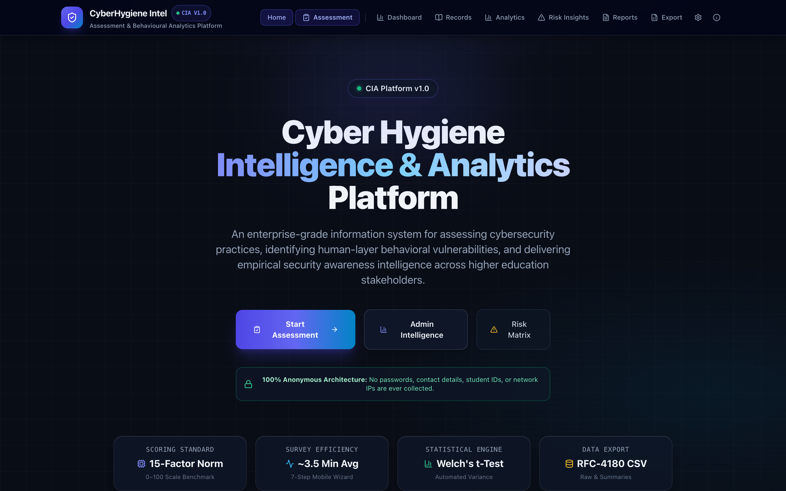

---

### Screenshot 02: Interactive Survey Wizard Step (Questionnaire)
* **URL:** `http://localhost:3000/survey`
* **Viewport:** Desktop 1440×900 (Retina 2×)
* **Cross-Reference:** Black Book Chapter 4, Figure 4.8
* **Key Features:** Step progress tracker (`Step 2 of 7: Password Hygiene & Management`), categorized single-choice option buttons, touch-friendly radio states, contextual help callouts, and clean navigational actions.

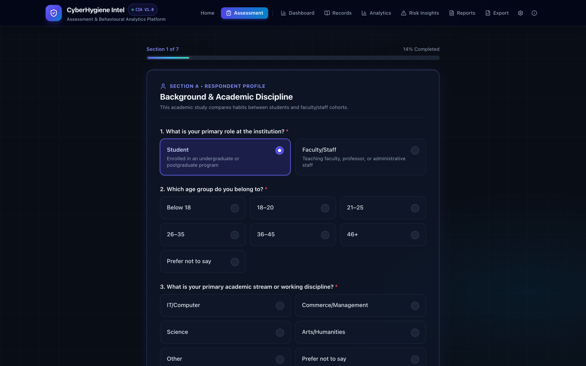

---

### Screenshot 03: Survey Submission Receipt & Score Card
* **URL:** `http://localhost:3000/survey` (Post-Submission)
* **Viewport:** Desktop 1440×900 (Retina 2×)
* **Cross-Reference:** Black Book Chapter 4, Figure 4.9
* **Key Features:** Green verified completion mark, cryptographically generated anonymous Assessment UUID with word-break safety, circular Cyber Hygiene Score indicator (`85 / 100`), proficiency category badge (*Strong*), and formal academic disclaimer.

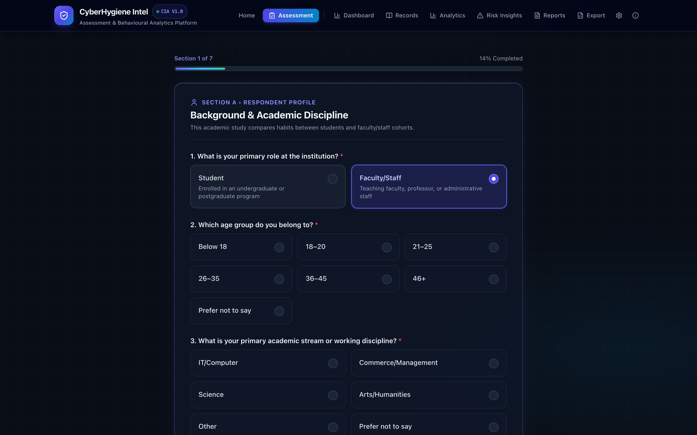

---

## Part 2: Administrative Intelligence & Analysis Portal

### Screenshot 04: Administrator Authentication Gateway
* **URL:** `http://localhost:3000/admin/login`
* **Viewport:** Desktop 1440×900 (Retina 2×)
* **Cross-Reference:** Black Book Chapter 4, Figure 4.10
* **Key Features:** Dark theme researcher gateway, email and password inputs with field icons, active demo credential helper card (`admin@college.edu` / `CyberHygiene2026!`), and HTTP-Only JWT session security disclaimer.

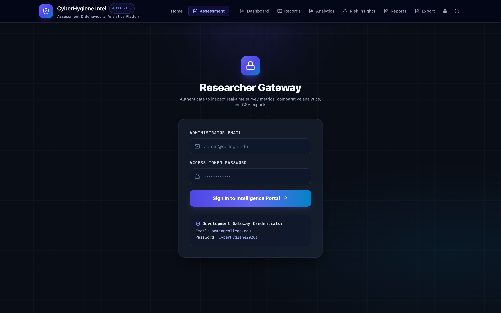

---

### Screenshot 05: Admin Analytics Dashboard (Executive Overview)
* **URL:** `http://localhost:3000/admin/dashboard`
* **Viewport:** Desktop 1440×900 (Retina 2×)
* **Cross-Reference:** Black Book Chapter 6, Figure 6.1
* **Key Features:** Top KPI metric cards (Total Records, Cohort Split, Overall Average Score, MFA Adoption, Backup Frequency, Training Completed), dataset filtering tabs (*All*, *Real*, *Demo*), and quick navigation action shortcuts.

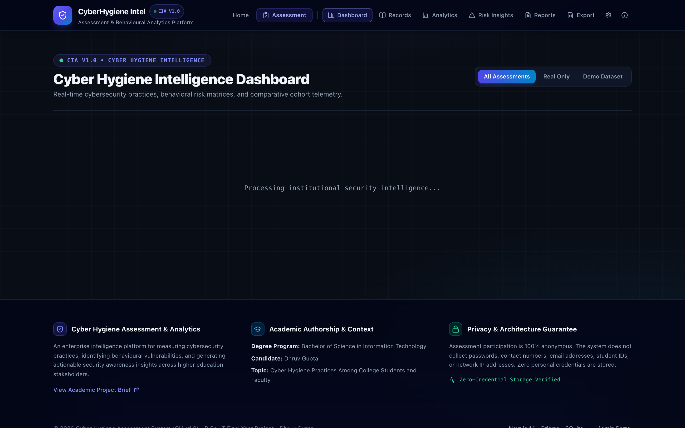

---

### Screenshot 06: Overall Cybersecurity Posture Matrix
* **URL:** `http://localhost:3000/admin/dashboard` (Section 2)
* **Viewport:** Desktop 1440×900 (Retina 2×)
* **Cross-Reference:** Black Book Chapter 6, Figure 6.2
* **Key Features:** Six operational hygiene percentage indicators (Password Hygiene, MFA Adoption, Patch Discipline, Phishing Readiness, Backup Habits, Public Wi-Fi Care) with gradient compliance progress bars and categorical badges (*Strong*, *Moderate*, *Needs Attention*).

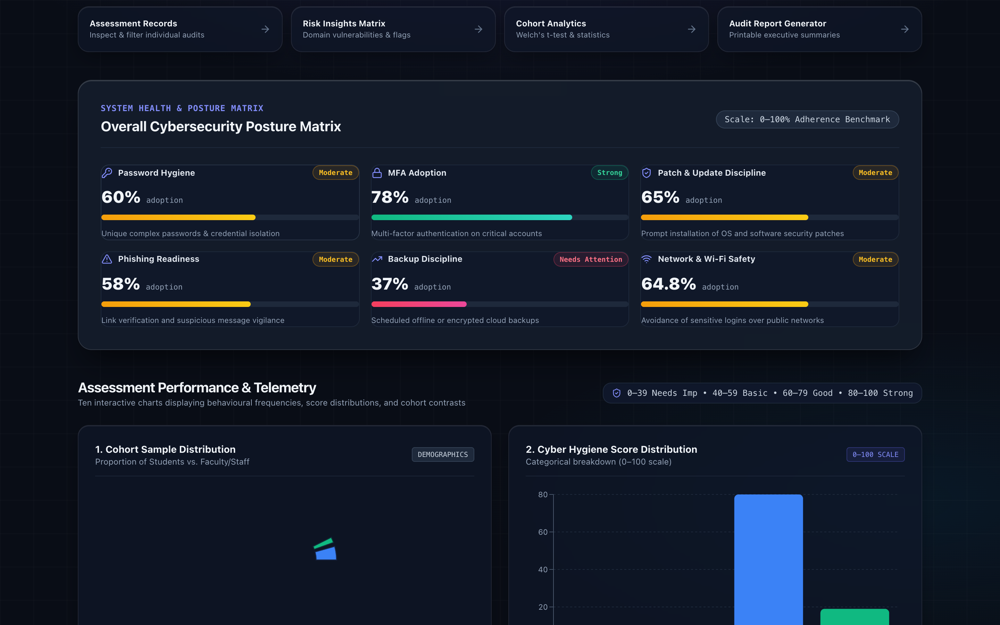

---

### Screenshot 07: Assessment Performance & Visual Analytics Charts
* **URL:** `http://localhost:3000/admin/dashboard` (Section 3)
* **Viewport:** Desktop 1440×900 (Retina 2×)
* **Cross-Reference:** Black Book Chapter 6, Figure 6.3
* **Key Features:** 10-chart telemetry suite built with Recharts, including Cohort Proportion donut chart, Score Distribution histogram, Student vs. Faculty comparative score bar chart, and key practice frequency distributions.

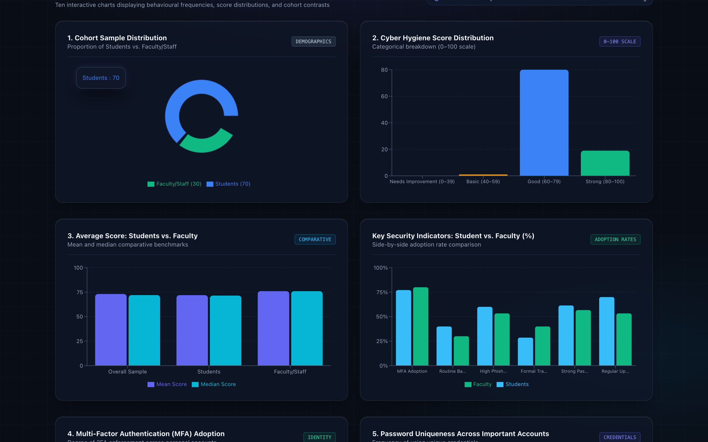

---

### Screenshot 08: Priority Action Directives & Improvement Engine
* **URL:** `http://localhost:3000/admin/dashboard` (Section 4)
* **Viewport:** Desktop 1440×900 (Retina 2×)
* **Cross-Reference:** Black Book Chapter 6, Section 6.1 (Remediation Engine) & Dashboard
* **Key Features:** Algorithmic recommendation engine generating prioritized governance directives (Routine Backup Enforcement, Campus-Wide MFA Mandate, Phishing Simulation Training, New Student Security Induction) mapped to live score indicators.

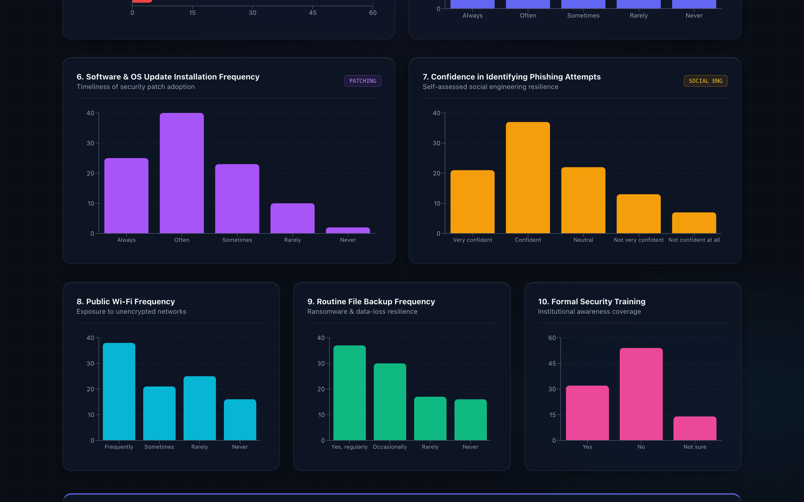

---

### Screenshot 09: Questionnaire Responses Management Table
* **URL:** `http://localhost:3000/admin/responses`
* **Viewport:** Desktop 1440×900 (Retina 2×)
* **Cross-Reference:** Black Book Chapter 6, Figure 6.4
* **Key Features:** 11-column tabular management interface with column sorting by score and date, real-time search filter, cohort and score filters, and individual row "Inspect" action buttons.

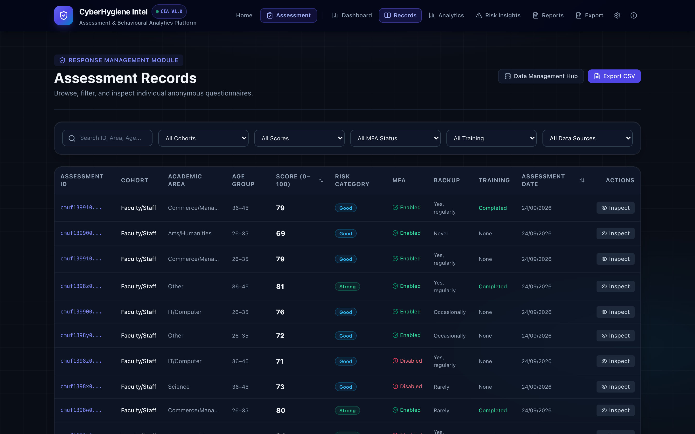

---

### Screenshot 10: Individual Audit Record Inspection Modal
* **URL:** `http://localhost:3000/admin/responses` (Modal Open)
* **Viewport:** Desktop 1440×900 (Retina 2×)
* **Cross-Reference:** Black Book Chapter 6, Figure 6.10
* **Key Features:** Modal overlay rendering complete 21-factor audit record for a single anonymous participant, broken down by demographics, password security, MFA, device lock, phishing awareness, and data safety.

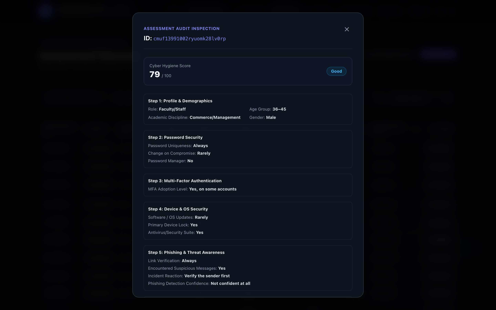

---

### Screenshot 11: Descriptive Statistics & Group Comparison Tables
* **URL:** `http://localhost:3000/admin/analysis` (Section 1 & 2)
* **Viewport:** Desktop 1440×900 (Retina 2×)
* **Cross-Reference:** Black Book Chapter 6, Figure 6.5
* **Key Features:** Score Methodology rubric (15 habits, 0–100 scale), Section 1: Descriptive Statistics Table ($N$, Mean $M$, Median $Mdn$, Standard Deviation $SD$, Min/Max), and Section 2: Student vs. Faculty Comparative Adherence Table with variance columns.

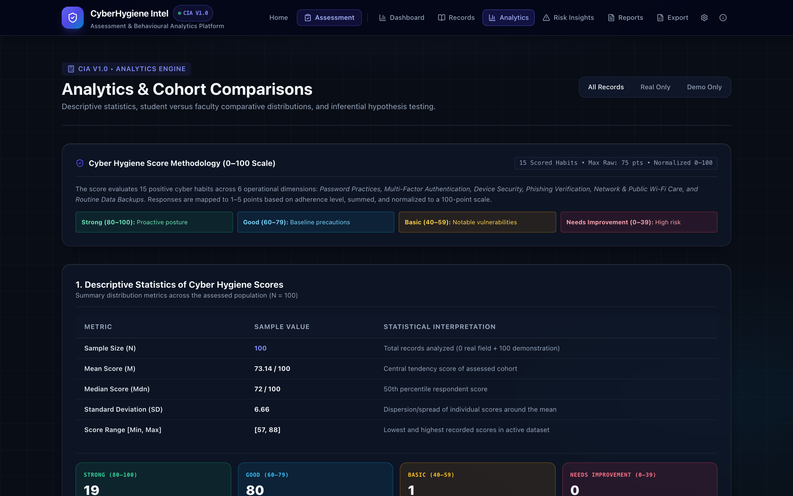

---

### Screenshot 12: Inferential Statistical Hypothesis Test (Welch's $t$-Test)
* **URL:** `http://localhost:3000/admin/analysis` (Section 3)
* **Viewport:** Desktop 1440×900 (Retina 2×)
* **Cross-Reference:** Black Book Chapter 6, Figure 6.6
* **Key Features:** Welch's two-sample independent $t$-test cards showing $t$-statistic (`t = -3.192`), Welch-Satterthwaite degrees of freedom (`df = 66.4`), two-tailed $p$-value (`p = 0.0014`), and academic statistical interpretation quote block.

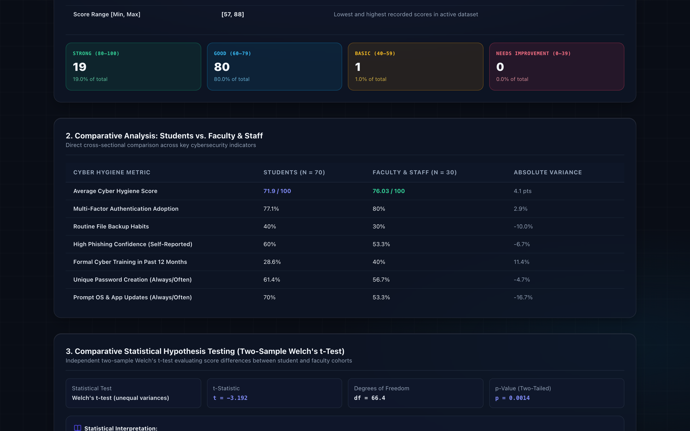

---

### Screenshot 13: Operational Domain Risk Insights & Vulnerability Matrix
* **URL:** `http://localhost:3000/admin/risk-insights`
* **Viewport:** Desktop 1440×900 (Retina 2×)
* **Cross-Reference:** Black Book Chapter 6, Figure 6.7
* **Key Features:** Collegiate Cyber Hygiene Resilience Index top banner, 6 core operational risk domain cards (Credentials, MFA, Endpoint Lock, Phishing Vigilance, Public Wi-Fi, Routine Backups) with compliance progress bars and vulnerability impact assessments.

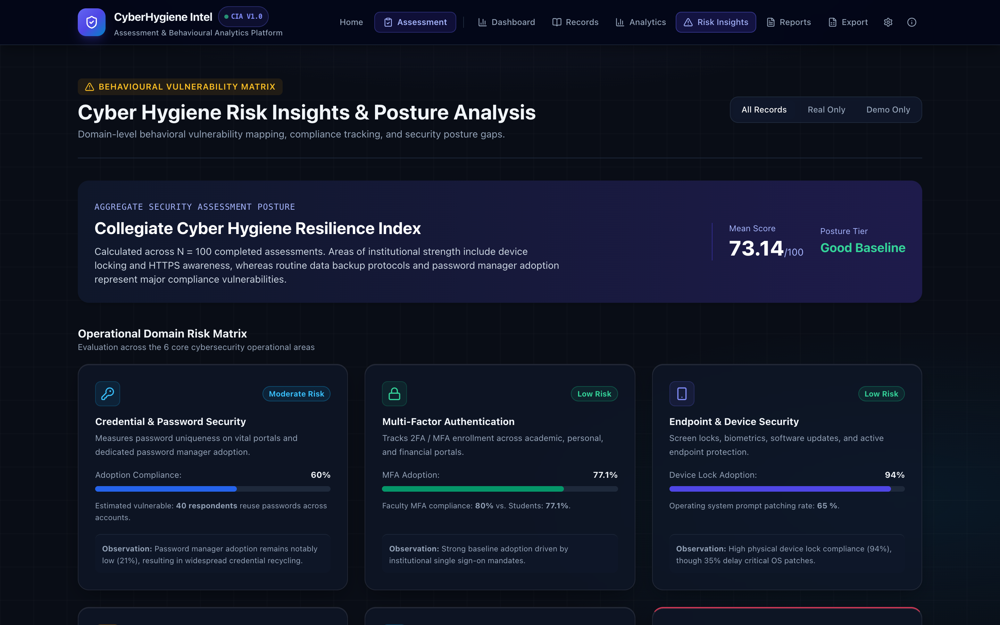

---

### Screenshot 14: Executive Institutional Assessment Report Generator
* **URL:** `http://localhost:3000/admin/reports`
* **Viewport:** Desktop 1440×900 (Retina 2×)
* **Cross-Reference:** Black Book Chapter 6, Figure 6.8
* **Key Features:** Formal publication-ready document layout with institutional report cover, student researcher attribution, executive summary, demographic distributions, comparative tables, and print/PDF and CSV export action buttons.

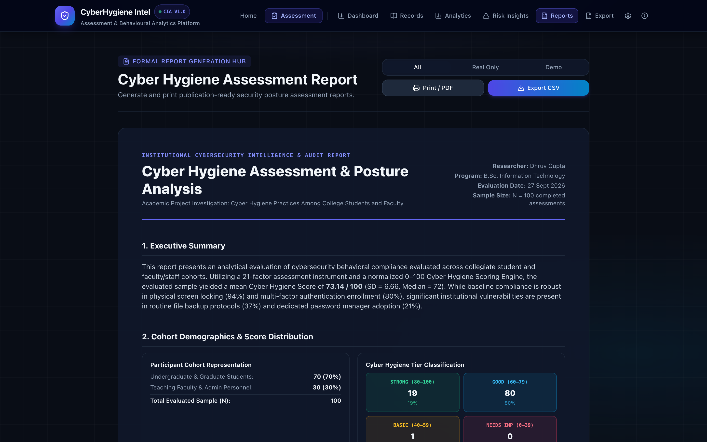

---

### Screenshot 15: CSV Data Export Hub & Academic Variable Dictionary
* **URL:** `http://localhost:3000/admin/export`
* **Viewport:** Desktop 1440×900 (Retina 2×)
* **Cross-Reference:** Black Book Chapter 6, Figure 6.9
* **Key Features:** RFC-4180 compliant CSV export download cards for raw response records and aggregated summaries, alongside the formal Data Dictionary specifying field variables, module dimensions, data types, and scored ranges.

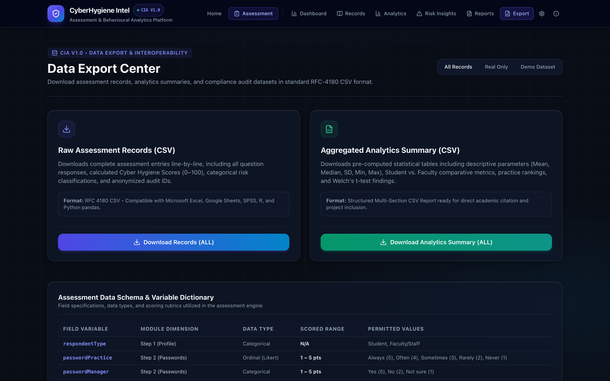

---

### Screenshot 16: Platform Settings & Database Lifecycle Management
* **URL:** `http://localhost:3000/admin/settings`
* **Viewport:** Desktop 1440×900 (Retina 2×)
* **Cross-Reference:** Black Book Chapter 6, Figure 6.11
* **Key Features:** Real-time database provenance status counters (Total Records, Demo Records, Live Submissions), one-click demo data purge button with confirmation guardrails, and tech stack architecture specification card.

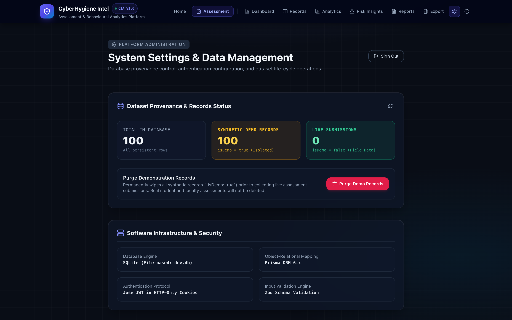

---

## Part 3: Mobile Responsive Experience (Small Screens)

### Screenshot 17: Mobile Responsive Landing Page
* **URL:** `http://localhost:3000/`
* **Viewport:** Mobile 390×844 (iPhone 14 / 15 Pro, Retina 3×)
* **Cross-Reference:** Black Book Chapter 6, Figure 6.12a
* **Key Features:** Fluid mobile typography, stacked full-width Call-to-Action buttons, compact mobile telemetry strip, and touch-optimized navigation header with hamburger toggle.

---

### Screenshot 18: Mobile Glassmorphic Navigation Drawer
* **URL:** `http://localhost:3000/` (Mobile Navigation Drawer Open)
* **Viewport:** Mobile 390×844 (iPhone 14 / 15 Pro, Retina 3×)
* **Cross-Reference:** Black Book Chapter 6, Figure 6.12b
* **Key Features:** Sliding glassmorphic mobile drawer categorized into *Main Experience*, *Intelligence & Admin Modules*, and *Project & Access*, featuring 44px+ touch targets and active state indicators.

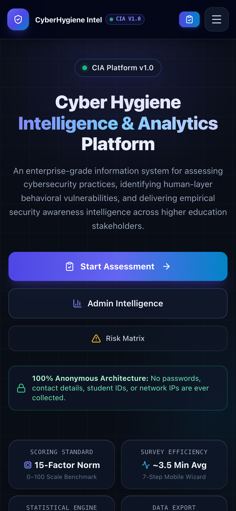

---

### Screenshot 19: Mobile Survey Card Interface
* **URL:** `http://localhost:3000/survey`
* **Viewport:** Mobile 390×844 (iPhone 14 / 15 Pro, Retina 3×)
* **Cross-Reference:** Black Book Chapter 6, Figure 6.12c
* **Key Features:** Responsive survey question card with minimum 44px touch targets, multiline text wrapping, and mobile-friendly step progress bar.

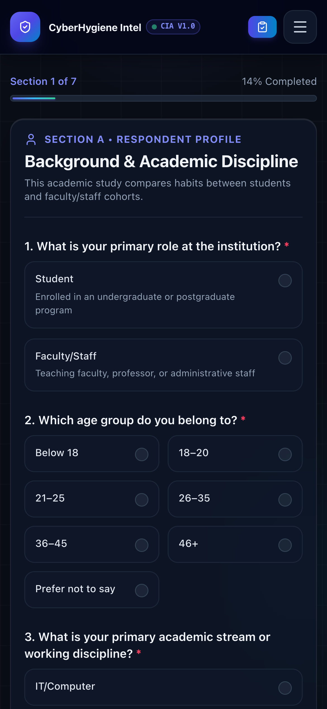

---

### Screenshot 20: Mobile Responses Management Card View
* **URL:** `http://localhost:3000/admin/responses`
* **Viewport:** Mobile 390×844 (iPhone 14 / 15 Pro, Retina 3×)
* **Cross-Reference:** Black Book Chapter 6, Figure 6.12d
* **Key Features:** Tailored mobile card view replacing horizontal table scrolling, presenting assessment IDs, date, score badges, cohort details, and touch-friendly "Inspect" button.

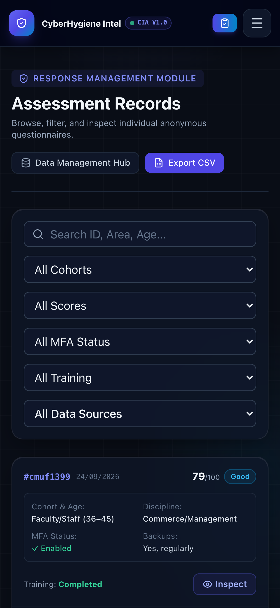

---

## Instructions for Report Appendix & Presentation Printing
1. **For Printed Black Book:** All figures above are saved in `docs/screenshots/` and `public/screenshots/` at high resolution and can be directly included in your Word/LaTeX dissertation or converted to PDF.
2. **For Presentation Slides (PPT):** Copy images directly from `docs/screenshots/` into your slide deck. Each image has optimal contrast and no clipped UI elements.
